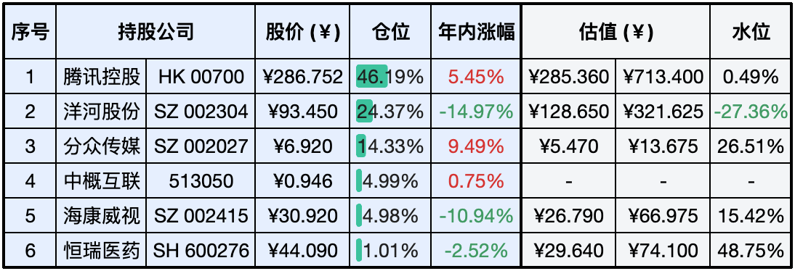
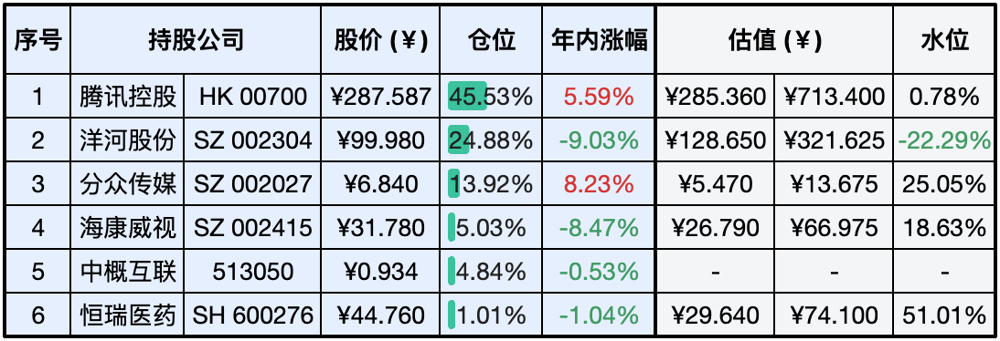
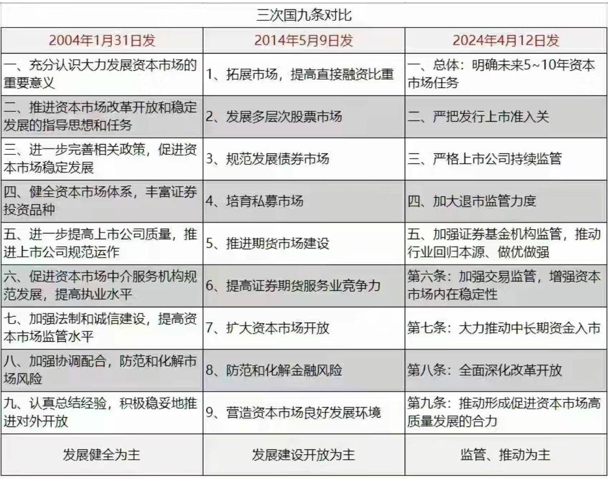
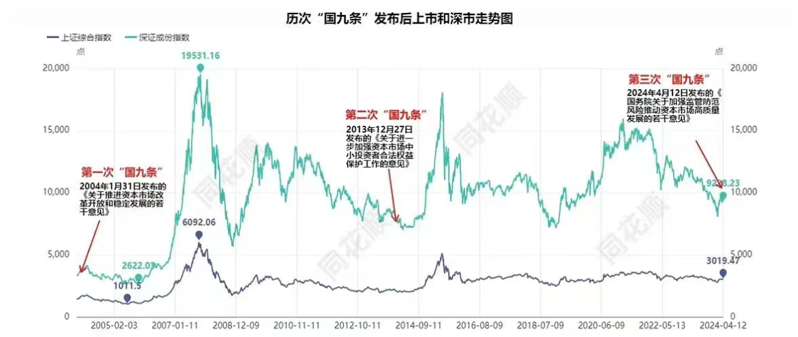

__微信公众号文章地址：[老罗实盘周记-20240413](https://mp.weixin.qq.com/s/hgB7G4ECfyTgS6GMK40oSQ)__

```
老罗实盘周记，每周六更新。专注于股权投资、阅读、学习与个人成长，知行合一、日拱一卒、投资人生。微信公众号【老罗投资】，文章均首发于公众号。
```

### 1. 本周交易

+ 周三(4月10日)买入洋河股份(002304)，买入价格为95.10元人民币。

### 2. 目前持仓

当前持有的股票包括：腾讯控股 46.19%、洋河股份 24.37%、分众传媒 14.33%、中概互联 4.99%、海康微视 4.98%、恒瑞医药 1.01%。

此外还有少量现金，加上少量的上海机场、宋城演义、京沪高铁等股票，其份额较少，仅作为观察仓不进行记录。

**注：港股已换算为人民币**



### 3. 上周数据



### 4. 持仓收益

本周：老罗的持仓 <span class="green">-1.80%</span>，沪深300指数 <span class="green">-2.58%</span>。 

截止到今日，老罗实盘今年收益率为 <span class="red">+0.40%</span>，沪深300指数今年收益率为 <span class="red">+1.30%</span>，今年第13周跑输沪深300指数。

### 5. 本周事项

+ 新国九条
+ 北京公积金最高可贷款160万
+ 惠誉下调中国主权信用评级展望
+ 买入洋河股份

==只对持股和交易感兴趣的朋友，读到这里就可以退出了。后面是对上述事件的展开，无新内容。==

#### 5.1 新国九条

国务院近日印发《关于加强监管防范风险推动资本市场高质量发展的若干意见》。这次出台的意见共9个部分，是继2004年、2014年两个国九条之后，国务院再次出台的资本市场指导性文件。



2004年第一次，迎来06-07年大牛市，指数从最低998点涨到最高6124点，足足上涨了5126点。2014年第二次，迎来14-15年大牛市，指数从最低2000点涨到最高5178点，足足上涨了3178点。2024年第三次，指数从3000点启动，让我们拭目以待。



诚然，历史经验犹如后视镜，为我们提供了一定的参考，但现今国内外环境与往昔已大相径庭。新国九条的发布并不意味着股市会立即好转，一蹴而就。宏观经济是难以掌控的，它超出了我们的能力圈。在投资中，我们应将重点放在寻找优质企业上，并努力与之实现长期的共同成长。

老罗同时认为这次的新国九条具有非常重要的意义，它将弥补制度短板，如果真正能把大A从融资市场变为投资市场，大A的长期繁荣发展未来可期。

#### 5.2 北京公积金最高可贷款160万

4月8日，北京住房公积金管理中心发布《关于住房公积金支持北京市建筑绿色发展的实施办法(征求意见稿)》，并公开征求意见至2024年4月15日。征求意见稿提出，使用住房公积金贷款购买二星级以上绿色建筑、装配式建筑或超低能耗建筑的缴存职工，贷款额度最高可提高40万元，至160万元。

适用对象包括申请住房公积金个人住房贷款购买二星级及以上绿色建筑、装配式建筑或超低能耗建筑的缴存职工。具体而言，购买二星级、三星级绿色建筑的借款人，公积金最高贷款额度将分别提高20万元、30万元；购买A(BJ)级、AA(BJ)级、AAA(BJ)级装配式建筑的借款人，最高贷款额度将分别提高10万元、20万元、30万元；购买超低能耗建筑的借款人，最高贷款额度可提高40万元。若借款人意向购买的住宅同时满足多个适用条件，最高贷款额度上浮金额可累加，最高不超过160万元。

绿色建筑分为一星、二星和三星级，涵盖建筑安全耐久、节能减排、环境宜居等多方面指标，星级越高标准越严格。装配式建筑则是通过工厂预制的楼板、窗户、墙体等构件进行现场安装，近年来已广泛应用于住宅建筑领域。超低能耗建筑在建筑保温、隔声等方面要求更为严格，部分北京商品住房项目已采用此技术。

要了解自己购买的房屋是否为绿色建筑以及执行的标准，可以关注开发商在售楼处公示的项目建设等级，或查阅购房合同中的相关信息。建议在购房时向开发商咨询或查看购房合同，以确认房屋是否符合绿色建筑标准及其具体等级。

房子这两年是越来越不好卖了，优惠政策一个接一个的出台，但效果并不明显。购房者的心态与大多数股票投资人一样，上涨时蜂拥而入，下跌时反而会持币观望，逆人性实在是太难了。

#### 5.3 惠誉下调中国主权信用评级展望

4月10日，惠誉国际信用评级公司发布报告，维持中国主权信用评级不变，但将评级展望由稳定调整为负面。对此财政部有关负责人回应，很遗憾看到惠誉调降中国主权信用评级展望。前期已经与惠誉评级团队进行了大量深入沟通，报告也部分反映了中方的看法。但从结果看，惠誉主权信用评级方法论的指标体系，未能有效前瞻性反映财政政策适度加力、提质增效对推动经济增长、进而稳定宏观杠杆率的正面作用。

惠誉评级是与标准普尔、穆迪齐名的全球三大评级公司之一。在三大评级公司里，惠誉是最早进入中国的。这三家评级机构各有侧重，标准普尔侧重于企业评级方面，穆迪侧重于机构融资方面，而惠誉则更侧重于金融机构的评级。如今，惠誉的评级类型主要包括企业、金融机构、结构融资和地方政府、国家主权等方面。惠誉在美国市场上的规模要比其他两家评级公司小，但在全球市场上，尤其在新兴市场上，惠誉的敏感度较高，视野比较国际化。

尽管评级展望调整，惠誉仍给予中国A+的较高评级，反映出外资评级机构对我国经济增长前景、全球商品贸易中心地位、稳健的外部金融状况等方面的认可。主要支撑因素包括庞大且多样化的经济体系、稳健的经济增长预期、全球商品贸易核心地位、稳健的外部金融状况以及人民币作为储备货币的地位等。

#### 5.4 买入洋河股份

本周白酒行业大跌，洋河跌幅超6%，可以理解为洋河头顶有多个利空威胁，但连浓眉大眼的茅台，一年净赚几百亿，几乎不用追加太多投资，增长率几乎都给你明牌的企业，本周也跌去了近5%，你说这跟谁说理去？

既然市场先生不按常理出牌，那老罗可就要出手了，本周小买了点洋河，买入价格为95.10元人民币。下周如果继续下跌，还会在93.10元与90.10元时进行买入。

幻想一下，如果茅台能跌到1400元以下，也会进行建仓买入，茅台一直是便宜时没钱买，有钱买时不便宜，耐心等待吧。

### 6. 本周读书

#### 6.1 《不白吃话山海经：全3册》

适合亲子阅读的一本书，《山海经》是中国古代最神秘的奇书之一，原文中的寥寥数字在作者的笔下变成了一个个生动有趣的漫画小故事，阅读体验还是很不错的。

评分三星半⭐️⭐️⭐️️❤️

### 7. 本周运动

本周遛弯4次，体重变化不大。

祝大家假期顺利，身体健康！

```
老罗实盘周记，每周六更新。专注于股权投资、阅读、学习与个人成长，知行合一、日拱一卒、投资人生。微信公众号【老罗投资】，文章均首发于公众号。
免责声明：本公众号只作为本人的投资日志记录，本文中提及的个股都有腰斩或血本无归的风险，本人不做任何投资建议，投资请坚持独立思考。
```

__微信公众号文章地址：[老罗实盘周记-20240413](https://mp.weixin.qq.com/s/hgB7G4ECfyTgS6GMK40oSQ)__