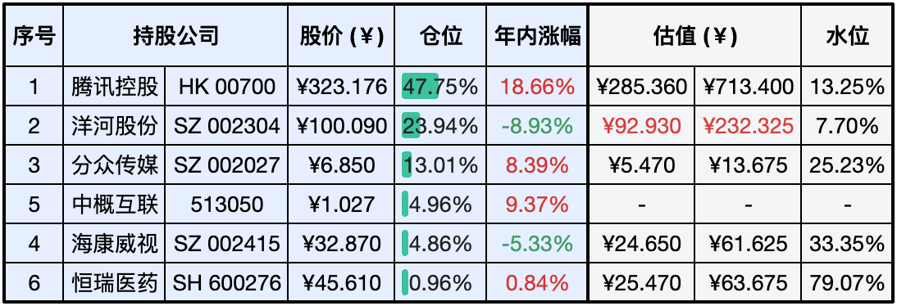
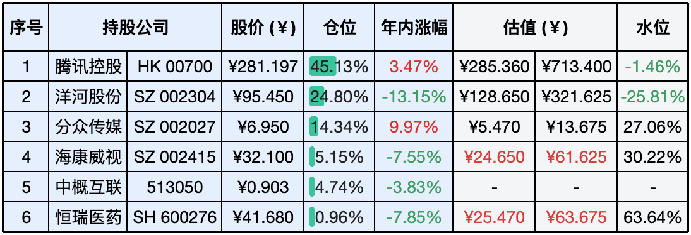

__微信公众号文章地址：[老罗实盘周记-20240427](https://mp.weixin.qq.com/s/3SmZnIqEMaRL4bPvJmXcWw)__

```
老罗实盘周记，每周六更新。专注于股权投资、阅读、学习与个人成长，知行合一、日拱一卒、投资人生。微信公众号【老罗投资】，文章均首发于公众号。
```

### 1. 本周交易

无

### 2. 目前持仓

当前持有的股票包括：腾讯控股 47.75%、洋河股份 23.94%、分众传媒 13.01%、中概互联 4.96%、海康微视 4.86%、恒瑞医药 0.96%。

此外还有少量现金，加上少量的上海机场、宋城演义、京沪高铁等股票，其份额较少，仅作为观察仓不进行记录。

**注：港股已换算为人民币**



### 3. 上周数据



### 4. 持仓收益

本周：老罗的持仓<span class="red">+8.87%</span>，沪深300指数<span class="red">+1.20%</span>。 

截止到今日，老罗实盘今年收益率为<span class="red">+8.86%</span>，沪深300指数今年收益率为<span class="red">+4.46%</span>。

本周港股大涨，连续14周跑输沪深300指数后，老罗的实盘收益本周终于反超沪深300。

### 5. 本周事项

+ 洋河股份23年财报
+ 恒生指数、恒生科技本周大涨

==只对持股和交易感兴趣的朋友，读到这里就可以退出了。后面是对上述事件的展开，无新内容。==

#### 5.1 洋河股份23年财报

营业收入与净利润增长：营业收入为331.26亿元，同比增长10.04%。归属于上市公司股东的净利润为100.16亿元，同比增长6.8%。

现金流量：经营活动产生的现金流量净额为61.30亿元，同比增长68.06%，表明公司的经营活动产生了较强的现金流入。

利润分配：公司提出了每10股派发现金红利46.60元（含税）的利润分配预案，显示了公司对股东回报的重视。

资产负债情况：总资产为697.92亿元，比上年末增长了2.68%。

归属于上市公司股东的净资产为519.39亿元，比上年末增长了9.40%。

存货与销售情况：存货账面价值为189.54亿元，占资产总额的27.16%。白酒销售量为166,154.73吨，同比下降14.93%。

成本与费用：营业成本为82.00亿元，销售费用为53.87亿元，管理费用为17.64亿元，研发费用为2.85亿元。财务费用为负数，即产生了财务收益，金额为-7.55亿元。

投资收益：投资收益为25.55亿元，其中包括权益法核算的长期股权投资收益和交易性金融资产的投资收益。

政府补助：计入当期损益的政府补助为5.11亿元，对公司的利润产生了正面影响。

非经常性损益：非经常性损益合计为17.31亿元，其中包括非流动性资产处置损益、政府补助等。

资产减值损失：报告期内资产减值损失为-2,828,018.24元。

递延所得税：递延所得税资产为132.63亿元，递延所得税负债为23.44亿元。

总体来说洋河的年报不及预期，净利润只增长了6.8%，在去年Q4更是出现了亏损，这与友商的高速增长形成了较为鲜明的对比。特别是洋河的管理层，表现难以让人满意。

最后是估值调整，按洋河年报中净利润5%的最低年增长，三年后预估净利润115亿人民币，115*25≈2800亿人民币，买点大幅下调为92元人民币(市值1400亿)，卖点下调为232元人民币(市值3500亿)。

当前市值1508亿人民币，超出适合的买点7.7%，仓位上限由25%降为10%。目前20%+的仓位偏高，后续可能降低仓位，换成其他低估的公司。

#### 5.2 恒生指数、恒生科技本周大涨

本周恒生指数上涨8.8%，恒生科技指数更是大涨13.43%，持有的腾讯上涨14.68%，带动老罗的实盘收益在一周内对沪深300指数实现了反超。

市场普遍认为，本轮港股市场大涨与监管层公布的相关政策密切相关，这些政策提振了市场的信心。之前证监会发布了5项资本市场对港合作措施，包括放宽沪深港通下股票ETF合资格产品范围、将REITs纳入沪深港通、支持人民币股票交易柜台纳入港股通、优化基金互认安排和支持内地行业龙头企业赴港交所上市。

同时叠加了日本加息结束了负利率，部分资金流入了低估的港股市场。港股肉眼可见的低估，很多赚钱能力强的公司，目前的PE不到10倍，聪明的资金肯定不会放过这种机会。

### 6. 本周读书

#### 6.1 《纳闷集》

微信读书神作榜中的一本漫画，匡扶所作的《纳闷集》。老罗读得却觉得稍有些枯燥，不长的篇幅读了很久(两周)。

评分三颗星 ⭐️⭐️⭐️

### 7. 本周运动

本周遛弯5次，体重继续下降中。

祝大家假期顺利，身体健康！

```
老罗实盘周记，每周六更新。专注于股权投资、阅读、学习与个人成长，知行合一、日拱一卒、投资人生。微信公众号【老罗投资】，文章均首发于公众号。
免责声明：本公众号只作为本人的投资日志记录，本文中提及的个股都有腰斩或血本无归的风险，本人不做任何投资建议，投资请坚持独立思考。
```

__微信公众号文章地址：[老罗实盘周记-20240427](https://mp.weixin.qq.com/s/3SmZnIqEMaRL4bPvJmXcWw)__