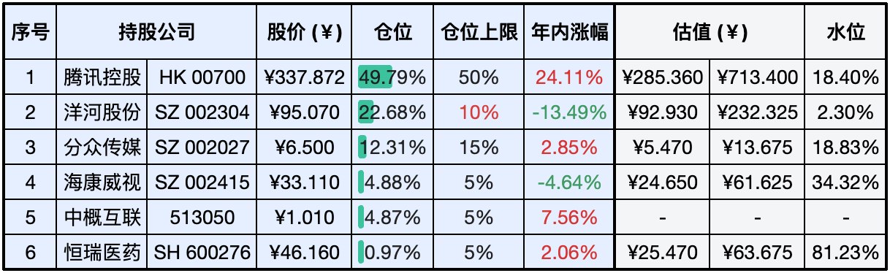

__微信公众号文章地址：[老罗实盘周记-20240504](https://mp.weixin.qq.com/s/Oa0vmpvEt_4dnZY5hkcaAA)__

```
老罗实盘周记，每周六更新。专注于股权投资、阅读、学习与个人成长，知行合一、日拱一卒、投资人生。微信公众号【老罗投资】，文章均首发于公众号。
```

### 1. 本周交易

无

### 2. 目前持仓

当前持有的股票包括：腾讯控股 49.79%、洋河股份 22.68%、分众传媒 12.31%、海康微视 4.88%、中概互联 4.87%、恒瑞医药 0.97%。

此外还有少量现金，加上少量的上海机场、宋城演义、京沪高铁等股票，其份额较少，仅作为观察仓不进行记录。

本周起估值表有了一些变化，增加了个股的仓位上限，方便记忆。

**注：港股已换算为人民币**



### 3. 上周数据


### 4. 持仓收益

本周：老罗的持仓<span class="red">+0.30%</span>，沪深300指数<span class="red">+0.56%</span>。 

截止到今日，老罗实盘今年收益率为<span class="red">+9.16%</span>，沪深300指数今年收益率为<span class="red">+5.05%</span>。

### 5. 本周事项

+ 分众传媒23年财报
+ 三中全会将于7月召开
+ 美联储宣布维持利率不变

==只对持股和交易感兴趣的朋友，读到这里就可以退出了。后面是对上述事件的展开，无新内容。==

#### 5.1 分众传媒23年财报

营业收入和净利润增长情况：2023年营业收入为119.04亿元，相较2022年的94.25亿元，增长了26.30%。归属于上市公司股东的净利润为48.27亿元，相较2022年的27.90亿元，增长了73.02%。

现金流量：经营活动产生的现金流量净额为76.78亿元，较上年的66.99亿元增长了14.61%。

资产负债情况：总资产为243.61亿元，相较2022年末的252.39亿元减少了3.48%。归属于上市公司股东的净资产为176.93亿元，相较2022年末的169.49亿元增长了4.39%。

股东权益变动：未分配利润为175.07亿元，较上年增加了4.39%。

每股收益：基本每股收益和稀释每股收益均为0.3342元，相较上年的0.1932元增长了72.98%。

资产减值和公允价值变动：无形资产减值损失为-0.09亿元，商誉减值损失为-0.33亿元。

投资收益：投资收益为4.11亿元，其中包括权益法核算的长期股权投资收益2.79亿元。

政府补助：计入当期损益的政府补助为4.56亿元。

非经常性损益：非经常性损益合计为4.53亿元。

研发投入：研发费用为0.62亿元，较上年下降了10.30%。

员工情况：在职员工总数为5309人，其中销售人员1379人，技术人员173人，财务人员177人，行政人员511人，开发人员848人，运营人员2221人。

利润分配：公司提出了利润分配预案，以公司2024年3月31日的总股本14,442,199,726股为基数，向全体股东每10股派发现金3.30元（含税），共计派发47.66亿元。相当于把2023年全年48.27亿的归母净利润全都分了，江总分红依然大方，也说明分众持续经营并不需要太多的追加投资。

分众传媒属于周期型公司，受经济环境影响较大，经济好时广告收入自然就高，对这种周期型公司使用席勒估值法，也就是用过去10年净利润平均值来代替普通市盈率中的一年净利润，以此来平滑经济周期对估值的影响。其目的是企业穿越了一个以上的完整产业周期，竞争格局稳定，剔除了个别极端的年份，企业利润总能均值回归。

算了下近十年年均利润44亿，算出的买点与卖点，与当前的买点790亿与卖点1850亿差距不是特别大(几十亿)，所以今年老罗就暂不做估值调整了。

#### 5.2 三中全会将于7月召开

在新闻联播里经常听到几中全会，几中全会分别是党的全国代表大会期间召开的不同届数的中央全会，它们各自承担着不同的职责和议题，以下是各届全会的主题和重点：

一中全会：主要聚焦于党的重要人事安排，讨论并选举产生新一届中央领导机构的成员。

二中全会：核心议题是国家机构的人事问题，推荐新一届全国人大、全国政协和国家机构领导人的建议名单。

三中全会：通常围绕国家发展和经济建设的重大问题进行讨论，作出重大决策，如经济改革、现代化建设等。

四中全会：以党的建设为主题，讨论并推出国家重大决策部署，如依法治国等。

五中全会：主要审议国民经济和社会发展规划建议，从五年计划改为五年规划后，制定相关规划。

六中全会：主题不固定，如精神文明建设、和谐社会构建等。

七中全会：一般为下一届党的全体代表大会做准备，包括文件及程序的准备工作。

可以看出三中全会的主题侧重于经济与建设，今年7月将在北京召开中国共产党第二十届中央委员会第三次全体会议，主要议程是：中共中央政治局向中央委员会报告工作，重点研究进一步全面深化改革、推进中国式现代化问题。会议分析研究当前经济形势和经济工作，审议《关于持续深入推进长三角一体化高质量发展若干政策措施的意见》。

在经历百年未遇之大变局的当下，这次的三中全会非常值得期待。

#### 5.3 美联储宣布维持利率不变

在5月2日的决策会议上，美联储决定保持联邦基金利率目标区间在5.25%至5.5%不变，这一决定与市场预期相符。美联储同时发出警告，指出尽管过去一年美国通胀有所缓和，但目前通胀水平仍然较高，且在实现2%通胀目标方面进展不足。此外，美联储对美国经济前景持谨慎态度，并对通胀风险保持高度警觉。

为了应对当前的经济状况，美联储宣布自6月起调整缩表策略，将每月美国国债的赎回上限从600亿美元减少至250亿美元，这表明美联储将减缓缩减资产负债表的步伐。

在随后的新闻发布会上，美联储主席鲍威尔指出，当前通胀数据超出了预期，因此降息的时机可能比预期要晚。

这次推迟降息一点也不意外，老美现在是进退都很难受，降息吧还没有割到韭菜，不降息吧34万亿的国债利息都快还不起了。还是那句话，专注做好自己的事，慢慢熬鹰吧。

### 6. 本周读书

#### 6.1 《无需抱怨，可以抱我》

半小时就可以读完，不错的漫画，小林的漫画质量一直稳定。印象最深的一句话：需要不断向前进，苦才后退。

评分四颗星 ⭐️⭐️⭐️⭐️

### 7. 本周运动

本周遛弯2次，五一放假彻底放飞自我，锻炼次数变少了。

祝大家五一假期顺利，身体健康！

```
老罗实盘周记，每周六更新。专注于股权投资、阅读、学习与个人成长，知行合一、日拱一卒、投资人生。微信公众号【老罗投资】，文章均首发于公众号。
免责声明：本公众号只作为本人的投资日志记录，本文中提及的个股都有腰斩或血本无归的风险，本人不做任何投资建议，投资请坚持独立思考。
```

__微信公众号文章地址：[老罗实盘周记-20240504](https://mp.weixin.qq.com/s/Oa0vmpvEt_4dnZY5hkcaAA)__