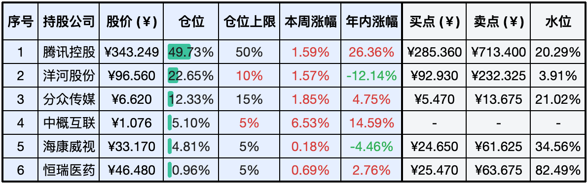
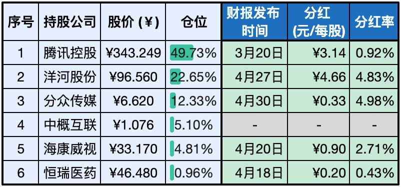

__微信公众号文章地址：[老罗实盘周记-20240511](https://mp.weixin.qq.com/s/UauxsCDwYFsLyxz3DJdNEg)__

```
老罗实盘周记，每周六更新。专注于股权投资、阅读、学习与个人成长，知行合一、日拱一卒、投资人生。微信公众号【老罗投资】，文章均首发于公众号。
```

### 1. 本周交易

无

### 2. 目前持仓

当前持有的股票包括：腾讯控股49.73%、洋河股份22.65%、分众传媒12.33%、中概互联5.10%、海康微视4.81%、恒瑞医药0.96%。

此外还有少量现金，加上少量的上海机场、宋城演义、京沪高铁等股票，其份额较少，仅作为观察仓不进行记录。

估值表进一步修改，去掉了股票代码，增加了周涨幅数据。

**注：港股已换算为人民币**



### 3. 上周数据


### 4. 持仓收益

本周：老罗的持仓<span class="red">+1.89%</span>，沪深300指数<span class="red">+1.72%</span>。 

截止到今日，老罗实盘今年收益率为<span class="red">+11.05%</span>，沪深300指数今年收益率为<span class="red">+6.85%</span>。

### 5. 本周事项

+ 伯克希尔·哈撒韦年会
+ 西安杭州全面取消住房限购
+ 老罗旗下非控股公司分红情况

==只对持股和交易感兴趣的朋友，读到这里就可以退出了。后面是对上述事件的展开，无新内容。==

#### 5.1 伯克希尔·哈撒韦年会

北京时间上周六晚，备受瞩目的伯克希尔·哈撒韦公司年度股东大会再次在美国投资重镇奥马哈盛大举行。数以万计的投资者齐聚于投资界传奇人物沃伦·巴菲特的故乡——美国内布拉斯加州的奥马哈，期待从巴菲特那里获得关于市场趋势、投资策略以及人生智慧的独到见解。

随着巴菲特的长期合作伙伴查理·芒格于去年年底离世，今年的大会特别由巴菲特本人以及两位公司高管——被指定为接班人的格雷格·阿贝尔和保险业务负责人阿吉特·贾恩共同出席，他们就股东们关心的问题进行了回答。

在股东大会上，巴菲特对当前投资市场所关注的多个重要议题，包括公司持有的巨额现金、对苹果股票的减持等，给出了坦率的回应。 此外他还分享了对投资于日本、加拿大、印度等海外市场的洞察。尽管巴菲特自称对科技领域了解不多，但他对电动汽车、太阳能和人工智能等新兴技术领域也表达了自己的观点。

尽管芒格已经离世，巴菲特在会议中还是多次提及这位老友，并在讨论中习惯性地转向格雷格·阿贝尔，询问『芒格会怎么看』。巴菲特在谈及继承问题时，也幽默地自嘲年龄，并在大会结束时表达了对未来参与股东大会的期待。

年龄增长是不可避免的话题，沃伦·巴菲特在股东大会上明确表示，他目前并没有退休的计划，并表示自己的身体状况感觉良好。他提到，伯克希尔·哈撒韦公司已经为未来20年的发展做好了规划，即便他个人有任何不测，公司也有明确的继任计划，格雷格·阿贝尔将向董事会提供指导。

巴菲特还表达了对即将到来的股东大会的期待，他希望投资者们能够继续参与，同时也希望自己能够继续出席。根据伯克希尔官网的引导，2025年的股东大会定于明年的5月3日举行。

#### 5.2 西安杭州全面取消住房限购

5月9日，杭州和西安两大城市相继宣布了取消住房限购政策，这一重大举措迅速引起了公众的广泛关注。杭州市房地产市场平稳健康发展领导小组办公室发布了《关于优化调整房地产市场调控政策的通知》，明确指出杭州市将全面取消住房限购政策，意味着在市内购买住房不再需要进行购房资格的审核。此外，对于在杭州市拥有合法产权住房的非户籍人员，现在也有资格申请落户。

同一天，西安市住房和城乡建设局也发布了相关通知，宣布全面取消西安市的住房限购措施，居民家庭在全市范围内购买新建或二手商品住房时，同样不再需要审核购房资格。

目前全国仅有6个城市继续实施住房限购政策，除了海南省之外，只有北京、上海、广州、深圳这四个一线城市以及天津的部分区域还在执行限购。与此同时，包括杭州在内的成都、重庆、长沙、南京等其他重点城市，已经全面放宽了房地产市场的准入限制，为居民提供了更大的购房自由度。

救市行动已全面启动，旨在稳定金融市场。楼市和股市作为大规模资金的集聚地，各自扮演着重要的角色。在当前市场环境下，老罗认为股市的流动性优于楼市，因此从长远来看，股市的投资回报可能超过楼市，股市的灵活性和动态性使其成为更具吸引力的长期投资选择。

#### 5.3 老罗旗下非控股公司分红情况

目前老罗旗下非控股公司23年财报已经全部发布，记录下分红计划：



等各公司股东大会投票通过后，分红就会陆续到账了，到账后的资金暂时没有好的想法，耐心等待好的机会。

### 6. 本周读书

#### 6.1 《怎样用常识做股票》

作者的投资理念与老罗的策略高度契合，使得阅读过程非常流畅。对致力于价值投资的读者，这本书无疑提供了宝贵的洞见和启发，非常值得一读。

评分四颗星 ⭐️⭐️⭐️⭐️

#### 6.2 《高山下的花环》

这部同名电影的原著小说，其感人程度远超电影本身。在那些不为人知的角落，有着无数值得我们尊敬和爱戴的人，他们不惜牺牲自己的生命，为我们守护着宝贵的和平。

强烈推荐阅读这部作品，评分五颗星 ⭐️⭐️⭐️⭐️⭐

### 7. 本周运动

本周遛弯5次，五一增加的4斤体重这一周基本减下去了，继续保持。

祝大家周末快乐，身体健康！

```
老罗实盘周记，每周六更新。专注于股权投资、阅读、学习与个人成长，知行合一、日拱一卒、投资人生。微信公众号【老罗投资】，文章均首发于公众号。
免责声明：本公众号只作为本人的投资日志记录，本文中提及的个股都有腰斩或血本无归的风险，本人不做任何投资建议，投资请坚持独立思考。
```

__微信公众号文章地址：[老罗实盘周记-20240511](https://mp.weixin.qq.com/s/UauxsCDwYFsLyxz3DJdNEg)__