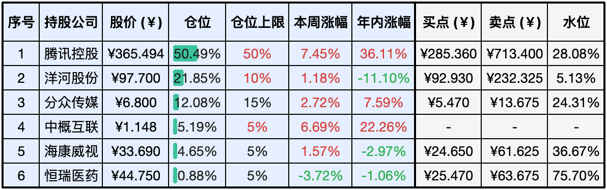
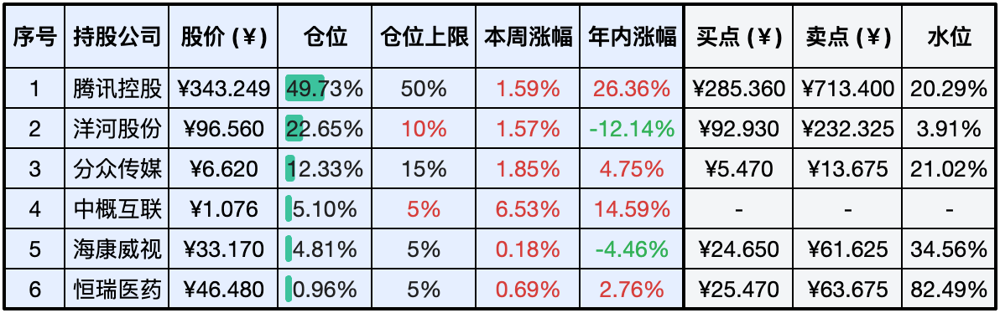
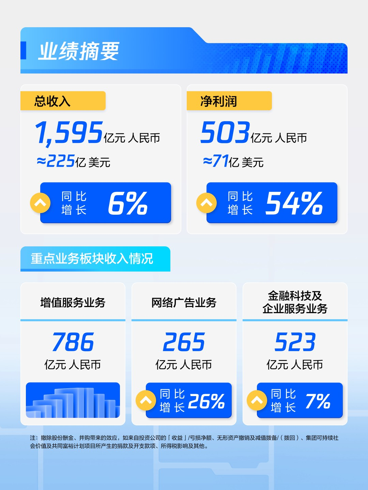
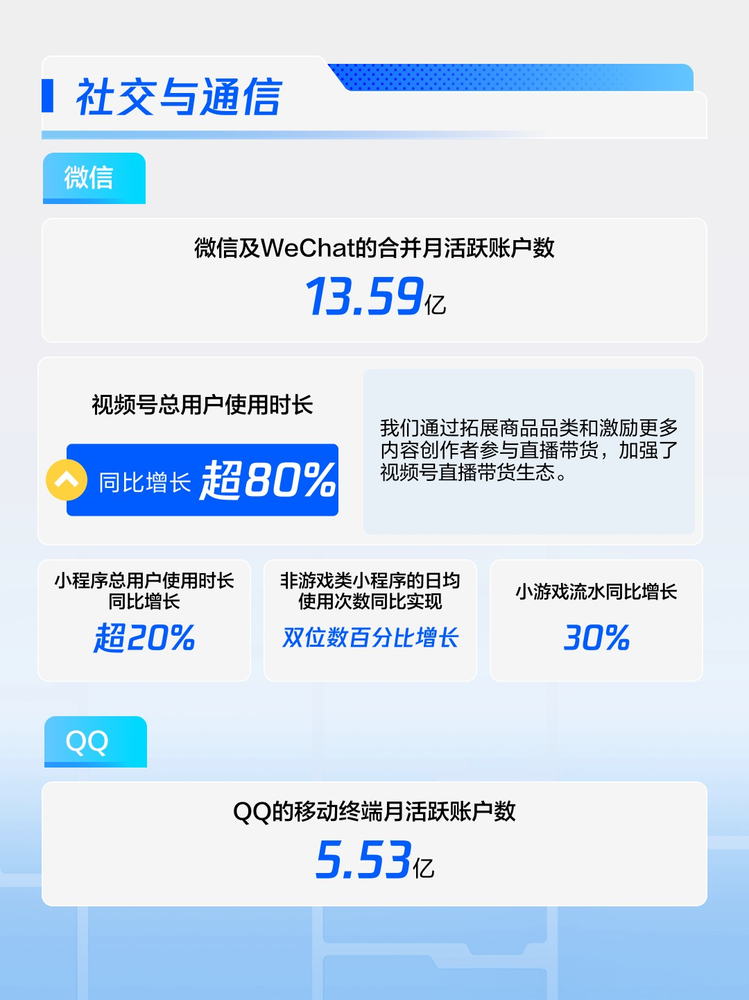

__微信公众号文章地址：[老罗实盘周记-20240518](https://mp.weixin.qq.com/s/apcA4xqSnDu4Ft-s9pkNYg)__

```
老罗实盘周记，每周六更新。专注于股权投资、阅读、学习与个人成长，知行合一、日拱一卒、投资人生。微信公众号【老罗投资】，文章均首发于公众号。
```

### 1. 本周交易

无

### 2. 目前持仓

当前持有的股票包括：腾讯控股50.49%、洋河股份21.85%、分众传媒12.08%、中概互联5.19%、海康微视4.65%、恒瑞医药0.88%。

此外还有少量现金，加上少量的上海机场、宋城演义、京沪高铁等股票，其份额较少，仅作为观察仓不进行记录。

**注：港股已换算为人民币**



### 3. 上周数据



### 4. 持仓收益

本周：老罗的持仓<span class="red">+4.75%</span>，沪深300指数<span class="red">+0.32%</span>。 

截止到今日，老罗实盘今年收益率为<span class="red">+15.80%</span>，沪深300指数今年收益率为<span class="red">+7.19%</span>。

### 5. 本周事项

+ 腾讯Q1财报
+ 央行下调房贷利率

==只对持股和交易感兴趣的朋友，读到这里就可以退出了。后面是对上述事件的展开，无新内容。==

#### 5.1 腾讯Q1财报

**腾讯2024年一季度财报概览：**

腾讯于5月13日晚间公布了2024年第一季度的财务报告，显示公司营收达到1595亿人民币，同比增长6%，环比增长3%。归属于母公司的净利润为419亿人民币，同比大幅增长62%，环比增长55%。在非国际财务报告准则下，归属于母公司的净利润为503亿人民币，同比增长54%，环比增长18%。此前市场对腾讯的一致性预期净利润为463亿港元，同比预期增长24%。即便是最乐观的分析师预测也仅为36%的增长，然而腾讯的实际业绩大幅超出了这些预期。



**社交与通信：**

微信及WeChat的合并月活跃用户数继续保持稳定增长，自2022年三季度起稳定在13亿以上。QQ移动端月活跃用户数在2023年一季度达到近6亿，之后虽有下滑，但依然保持在5.5亿以上。2024年一季度，视频号和小程序表现突出，视频号用户总使用时长同比增长超过80%，是朋友圈使用时间的两倍多。腾讯通过扩展商品品类和激励内容创作者参与直播带货，加强了视频号的直播带货生态。小程序用户总使用时长同比增长超过20%，非游戏类小程序日均使用次数实现双位数增长，特别是在生产力工具、餐饮服务和交通等领域，表现亮眼。小游戏流水同比增长30%。



**业务营收分析：**

增值业务营收为786亿人民币，同比下降0.9%，环比增长13.8%。游戏业务营收为481亿人民币，同比下降0.4%，环比增长17.6%。本土游戏营收为345亿人民币，虽然总流水恢复同比增长3%，但由于收入递延，营收同比下降1.7%，环比增长27.8%，主要是受到了春节期间旺季影响。海外游戏营收为136亿人民币，同比增长3%，环比下降2.2%，占总收入的比例保持在30%左右，约为本土游戏收入的四成。

社交网络业务营收为305亿人民币，同比下降1.6%。音乐和长视频付费会员数分别同比增长20%和8%，达到1.14亿和1.16亿。然而，这些增长未能抵消音乐直播和游戏直播服务收入的下降，导致社交网络业务整体营收下降。

广告业务营收为265亿人民币，同比增长26%，主要是由于微信视频号、小程序、公众号和搜一搜的增长。这一增长得益于用户参与度的提升和AI驱动的广告技术平台的不断升级。

金融科技及企业服务营收为523亿人民币，同比增长7%。金融科技收入实现了个位数百分比的同比增长，而企业与云服务实现了超过10%的同比增长率。

**净利润增涨分析：**

初看6%的营收增长和54%的净利润增长，许多人或许会好奇，这惊人的净利润增长是如何实现的，是否有不实之处？通过深入分析，可以发现净利润的显著增长主要归因于以下三个关键因素：

整体毛利率从45%显著提高到53%，这一显著的增长主要得益于视频号、搜索广告和小游戏等高毛利产品所占比例的提升。这些产品不仅优化了公司的收入结构，还增强了公司的盈利能力，使其更加稳定和持久，这一点也在连续几个季度的财务报告中得到了明显体现。

与此同时，尽管高利润收入大幅增长，营业成本却同比下降了8%，这一下降主要归因于腾讯视频内容成本的降低以及云业务部署成本的减少。腾讯的大部分业务已经迁移到云端，大量的成本已经在早期的云开发中投入。这就像商场已经建成，建设成本已经支付，后续的运营利润几乎全部为净利润。

管理费用率同比下降了5%，员工人数从10.54万小幅减少到10.47万，降本增效的措施仍在继续。然而与阿里巴巴一季度减少1.4万名员工相比，腾讯的裁员幅度并不大，这说明降本并非通过大规模裁员来实现的。

**总结：**

在2024年一季度，腾讯的增值业务营收表现疲软，尤其是本土游戏和社交网络业务均出现同比负增长。金融科技及企业服务的营收增速放缓，结束了此前连续四个季度的双位数增长。尽管广告业务营收保持了较高的同比增速，但由于其他业务板块增长乏力，腾讯一季度的总营收增长仅为6%出头。 尽管营收增长速度依然平缓，但腾讯公司盈利能力显著提升，赚取真金白银的能力依旧强劲，可以称之为大象起舞。

#### 5.2 央行下调房贷利率

中国人民银行、国家金融监管总局、住建部、自然资源部等多部委于2024年5月17日联合发布了一系列政策，意在刺激房地产市场，加快去库存。这些政策包括扩大保障性住房救助范围、降低最低首付比例、调整公积金贷款利率、取消住房商业贷款利率下限，以及鼓励购买存量房作为保障性住房。

根据中国人民银行及国家金融监督管理总局发布的《关于调整个人住房贷款最低首付款比例政策的通知》，首套住房商业性个人住房贷款的最低首付款比例调整为不低于15%，而二套住房的相应比例调整为不低于25%。

自2024年5月18日起，个人住房公积金贷款利率下调0.25个百分点。具体调整如下：5年及以下首套个人住房公积金贷款利率调整至2.35%，5年以上调整至2.85%；5年及以下第二套个人住房公积金贷款利率不低于2.775%，5年以上不低于3.325%。

国家统计局发布的数据显示，2024年1-4月全国新建商品房销售面积同比下降20.2%，至2.9亿平方米。截至4月末，商品房待售面积同比增长15.7%，达到7.46亿平方米。4月份70个大中城市中新房价格下跌的城市数量由57个增至64个，而二手房价上涨的城市仅有1个，其余69个城市房价均呈下跌趋势。

当前房地产市场面临较大的库存及去化压力，这已成为行业风险的主要来源。房地产行业资金的大量投入在土地购置和银行贷款利息上，导致其投资回报并不理想，类似于查理·芒格所描述的『利润都在院子里那些旧设备上』的行业，因此房地产并非一个理想的投资选择。

### 6. 本周读书

本周无读完书籍。

### 7. 本周运动

本周遛弯6次，夏天到了，得加速减重了。

祝大家周末快乐，身体健康！

```
老罗实盘周记，每周六更新。专注于股权投资、阅读、学习与个人成长，知行合一、日拱一卒、投资人生。微信公众号【老罗投资】，文章均首发于公众号。
免责声明：本公众号只作为本人的投资日志记录，本文中提及的个股都有腰斩或血本无归的风险，本人不做任何投资建议，投资请坚持独立思考。
```

__微信公众号文章地址：[老罗实盘周记-20240518](https://mp.weixin.qq.com/s/apcA4xqSnDu4Ft-s9pkNYg)__