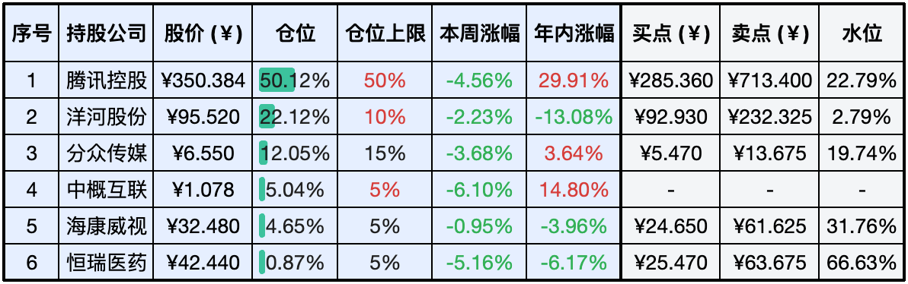
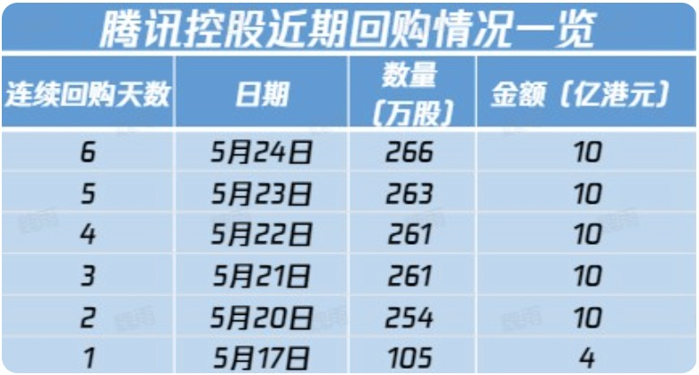
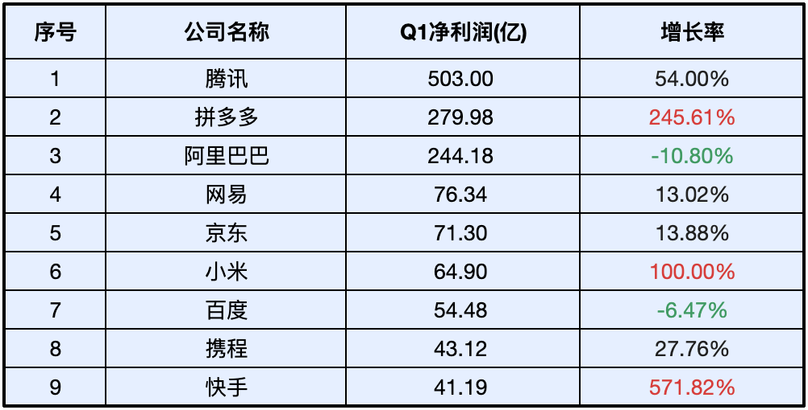

__微信公众号文章地址：[老罗实盘周记-20240525](https://mp.weixin.qq.com/s/oLEe4Nu8w-6aG3386nFAPw)__

```
老罗实盘周记，每周六更新。专注于股权投资、阅读、学习与个人成长，知行合一、日拱一卒、投资人生。微信公众号【老罗投资】，文章均首发于公众号。
```

### 1. 本周交易

无

### 2. 目前持仓

当前持有的股票包括：腾讯控股50.12%、洋河股份22.12%、分众传媒12.05%、中概互联5.04%、海康微视4.65%、恒瑞医药0.87%。

此外还有少量现金，加上少量的上海机场、宋城演义、京沪高铁等股票，其份额较少，仅作为观察仓不进行记录。

**注：港股已换算为人民币**



### 3. 上周数据


### 4. 持仓收益

本周：老罗的持仓<span class="green">-4.10%</span>，沪深300指数<span class="green">-2.08%</span>。 

截止到今日，老罗实盘今年收益率为<span class="red">+11.70%</span>，沪深300指数今年收益率为<span class="red">+4.97%</span>。

### 5. 本周事项

+ 腾讯回购和DNF手游
+ 分众传媒2023年度业绩说明会要点整理
+ 中国互联网公司一季度利润增速明显

==只对持股和交易感兴趣的朋友，读到这里就可以退出了。后面是对上述事件的展开，无新内容。==

#### 5.1 腾讯回购和DNF手游

上周腾讯发布了财报，随后启动了每日10亿港币的股票回购计划。有趣的是在财报发布前，尽管没有明显的利好消息和回购行动，腾讯的股价却连续上涨超过25%。然而在财报公布后，尽管公司利润增长炸裂，并且公司恢复了大规模回购，股价却在本周内依然下跌了4.56%，这跟谁说理去？



股价的波动并不总是与公司的基本面直接相关，而是受到多种因素的影响，包括市场情绪(本周两岸关系陡然紧张)、宏观经济状况以及投资者对未来的预期等。股价的短期波动可能并不总是反映公司的真实价值，投资者在做出投资决策时，应综合考虑公司的长期增长潜力、行业趋势以及市场环境等多种因素，而不应仅仅基于短期股价波动。

本周备受期待的DNF手游《地下城与勇士：起源》终于结束了长达9年的等待，开启了公测。公测之初，游戏异常火爆，吸引了大量玩家的关注和参与。然而好景不长，没过几天，游戏的口碑开始崩塌。许多玩家吐槽，认为这不过是一款以氪金为主要盈利模式的页游。在App Store上，游戏的评分也迅速下降至3.7分。

作为一款情怀游戏，DNF手游需要用心运营，以满足玩家的期待和需求。游戏开发者和运营团队应该重视玩家的反馈，不断优化游戏体验，而不是仅仅将情怀和玩家视为盈利的工具。游戏公司应该认识到，只有真正关注和满足玩家的需求，才能赢得玩家的信任和支持。将玩家当作捞钱的途径，最终只会损害游戏的口碑和公司的长远发展。

#### 5.2 分众传媒2023年度业绩说明会要点整理

**1. 市场份额概览**

中国广告市场：2023年市场规模达到1.4万亿人民币，分众传媒占据0.8%的份额。

户外广告市场：2023年市场规模为820.5亿人民币，分众传媒在该领域占比高达14%。

**2. 财务问题**

股权转让方面，2016年分众传媒将上海科非公司的股权转让给上海钦达公司，涉及金额2500万元。至今未收到款项，公司已对该笔应收款项计提100%的坏账准备。

**3. 韩国业务挑战**

亏损与减值，韩国业务在多年盈利后突然遭遇大幅亏损。原因分析如下：

宏观经济挑战，过去两年，韩国宏观经济面临挑战，中小型及初创企业受创严重，广告市场持续低迷。

市场需求下降，受宏观经济影响，新客户和中小型客户需求减少，导致分众韩国收入下降。

竞争地位，分众在海外市场尚未形成牢固的护城河，面临可替代性竞争。

**4. 楼宇媒体业务恢复情况**

营收与点位增长：2023年楼宇媒体板块营收恢复至2021年同期的82%，而自营点位数量达到2021年末的134%。

租赁费用：2023年支付的租赁费用（主要为点位租金）为2021年的109%。

经营效率：尽管点位大幅增加，租赁费用微升，但营收尚未恢复至2021年水平，反映出经营效率有所下降。

#### 5.3 中国互联网公司一季度利润增速明显

近期，中国互联网公司陆续发布了一季度的财报，其中大多数公司的净利润增速表现抢眼。



在众多公司中，除了阿里巴巴和百度之外，其他公司均实现了两位数以上的净利润增长。特别值得一提的是拼多多、小米和快手，它们的净利润增长达到了三位数。拼多多的表现尤为突出，其在第一季度的净利润已经超过了阿里巴巴，成为仅次于未上市的字节跳动和腾讯的中国互联网公司中盈利能力第三强的公司。

尽管互联网头部公司的净利润增速显著，但同时也传出了一些公司计划在年中进行大规模裁员的消息。京东作为裁员事件的一个例子，推出了新的考勤制度。该制度规定，如果员工在上午9点之前未到岗，将需要核查原因；对于刚好在9点到达的员工，也需要进行登记。考勤问题严重的员工，将需要在集团的例会上进行检讨。此外，下午1点30分至晚上8点期间，在办公楼外抽烟或散步的员工也将受到严格检查并进行登记。公司每周还将通过ERP系统抽查员工的工作饱和度，并鼓励员工之间相互监督举报，甚至拍照记录。

一些企业在盈利的同时进行裁员，这种做法可能会带来一系列负面连锁反应。裁员导致失业人数增加，进而影响消费者的购买力和整体消费水平。消费能力的下降可能会进一步加剧市场环境的恶化，对经济产生不利影响。

那些资本家和企业决策者，他们是否真正理解裁员对市场环境和自身长远发展的潜在影响？是否认识到企业利润的增长不应该以牺牲员工利益和社会责任为代价？

对于那些在盈利的同时进行裁员的公司，建议投资者保持警惕并慎重考虑。投资决策应该基于对企业社会责任和可持续发展能力的全面评估，远离那些忽视社会责任、以牺牲员工利益为代价追求短期利润的公司，可能是更为明智的选择。

### 6. 本周读书

本周无读完书籍，最近有点懒惰了。

### 7. 本周运动

本周遛弯5次，最近喝酒有点多，并且吃了不少榴莲这种高热量水果(今年榴莲泛滥成灾了)，体重基本没有变化。

祝大家周末快乐，身体健康！

```
老罗实盘周记，每周六更新。专注于股权投资、阅读、学习与个人成长，知行合一、日拱一卒、投资人生。微信公众号【老罗投资】，文章均首发于公众号。
免责声明：本公众号只作为本人的投资日志记录，本文中提及的个股都有腰斩或血本无归的风险，本人不做任何投资建议，投资请坚持独立思考。
```

__微信公众号文章地址：[老罗实盘周记-20240525](https://mp.weixin.qq.com/s/oLEe4Nu8w-6aG3386nFAPw)__