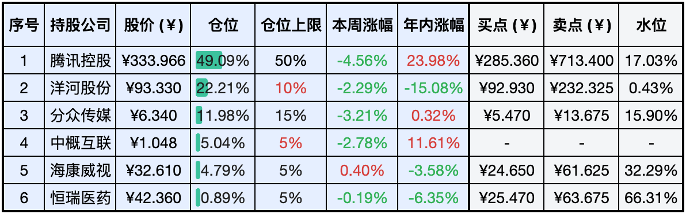
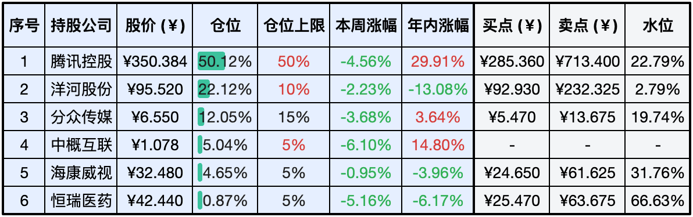
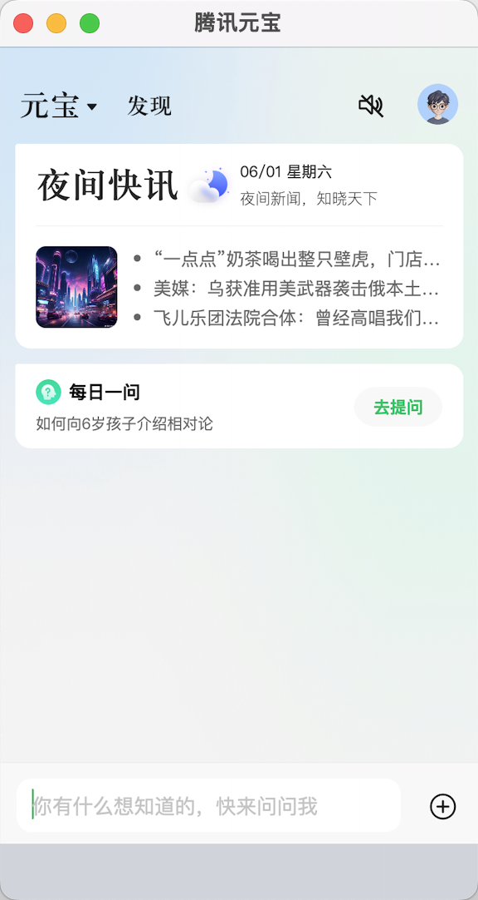

__微信公众号文章地址：[老罗实盘周记-20240601-儿童节快乐](https://mp.weixin.qq.com/s/1L46GRtxixK7RCuH-yrpkg)__

```
老罗实盘周记，每周六更新。专注于股权投资、阅读、学习与个人成长，知行合一、日拱一卒、投资人生。微信公众号【老罗投资】，文章均首发于公众号。
```

### 1. 本周交易

无

### 2. 目前持仓

当前持有的股票包括：腾讯控股49.09%、洋河股份22.21%、分众传媒11.98%、中概互联5.04%、海康微视4.79%、恒瑞医药0.89%。

此外还有少量现金，加上少量的上海机场、宋城演义、京沪高铁等股票，其份额较少，仅作为观察仓不进行记录。

**注：港股已换算为人民币**



### 3. 上周数据



### 4. 持仓收益

本周：老罗的持仓<span class="green">-3.88%</span>，沪深300指数<span class="green">-0.60%</span>。 

截止到今日，老罗实盘今年收益率为<span class="red">+7.82%</span>，沪深300指数今年收益率为<span class="red">+4.34%</span>。

### 5. 本周事项

+ 5月份制造业PMI回落
+ 腾讯分红预计下周到账
+ 腾讯元宝发布

==只对持股和交易感兴趣的朋友，读到这里就可以退出了。后面是对上述事件的展开，无新内容。==

#### 5.1 5月份制造业PMI回落

经过两个月的短暂回升，制造业采购经理指数（PMI）再次回落至收缩区间。5月31日，国家统计局公布的最新数据显示，5月份制造业PMI为49.5%，较上月下降0.9个百分点，跌破50%的荣枯线，表明制造业活动有所收缩。

从13个分项指数来看，与上月相比，购进价格指数、出厂价格指数和从业人员指数呈现上升态势，升幅在0.1至2.9个百分点之间。而生产指数、新订单指数、新出口订单指数等多个指数均出现下降，降幅在0.3至2.3个百分点之间。

在当前复杂多变的外部环境和内部形势下，经济复苏的前景仍不明朗。老罗认为，未来政府将继续出台一系列经济刺激政策。在这种情况下保持耐心和定力显得尤为重要，以便更好地把握未来的投资机会。

#### 5.2 腾讯分红预计下周到账

腾讯于周五顺利完成分红，港股和美股账户均在当日收到了款项。对于老罗这样通过港股通投资腾讯的投资者，分红预计将在下周二或三到账。

关于分红到账后的资金使用计划，老罗倾向于先将资金存放至券商的天添利理财产品中。一方面，尚未确定具体的投资目标；另一方面，洋河股份的仓位尚未调低至10%。因此保持充足的现金储备是明智之举。在当前市场环境下，机会随时可能出现，一旦有机会老罗将迅速采取行动。

#### 5.3 腾讯元宝发布

5月30日，腾讯宣布上线App腾讯元宝，这是一款基于腾讯混元大模型的C端应用，苹果及安卓应用商店均都已经开放下载。

老罗下载了iOS手机与macOS端的App，在macOS端并没有单独做优化，但也不影响使用体验，macOS端界面如下：



腾讯元宝App集成了先进的AI技术，提供包括AI搜索、AI总结和AI写作在内的核心功能。它针对日常生活场景，推出了一系列特色AI应用，例如个性化AI头像、口语练习助手和全能翻译官等。此外，腾讯元宝还引入了创新玩法，如创建个人智能体。

老罗之前用得比较多的是ChatGPT、Kimi和Coze等AI应用。随着腾讯元宝的发布，可供的选择更多了。

### 6. 本周读书

本周无读完书籍。

### 7. 本周运动

本周遛弯5次，天气越来越热，肚子快藏不住了。

祝小朋友和大孩子们儿童节快乐！

```
老罗实盘周记，每周六更新。专注于股权投资、阅读、学习与个人成长，知行合一、日拱一卒、投资人生。微信公众号【老罗投资】，文章均首发于公众号。
免责声明：本公众号只作为本人的投资日志记录，本文中提及的个股都有腰斩或血本无归的风险，本人不做任何投资建议，投资请坚持独立思考。
```

__微信公众号文章地址：[老罗实盘周记-20240601-儿童节快乐](https://mp.weixin.qq.com/s/1L46GRtxixK7RCuH-yrpkg)__