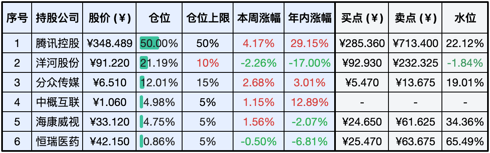
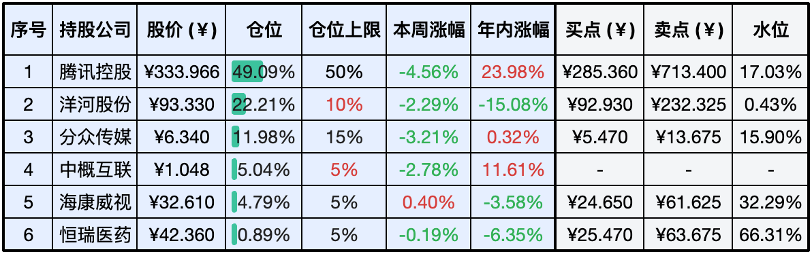

__微信公众号文章地址：[老罗实盘周记-20240608-端午安康](https://mp.weixin.qq.com/s/PNF9sAGdfaQ7xNEXs4OcIQ)__

```
老罗实盘周记，每周六更新。专注于股权投资、阅读、学习与个人成长，知行合一、日拱一卒、投资人生。微信公众号【老罗投资】，文章均首发于公众号。
```

### 1. 本周交易

无

### 2. 目前持仓

当前持有的股票包括：腾讯控股50.00%、洋河股份21.19%、分众传媒12.01%、中概互联4.98%、海康微视4.75%、恒瑞医药0.86%。

此外还有少量现金，加上少量的上海机场、宋城演义、京沪高铁等股票，其份额较少，仅作为观察仓不进行记录。

**注：港股已换算为人民币**



### 3. 上周数据



### 4. 持仓收益

本周：老罗的持仓<span class="red">+2.71%</span>，沪深300指数<span class="green">-0.16%</span>。 

截止到今日，老罗实盘今年收益率为<span class="red">+10.53%</span>，沪深300指数今年收益率为<span class="red">+4.17%</span>。

### 5. 本周事项

+ 分众分红下周到账
+ 洋河股东大会
+ 腾讯分红到账

==只对持股和交易感兴趣的朋友，读到这里就可以退出了。后面是对上述事件的展开，无新内容。==

#### 5.1 分众分红下周到账

近日，分众传媒发布通知，宣布实施2023年度权益分派，向全体股东每10股派发3.3元现金（含税）。股权登记日定于6月12日，当天收盘应该就能收到分红，其中江南春的分红超过11亿，这才是有钱人的赚钱方式！

收到分红后，可能会继续增持分众传媒的股份。目前现金比例已超过5%，结合计划减持10%+仓位的洋河股份，以及即将到账的分红，预计将有近20%的现金可供支配，老罗还从来没有打过这么富裕的仗。

#### 5.2 洋河股东大会

洋河股份于6月7日举办了2023年度股东大会，吸引了超过200名股东现场参加。鉴于登记参会人数超过原会议场地容量，公司提前三天将会议地点调整至宿迁恒力国际大酒店。在会议上，股东们普遍关注公司的发展战略、业绩增速放缓、分红与回购政策以及与今世缘的竞争等问题，公司管理层针对这些问题逐一进行了回应。

总体上大家对这次股东大会持正面态度，老罗认为，当前白酒行业正处于深度调整阶段，面临诸多挑战。因此投资者在投资时应该降低预期，以应对行业的困难时期。

#### 5.3 腾讯分红到账

周一腾讯的分红已经到账。然而令人感慨的是，港股通20%的分红税率实在过高，希望能尽快得到减免，毕竟港股账户和美股ADR都不需要扣除税款。

近期在使用腾讯元宝的过程中，感觉相当顺畅。我特别喜欢其中的每日要闻推荐功能以及自定义智能体功能，这些功能都非常实用。不过有一点令我不太理解：作为习惯在网页端使用腾讯元宝的用户，那些个性化的自定义智能体只能通过手机扫码来使用，这在一定程度上带来了不便。

### 6. 本周读书

#### 6.1《这才是我说的》

这本书是鲁迅先生作品的小全集，每一位中国人都应当阅读鲁迅的作品，这一观点堪称至理名言。

评分四颗星 ⭐️⭐️⭐️⭐️

#### 6.2《段永平传》

根据段永平的观点，随着企业规模的扩大，个人越来越难以保持一颗平常心，容易陷入超出能力范围的冒险。这里的平常心意味着回归事物的本质，而理解事物的本质并非易事。

以投资为例，投资主要是购买公司未来的净现金流，其他因素大多与之无关。然而，要搞清楚公司未来的净现金流相当困难。当投资者对公司未来的净现金流了解不足时，往往无法确定投资方向，导致投资行为演变为投机。

段永平所强调的平常心，即尽量避免涉足自己不熟悉的事物，即使它们利润丰厚，也应保持距离，理性应对。

评分四颗星 ⭐️⭐️⭐️⭐️

### 7. 本周运动

本周遛弯5次，体重变化不大。

祝大家端午安康，健康快乐。

```
老罗实盘周记，每周六更新。专注于股权投资、阅读、学习与个人成长，知行合一、日拱一卒、投资人生。微信公众号【老罗投资】，文章均首发于公众号。
免责声明：本公众号只作为本人的投资日志记录，本文中提及的个股都有腰斩或血本无归的风险，本人不做任何投资建议，投资请坚持独立思考。
```

__微信公众号文章地址：[老罗实盘周记-20240608-端午安康](https://mp.weixin.qq.com/s/PNF9sAGdfaQ7xNEXs4OcIQ)__