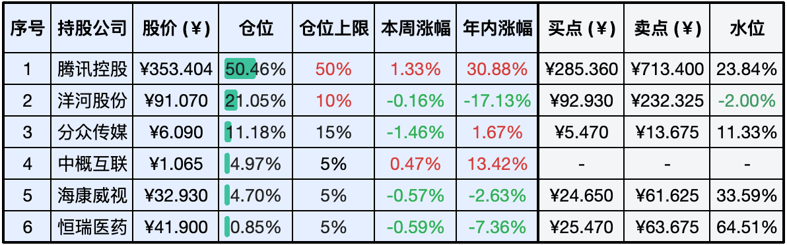
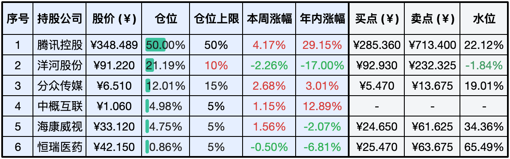

__微信公众号文章地址：[老罗实盘周记-20240615](https://mp.weixin.qq.com/s/nqvLOKxgJ8L7balqjQZlQg)__

```
老罗实盘周记，每周六更新。专注于股权投资、阅读、学习与个人成长，知行合一、日拱一卒、投资人生。微信公众号【老罗投资】，文章均首发于公众号。
```

### 1. 本周交易

无

### 2. 目前持仓

当前持有的股票包括：腾讯控股50.46%、洋河股份21.05%、分众传媒11.18%、中概互联4.97%、海康微视4.70%、恒瑞医药0.85%。

此外还有少量现金，加上少量的上海机场、宋城演义、京沪高铁等股票，其份额较少，仅作为观察仓不进行记录。

**注：港股已换算为人民币**



### 3. 上周数据



### 4. 持仓收益

本周：老罗的持仓<span class="red">+0.53%</span>，沪深300指数<span class="green">-0.91%</span>。 

截止到今日，老罗实盘今年收益率为<span class="red">+11.06%</span>，沪深300指数今年收益率为<span class="red">+3.22%</span>。

### 5. 本周事项

本周公司组织团建旅游，请假一次，只更新持仓收益。

### 6. 本周读书

#### 6.1《可是你真的真的很可爱》

成长的烦恼有千百种，唯有快乐永远相通。非常治愈的漫画，推荐一读。

评分四颗星 ⭐️⭐️⭐️⭐️

#### 6.2《没什么大不了：做不被情绪支配的自己》

人如果不按自己所想的去活，就会按自己所活的去想。

评分四颗星 ⭐️⭐️⭐️⭐️

#### 6.3《聪明的老板不苛责摸鱼的人》

摸鱼不是摆烂，满血复活才能高效工作生活！学习>摸鱼>工作。

评分四颗星 ⭐️⭐️⭐️⭐️

### 7. 本周运动

本周遛弯6次，体重变化不大。

祝大家周末愉快，身体健康！

```
老罗实盘周记，每周六更新。专注于股权投资、阅读、学习与个人成长，知行合一、日拱一卒、投资人生。微信公众号【老罗投资】，文章均首发于公众号。
免责声明：本公众号只作为本人的投资日志记录，本文中提及的个股都有腰斩或血本无归的风险，本人不做任何投资建议，投资请坚持独立思考。
```

__微信公众号文章地址：[老罗实盘周记-20240615](https://mp.weixin.qq.com/s/nqvLOKxgJ8L7balqjQZlQg)__