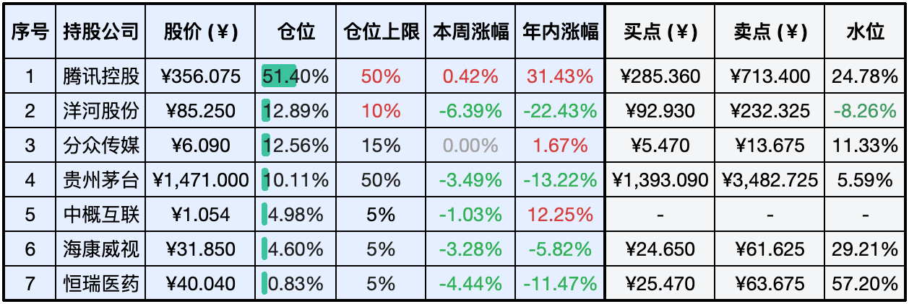
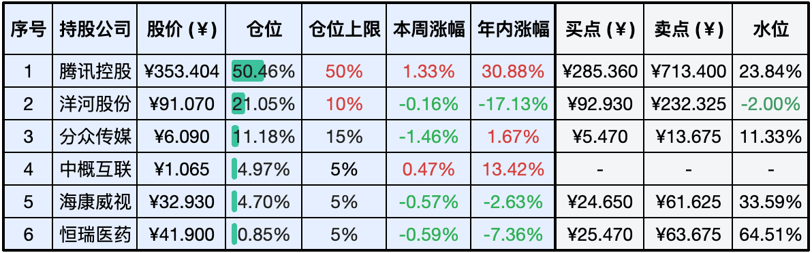

__微信公众号文章地址：[老罗实盘周记-20240622](https://mp.weixin.qq.com/s/1fsQ3CriyzL50rltVJ5ntg)__

```
老罗实盘周记，每周六更新。专注于股权投资、阅读、学习与个人成长，知行合一、日拱一卒、投资人生。微信公众号【老罗投资】，文章均首发于公众号。
```

### 1. 本周交易

+ 周二(6月18日)卖出部分洋河股份(002304)，卖出价格为90.083元人民币；买入贵州茅台(600519)，买入价格为1540.000元人民币；买入分众传媒(002027)，买入价格为6.040元人民币。
+ 周四(6月20日)买入分众传媒(002027)，买入价格为5.990和6.010元人民币。

### 2. 目前持仓

当前持有的股票包括：腾讯控股51.40%、洋河股份12.89%、分众传媒12.56%、贵州茅台10.11%、中概互联4.98%、海康微视4.60%、恒瑞医药0.83%。

此外还有少量现金，加上少量的上海机场、宋城演义、京沪高铁等股票，其份额较少，仅作为观察仓不进行记录。

**注：港股已换算为人民币**



### 3. 上周数据



### 4. 持仓收益

本周：老罗的持仓<span class="green">-1.25%</span>，沪深300指数<span class="green">-1.30%</span>。 

截止到今日，老罗实盘今年收益率为<span class="red">+9.81%</span>，沪深300指数今年收益率为<span class="red">+2.83%</span>。

### 5. 本周事项

+ 本周交易说明
+ 人生尽力做好三件事

==只对持股和交易感兴趣的朋友，读到这里就可以退出了。后面是对上述事件的展开，无新内容。==

#### 5.1 本周交易说明

本周，受诸多不利因素影响，白酒行业整体跌幅超过5%，即便是茅台也进入了相对合理的估值区间。在此背景下，我卖出了约一半的洋河股份，将其仓位调整至约10%，并相应地买入了贵州茅台。巧合的是，买入茅台后恰逢其分红，次日分红款项便顺利到账，且未产生扣税。剩余的部分资金，都分给了6块出头的分众传媒。

展望未来，若茅台股价跌至1400元以内，我可能会继续买入。届时我或许会进一步减持洋河和海康威视，以腾挪资金换取更多的茅台股份。

尽管此次投资洋河造成了超过六位数的损失(可能是永久性的)，但我仍会保留一部分洋河股份，将其作为犯错的经验样本。这将时刻提醒我：在投资时，应优先选择行业内的佼佼者，以合理的价格买入卓越的公司，而非贪图便宜而选择平庸的企业。

#### 5.2 人生尽力做好三件事

本周旗下子公司也没有特别值得一提的大事，就聊点其他的吧。

老罗已步入中年，经过十几年的工作生涯，对人生的下半场产生了些许疑惑：在有限的生命中，我们应该致力于哪些事情，又有哪些事情应尽量避免呢？老罗认为，健康、财富和良好的人际关系是人生中最为关键的三个要素。

在健康方面，我们既要关注身体健康，也要重视精神健康。为了保持身体健康，我们需要养成良好的作息习惯，定期进行锻炼，以及保持健康的饮食习惯。精神健康则涉及不断提升自我认知水平，以及保持乐观的心态，确保心理健康。

在财富方面，我们需兼顾主业、副业和理财。在工作中，我们要关注工作强度、薪资水平是否与自身专业技能相匹配。在选择副业时，要充分考虑个人兴趣和实际可行性。至于理财，关键在于合理规划财务，降低欲望，避免不必要的支出。

良好的人际关系则涵盖了亲情、爱情和友情。在与亲人相处时，我们应减少内耗，增加定期沟通以避免误解。在爱情中，我们要与伴侣相互扶持，加强交流。在友情方面，寻找志同道合的朋友，并尽量定期相聚。

若能实现这三个方面的目标，我们便能收获一个充实且美好的人生。

### 6. 本周读书

#### 6.1《父与子全集》

儿子不仅是父亲生命的延续，更是家庭爱与欢乐的核心。每一个关于成长的关键时刻，都在塑造着子女的未来。因此欣赏经典漫画《父与子》，无疑是一种值得投入时间的美好体验。

评分三星半 ⭐️⭐️⭐️❤️

#### 6.2《战胜市场：逆势投资的逻辑》

尽管吉姆·罗杰斯是这本书的署名作者，但其实际内容源自于日本独立财务顾问花轮阳子对他的一系列访谈。这些访谈的时间跨度从2021年10月至2022年5月，正值新冠疫情肆虐和俄乌战争爆发之际。

本书的核心内容涉及全球范围内经济泡沫的濒临破裂、俄乌冲突对世界的深远影响、日本未来的发展方向以及罗杰斯个人的投资策略。篇幅适中，便于读者一气呵成地阅读完毕。

评分四颗星 ⭐️⭐️⭐️⭐️

#### 6.3《漫长岁月，没有一天是适合上班的》

打工人会有很深的共鸣，仅仅依赖工作并不能有效应对生活中的核心挑战。随着年龄的增长进入中年阶段，更需要深入思考寻找能够切实解决问题的途径，比如副业，投资等等。

评分三星半 ⭐️⭐️⭐️❤️

#### 6.4《花小烙漫画科普》

在B站上经常能刷到花小烙的视频，而她的这本著作也同样出色，延续了其一贯轻松幽默的风格。在享受阅读的乐趣的同时，我们还能汲取到有趣且实用的新知识。

评分四颗星 ⭐️⭐️⭐️⭐️

### 7. 本周运动

本周遛弯5次，前期体重变化不大，但因为周四生病体重掉了一公斤多，这个夏天生病的频率有点高，需要加强锻炼了。

祝大家周末愉快，身体健康！

```
老罗实盘周记，每周六更新。专注于股权投资、阅读、学习与个人成长，知行合一、日拱一卒、投资人生。微信公众号【老罗投资】，文章均首发于公众号。
免责声明：本公众号只作为本人的投资日志记录，本文中提及的个股都有腰斩或血本无归的风险，本人不做任何投资建议，投资请坚持独立思考。
```

__微信公众号文章地址：[老罗实盘周记-20240622](https://mp.weixin.qq.com/s/1fsQ3CriyzL50rltVJ5ntg)__