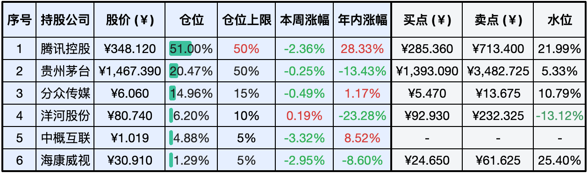
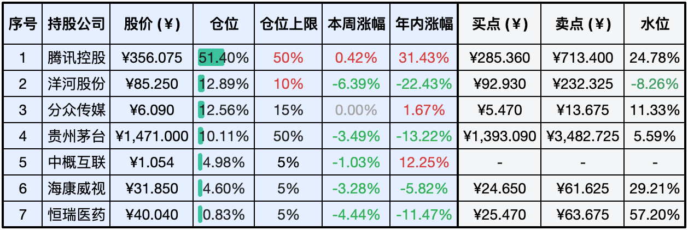

__微信公众号文章地址：[老罗实盘周记-20240629](https://mp.weixin.qq.com/s/qUWag7vbGNNXagPp2D_3iw)__

```
老罗实盘周记，每周六更新。专注于股权投资、阅读、学习与个人成长，知行合一、日拱一卒、投资人生。微信公众号【老罗投资】，文章均首发于公众号。
```

### 1. 本周交易

+ 周一(6月24日)卖出部分洋河股份(002304)，卖出价格为85.130元人民币；卖出部分海康威视(002415)，卖出价格为31.430和31.420元人民币；清仓京沪高铁(601816)，卖出价格为5.190元人民币。
+ 周一(6月24日)买入分众传媒(002027)，买入价格为6.050和6.070元人民币；买入贵州茅台(600519)，买入价格为1461.300元人民币。
+ 周二(6月25日)买入分众传媒(002027)，买入价格为5.910和5.970元人民币。
+ 周三(6月26日)买入分众传媒(002027)，买入价格为5.910元人民币。

### 2. 目前持仓

当前持有的股票包括：腾讯控股51.00%、贵州茅台20.47%、分众传媒14.96%、洋河股份6.20%、中概互联4.88%、海康微视1.29%。

此外还有少量现金，加上少量的恒瑞医药、上海机场、宋城演义等股票，其份额较少，仅作为观察仓不进行记录。

**注：港股已换算为人民币**



### 3. 上周数据



### 4. 持仓收益

本周：老罗的持仓<span class="green">-1.66%</span>，沪深300指数<span class="green">-0.97%</span>。 

截止到今日，老罗实盘今年收益率为<span class="red">+8.15%</span>，沪深300指数今年收益率为<span class="red">+2.06%</span>。

### 5. 本周事项

+ 本周交易说明
+ 股神巴菲特谈身后事

==只对持股和交易感兴趣的朋友，读到这里就可以退出了。后面是对上述事件的展开，无新内容。==

#### 5.1 本周交易说明

本周白酒行业市场表现持续低迷，整体呈现下跌态势。在这样的背景下老罗进行了部分仓位的调整。卖出了部分持有的洋河股份和海康威视股票，然后将这部分资金加上本周洋河的分红用于买入贵州茅台，还有一部分则给到了分众传媒。

经过这两周的仓位调整，老罗的可用投资额度已经全部用完，目前投资组合已经达到了满仓状态。在这种情况下，老罗后续会果断选择“躺平”，不会再进行大规模的买卖操作，而是静待市场变化，等待优秀企业的价值得到进一步体现。

投资不是一场短跑比赛，而是一场长跑。在这个过程中，耐心和定力至关重要。只有坚持价值投资，不被市场短期波动所左右，才能在长期内获得丰厚的回报。

#### 5.2 股神巴菲特谈身后事

周五美国媒体发布了对93岁高龄的奥马哈股神沃伦·巴菲特的专访，出人意料的是，这位传奇投资人竟在采访中畅谈自己的身后事。对于长期关注巴菲特的投资者来说，或许已经注意到，随着年事渐高，巴菲特的公开露面已变得相当稀少，除了每年5月的股东大会上例行的参与和答疑，他几乎全年都保持低调沉默。

众所周知，巴菲特曾坚定承诺，在有生之年或离世之际，将捐出个人财富的99%用于慈善事业，并且一直在身体力行地履行这一诺言。自2006年起，他便开始逐步将自己持有的伯克希尔·哈撒韦公司股票的一半捐赠出去，主要受益者是盖茨基金会以及巴菲特家族关联的四个慈善机构。在最新的采访中，巴菲特进一步透露了自己的遗产规划。

巴菲特表示，经过多次修改遗嘱，他现已确定了最终的遗产分配方案。在他过世后，所有剩余的财富将悉数投入到一个新设立的慈善信托基金中，这个基金将由他的女儿苏珊·巴菲特以及两个儿子霍华德·巴菲特和彼得·巴菲特共同负责监管，且三人需达成一致意见才能支配这笔资金。

尽管没有给子女们留下具体的指令，但巴菲特分享了他对慈善的看法：“这笔钱应致力于改善那些不如我们这般幸运的人的生活。”他坦言：“世界上有超过80亿人口，而我们一家人，无疑属于那最幸运的百分之一。帮助他人的方式多种多样。”

按照早在2006年就制定的计划，巴菲特原本打算逐年将财富分批捐给五个指定的基金会，每年捐出现有股权的5%。他也明确表示，这些捐赠仅在他健在期间有效。值得一提的是，在2021年5月比尔·盖茨与梅琳达宣布离婚后，为了顾及老友的感受，两人选择在伯克希尔股东大会结束后才公开这一消息。仅仅两个月后，巴菲特便宣布辞去盖茨基金会受托人的职位。梅琳达也于同年早些时候辞去了基金会职务，并在本月初彻底切断了与该机构的联系。

在这次深度专访中，巴菲特直截了当地表明：“我去世后，不会再有资金流向盖茨基金会。”根据盖茨基金会的数据显示，自2006年至2023年，巴菲特已向该机构累计捐赠了高达393亿美元的资金，并且这个数字仍在持续增长之中。

此外，伯克希尔公司在周五宣布，巴菲特将转换其持有的8674股A类股为B类股，以执行新一轮的捐赠计划。按照转换规则，每1股A类股可兑换为1500股B类股，同时A类股在投票权上具有更大权重。在这次捐赠行动中，盖茨基金会将获得价值40亿美元的B类股；苏珊·汤普森·巴菲特基金会得到4亿美元的股票；而三个子女各自管理的基金会则分别获得2.8亿美元的股份。

### 6. 本周读书

#### 6.1《大道无形：段永平》

段永平投资核心思想：什么是投资中做正确的事？买股票就是买公司，买公司就是买公司的未来现金流折现。怎么在投资中做正确的事？好的商业模式加上好的企业文化加上好的价格等于好的结果。

段永平的传记读过不少，每次阅读都有新收获，投资的道理就那么简单，为什么很少有人能做到？因为大多数人不愿意慢慢变富。

评分三星半 ⭐️⭐️⭐️❤️

### 7. 本周运动

本周因故没有遛弯，以节食为主，每顿饭尽量减少饭量，只吃七八成饱足矣。下周计划开始恢复低强度锻炼，遛弯心率确实达不到最低要求。

祝大家周末愉快，身体健康！

```
老罗实盘周记，每周六更新。专注于股权投资、阅读、学习与个人成长，知行合一、日拱一卒、投资人生。微信公众号【老罗投资】，文章均首发于公众号。
免责声明：本公众号只作为本人的投资日志记录，本文中提及的个股都有腰斩或血本无归的风险，本人不做任何投资建议，投资请坚持独立思考。
```

__微信公众号文章地址：[老罗实盘周记-20240629](https://mp.weixin.qq.com/s/qUWag7vbGNNXagPp2D_3iw)__