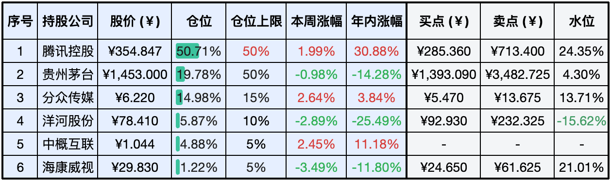
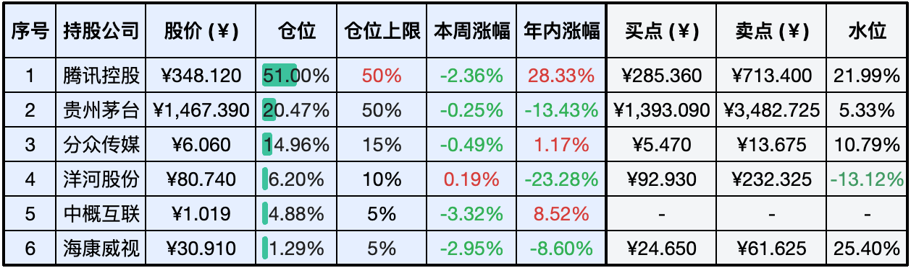

__微信公众号文章地址：[老罗实盘周记-20240706](https://mp.weixin.qq.com/s/W5RLFFNbcWWMB_wAk2VU6Q)__

```
老罗实盘周记，每周六更新。专注于股权投资、阅读、学习与个人成长，知行合一、日拱一卒、投资人生。微信公众号【老罗投资】，文章均首发于公众号。
```

### 1. 本周交易

无

### 2. 目前持仓

当前持有的股票包括：腾讯控股50.71%、贵州茅台19.78%、分众传媒14.98%、洋河股份5.87%、中概互联4.88%、海康微视1.22%。

此外还有少量现金，加上少量的恒瑞医药、上海机场、宋城演义等股票，其份额较少，仅作为观察仓不进行记录。

**注：港股已换算为人民币**



### 3. 上周数据



### 4. 持仓收益

本周：老罗的持仓<span class="red">+1.22%</span>，沪深300指数<span class="green">-0.88%</span>。 

截止到今日，老罗实盘今年收益率为<span class="red">+9.37%</span>，沪深300指数今年收益率为<span class="red">+1.21%</span>。

### 5. 本周事项

+ 腾讯回购上半年总结
+ 腾讯游戏2024年第二季度表现出色
+ 茅台1935暂停发售
+ 洋河近期连续下跌

==只对持股和交易感兴趣的朋友，读到这里就可以退出了。后面是对上述事件的展开，无新内容。==

#### 5.1 腾讯回购上半年总结

腾讯在2024年上半年可是拼了命地回购股票，总共花了523亿港元，这比2023年全年还多多了。这钱砸的，足以看出腾讯对自己股价和未来发展的满满信心。

来看看具体的数字：上半年就回购了523亿港元，二季度更是疯狂，单季度就花了375亿港元，平均每天回购9.87亿港元，创下了历史记录。而且腾讯还打算把2024年的回购规模翻一番，至少要到1000亿港元。

为什么要这么大规模回购呢？首先腾讯这是向市场传递信心，想让股价稳一稳，给股东们多赚点钱。其次也是为了应对大股东Prosus的减持，不能让市场因为大股东减持而乱了套。最后，回购也表明了腾讯对未来发展的乐观态度，觉得自己的公司还能继续做大做强。

腾讯这么一通操作下来，不仅让自己人对公司更有信心了，也给整个市场带了好头，让投资人觉得腾讯的未来还是值得期待的。

#### 5.2 腾讯游戏2024年第二季度表现出色

腾讯游戏在2024年第二季度可真是火了一把，好几款新游戏一上线就表现惊艳，让腾讯在手机端的收入都涨了12%。特别是《DNF手游》，5月21号一公测就冲到了iOS游戏榜的第一名，连续29天都是榜首，前无古人。此外还有心动的《出发吧麦芬》和哔哩哔哩的《三国:谋定天下》，也是相当给力，上线后首月流水分别为1.87亿元和排名iOS畅销榜TOP4。

说到市场策略和版号，6月份有104款游戏拿到了版号，整个上半年有689款，比去年同期多了25.8%。腾讯也拿到不少版号，成功推出了多款新游，进一步稳住了它在游戏市场的老大地位。版号的稳定发放对腾讯来说太重要了，这意味着他们有更多的机会推出新游戏，业务也能持续增长，竞争力更强。对于未来，腾讯游戏肯定会继续抓住暑期档这个黄金时期，不断推出高质量的新游戏，优化现有的游戏产品，确保自己在游戏市场的领先地位。

总之，腾讯游戏在2024年第二季度的成功，靠的就是它的市场策略和新游戏的出色表现。有了稳定的版号发放，腾讯未来在游戏市场的发展更是如虎添翼。

#### 5.3 茅台1935暂停发售

茅台1935为啥暂停发货呢？简单来说，就是为了让市场更健康地发展。茅台官方说了，他们今年的任务已经完成得差不多了，所以决定先停一停发货。这么做是为了稳住价格，给大家一种信心。其实这段时间茅台1935的价格有点波动，批发价都降到800元以下了。这可能跟整体消费环境、淡季还有行业周期有关。

虽然茅台1935是茅台酱香系列里比较高端的产品，但大家对它的认可度还没那么高。大家在选千元档的白酒时，还是更喜欢五粮液和国窖1573。

茅台官方已经确认了暂停发货的事，还特意买了些低于官方指导价的产品来检测，结果发现都是假货。

总的来说，茅台1935暂停发货就是茅台集团对市场策略的一次调整。他们想通过控制数量来保证价格稳定，给大家信心。虽然短期内可能会影响到供应，但从长远来看，这对维护茅台的品牌形象和价格体系是有好处的。

除茅台1935外，泸州老窖国窖52度经典装，西凤酒老绿瓶系列也暂停了发售。

#### 5.4 洋河近期连续下跌

洋河股份的股票最近就像坐滑梯一样往下滑，这主要是因为管理层出了点争议、业绩不太行，再加上白酒行业的竞争越来越激烈了，咱们就来好好聊聊这背后的原因和影响。

股票下跌的原因，第一是管理层争议，大V唐书院在公众号上一顿炮轰，质疑洋河股份的管理层，还把手里的洋河股票全都抛了，这事儿一下子就炸开了锅。第二是业绩不佳，洋河股份在2023年和2024年一季度的成绩单都不好看，特别是2023年四季度，竟然还亏损了。第三是行业竞争加剧，现在白酒行业的日子都不好过，洋河股份的业绩增长预期也降了，还得跟泸州老窖、山西汾酒这些大佬抢市场。

股票下跌的影响，对洋河股份自己的影响是股价一路下跌，资金往外流，市值自然就缩水了。对整个白酒板块的影响，白酒板块现在整体都不太行，洋河股份和其他公司的股价都创了新低，整个板块都挺乏力的。

未来展望，洋河股份对策略进行了调整，洋河股份把业绩增长预期调低了，而且打算把重心放回江苏省内市场，这是在适应现在的市场环境。虽然洋河股份现在有点困难，但它毕竟是白酒行业的老牌强队，有一定的市场基础和品牌影响力，只要战略调整得当，未来还是有可能恢复增长的。

洋河股份的股票下跌，主要是因为公司现在面临的这些挑战。不过，洋河股份已经在想办法应对了，未来的情况还得看它的策略调整和市场反应。

### 6. 本周读书

#### 6.1《巴菲特的伯克希尔崛起：从1亿到10亿美元的历程》

巴菲特从1亿美元崛起到10亿美元，每个案例都堪称经典。他买入的企业并非一开始就盈利，其中亏损三年的企业屡见不鲜，如盖可保险、水牛城新闻晚报、华盛顿邮报等。

然而，耐心的等待为巴菲特带来了丰厚的回报，例如盖可保险全资子公司，买入价仅4520万美元加上23亿美元，如今每年都能赚取20亿美元，其中10亿美元来自投资业务，另10亿美元来自承保业务。

投资至少需要观察三年，以巴菲特推崇的辛普森为例，其收益率可与巴菲特相媲美，但也曾连续3年跑输大盘。辛普森的神奇之处在于，若1980年投资1万美元，在标普指数年化13.5%的情况下，25年后（2004年）可获得23万7801美元；而若投资给辛普森，年化收益率为20.3%，25年后则能获得101万5408美元。

经济下行期并不可怕，以1980-1983年美国经济衰退为例，商家广告预算大幅削减，企业艰难求生，虽然亏损严重，但在母公司的支持下，加上芒格律师团队的协助，最终熬垮了竞争对手。水牛城独家报社便是如此，1977年投入的3.55亿美元投资，最终收获了15倍的回报。

广告在经济下行期往往是最先被削减的预算，比如分众的业绩便受到了经济周期的显著影响。然而，品牌广告的需求始终存在，以可口可乐为例，持续且大量的广告和促销活动在消费者心中塑造了众多场景，如体育夺冠、家庭聚会、庆祝活动等，使得人们将愉悦时光与可乐紧密联系起来。尽管创造这些广告费用高昂，但其价值不言而喻。

金霸王则是用宝洁股票换来的，2015年以42亿美元的价格成交。当时金霸王销售增长放缓，市场份额下降，但巴菲特仍看好其潜力。原因在于：第一，吉列和宝洁管理层挥霍无度，巴菲特的收购价仅为20年前吉列收购金霸王时的1/3；第二，以换股形式完成交易，推迟了缴纳资本利得税；第三，金霸王账上拥有18亿美元现金，可供巴菲特进行投资；第四，金霸王仍占据全球24%的市场份额，现金流强劲，拿走18亿美元不影响其销售，表明其高净资产回报率仍可持续。第三和第四点，不禁令人联想到2024年的苹果。

巴菲特坚持每天阅读，他并非一个交易频繁的投资人，而是一个阅读密集型、思维密集型的人。在纷繁复杂的市场中，他有能力做到有效隔绝噪音，洞察真相。

评分三星半 ⭐️⭐️⭐️❤️

### 7. 本周运动

本周遛弯一次，体重保持不变。

祝大家周末愉快，身体健康！

```
老罗实盘周记，每周六更新。专注于股权投资、阅读、学习与个人成长，知行合一、日拱一卒、投资人生。微信公众号【老罗投资】，文章均首发于公众号。
免责声明：本公众号只作为本人的投资日志记录，本文中提及的个股都有腰斩或血本无归的风险，本人不做任何投资建议，投资请坚持独立思考。
```

__微信公众号文章地址：[老罗实盘周记-20240706](https://mp.weixin.qq.com/s/W5RLFFNbcWWMB_wAk2VU6Q)__