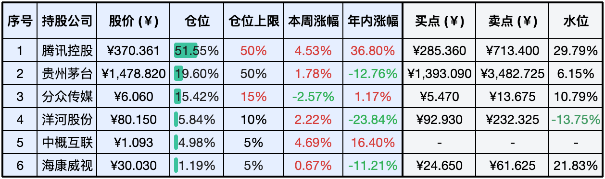

__微信公众号文章地址：[老罗实盘周记-20240713](https://mp.weixin.qq.com/s/QUN-GowM-aqVMllQjXi4VQ)__

```
老罗实盘周记，每周六更新。专注于股权投资、阅读、学习与个人成长，知行合一、日拱一卒、投资人生。微信公众号【老罗投资】，文章均首发于公众号。
```

### 1. 本周交易

+ 周四(7月11日)买入分众传媒(002027)，买入价格为5.760和5.700元人民币。

### 2. 目前持仓

当前持有的股票包括：腾讯控股51.55%、贵州茅台19.60%、分众传媒15.42%、洋河股份5.84%、中概互联4.98%、海康微视1.19%。

此外还有少量现金，加上少量的恒瑞医药、上海机场、宋城演义等股票，其份额较少，仅作为观察仓不进行记录。

**注：港股已换算为人民币**



### 3. 上周数据


### 4. 持仓收益

本周：老罗的持仓<span class="red">+3.02%</span>，沪深300指数<span class="red">+1.29%</span>。 

截止到今日，老罗实盘今年收益率为<span class="red">+12.39%</span>，沪深300指数今年收益率为<span class="red">+3.07%</span>。

### 5. 本周事项

+ 分众周四股价波动
+ 腾讯将年底13薪分摊到月薪
+ DNF手游登顶6月全球手游畅销榜
+ 证监会批准暂停转融券业务
+ IPO撤否刷新纪录
+ 美国九月降息可能性增加

==只对持股和交易感兴趣的朋友，读到这里就可以退出了。后面是对上述事件的展开，无新内容。==

#### 5.1 分众周四股价波动

本周四下午，美团要杀进梯广市场的消息一传开，分众传媒的股票就像坐滑梯一样往下跌，差点儿就跌了7%，看来大家都挺怕竞争的。那时候老罗正忙着干活，群里有人问分众咋跌这么惨。老罗一看，股价都快到5.4元的买点了，手头正好有点儿零花钱，那就先买点儿试试水，5.7元左右入手了一些。

到晚上，分众发布了一个澄清消息，原来他们和美团已经私下达成了共识，要携手加速开发三四线城市的电梯视频媒体，把那块被遗忘的大蛋糕给切一块。分众和美团觉得，现在国内市场这么大，咱们得联手帮中小品牌找找出路。分众在电梯广告上专业，美团有用户又有数据，咱们一起开到三四线城市去，开疆拓土！他们的目标很明确，就是在三四线城市电梯广告领域深耕细作，挖掘更多商机。

两个大佬联手，让广告和本地服务遍地开花，让更多人知道。先选几个城市试试水，看看效果怎么样。如果不错，就一步步扩大，让更多地方都能享受到这种新的广告方式。这样一来，分众和美团的牌子在三四线城市就更响了，中小企业也能得到更好的推广。

对分众来说，能更快地打入三四线城市，吸引更多客户。而且，他们的广告能让中小企业的产品更吸引人，销量飙升。对美团来说，他们手里有那么多本地商家，正好可以借分众的电梯广告，把广告从线上做到线下，吸引更多顾客。

总的来说，分众和美团这次合作，不仅能让双方在三四线城市大展拳脚，还能给那里的中小企业带来更多商机，这绝对是个双赢的好主意！

#### 5.2 腾讯将年底13薪分摊到月薪

腾讯真的把年底的十三薪加到每个月的工资里了，这个新规定从2024年7月1日开始，8月5号发工资的时候就能看到了。

他们这么做的意思是，想让员工每个月都能有更多的现金可用，特别是那些刚工作不久的年轻人，他们担心易居计划结束后工资会少。

具体来说，腾讯把服务奖平均分到每个月的固定工资里，这样大家每个月的钱就更多了。还有，那些享受易居计划的员工，他们的租房补贴也会分到每个月，让大家更安心地生活和工作。

这个调整让大家的月收入更高、更稳定，手里的钱也更多了。除了这些，腾讯还提高了基本工资的比例，减少了绩效奖金，想让整个薪酬体系更稳、更长久。

总的来说，腾讯这么做就是想让员工过得更好，工作更有劲头。他们真的很在乎员工的需求和生活质量，想让每个人都在这里过得开心、有归属感。

其他公司的老板们，别再把员工当牛做马了，他们才是你们公司最宝贵的财富。多关心关心他们，别老想着怎么省钱增效，把人当成作电池使用。

#### 5.3 DNF手游登顶6月全球手游畅销榜

DNF手游在2024年6月全球手游畅销榜上夺冠，真是牛气冲天！来看看具体数据：6月收入高达1.634亿美元，远超第二名的《RoyalMatch》。

自5月21日公测以来，DNF手游风光无限，连续38天霸占国内iPhone总榜和手游畅销榜双料冠军。6月28日虽然被腾讯自家的《王者荣耀》短暂超越，但7月2日又强势回归榜首。

再看看其他游戏，《RoyalMatch》虽然四次单月吸金超1亿美元，但仍不及DNF手游。《王者荣耀》虽然全球收入最高，但在6月还是败给了DNF手游。

DNF手游的成功，不仅彰显了腾讯在全球手游市场的实力，也进一步巩固了其游戏行业领头羊的地位。对其他腾讯游戏来说，DNF手游的成功也是个好消息，可能会带动整个品牌的全球影响力。

总之，DNF手游6月的出色表现，不仅让腾讯赚得盆满钵满，更证明了其在游戏开发和运营方面的卓越能力。

#### 5.4 证监会批准暂停转融券业务

证监会批准暂停转融券业务，这个决定从2024年7月11日开始执行，咱们来看看具体是怎么回事。

已有的转融券合约可以延期，但最晚9月30日要搞定。证券交易所把融券保证金比例从80%提到了100%。私募证券投资基金参与融券的保证金比例也从100%提高到了120%，这个新规定从2024年7月22日开始。

短期来看，暂停转融券业务让一些投资者资金紧张，市场抛售潮涌，大家信心受挫，市场波动加大。但长期来看，随着时间的推移，信心会慢慢恢复，监管部门的措施也让大家看到了他们对市场稳定的重视，投资者对市场监管的信心也增强了。

从2023年8月开始，证监会就采取了一系列措施来加强融券和转融券业务的监管，比如限制战略投资者配售股份出借，提高融券保证金比例，降低转融券市场化约定申报证券划转效率，暂停新增转融券规模等。

总的来说，证监会暂停转融券业务是为了审慎应对市场，保护大家的利益。同时，调整保证金比例等措施也是为了平衡市场风险和投资者保护。

#### 5.5 IPO撤否刷新纪录

到2024年7月7号，沪深北三家交易所停止审查的IPO企业已经有324家了，比上周还多了26家。跟2023年同一时期比，增长了141.79%。这数字不仅说明IPO撤否的数量激增，还显示出市场有很大的压力和挑战。

企业撤回IPO申请的理由五花八门，有的是因为公司基本情况变了，有的是选错了板块，还有的是申报材料有问题。监管的信号越来越强，现场检查也查得更严了，给大家一种严格监管的感觉。

IPO撤否可能会影响到投资者对市场的信心，特别是那些大IPO项目。那些本来准备用于IPO的钱，现在可能会投到别的项目或者公司去，这对相关行业或公司可能会有好处。有些行业可能会受到特别大的影响，比如农业科技。先正达撤回了650亿的IPO申请，这家农业巨头一撤，可能会影响到整个农业科技领域的投资和市场预期。

总的来说，IPO撤否创纪录这件事，既显示了市场有多大的压力和挑战，也反映了在严格的监管环境下，企业、中介机构、监管部门、投资者等各种角色之间的相互作用。

#### 5.6 美国九月降息可能性增加

根据芝加哥商品交易所（CME）的FedWatch工具分析，专家们现在觉得美联储9月降息的可能性已经超过70%了，比之前预测的六成还要高一成。甚至还有预测说，9月份降息的概率高达90%！全球各地的央行都在纷纷降息，这让美联储也感到了压力，可能不得不考虑在年内降息。

美国9月份的Markit制造业和服务业PMI初值都显示，经济活动有点放缓。美联储自己也说了，未来的经济走向很大程度上要看疫情怎么发展，他们会继续坚持宽松货币政策，直到通胀和就业都达到目标。

美联储主席鲍威尔在参议院作证时说，现在的限制性货币政策有助于平衡需求和供应，也能给通胀降降温。他强调，美联储的政策都是为了最大化就业和稳定物价，暗示他们在未来的货币政策上会非常谨慎。

总的来说，美国九月份降息的可能性确实越来越大，这主要是因为全球经济环境和美联储对当前经济的评估。但鲍威尔的态度也表明，美联储在降息这件事上会非常小心，确保政策能保障美国人民的就业和物价稳定。

注：FedWatch是由芝加哥商品交易所（CME）提供的一个工具，主要用于分析联邦公开市场委员会（FOMC）在未来会议中调整联邦基金利率目标的可能性。它通过利用芝商所上市的30天短期联邦基金期货（FedFund Futures, FF）的价格来进行计算，从而预测美联储未来的利率决策。

### 6. 本周读书

#### 6.1《食南之徒》

亲王出品，绝对精品！读完马伯庸的新小说《食南之徒》，我只能说，太马伯庸了！独特的叙事，幽默的语言，巧妙融合历史、文化、悬疑，让人回味无穷。

这本书讲的是爱吃的汉副使唐蒙在南越的美食冒险，他不小心卷入宫廷纷争，还成了“大内密探”，推理破案，毫不费力。南北对峙、族群隔阂、权位争斗，这局势错综复杂，他唯一能依靠的就是美食和那颗追求美食的心。

马伯庸说他在史料中偶然发现唐蒙和枸酱的故事，决定写这本书，向汉代的吃货致敬。就像《长安的荔枝》和《两京十五日》，这又是他从历史缝隙里挖出来的故事。通过这些小细节，我们可以窥见官场之道和人心险恶。这次，马伯庸又用他擅长的虚实结合手法，创造了一个引人入胜的世界。

马伯庸透露，为了写好主角的美食经历，他自己可是大吃特吃，结果减肥全泡汤了！他警告读者，别和主角太共情，不然你也得长胖！

《食南之徒》最吸引人的不仅是唐蒙的美食侦探故事，还有它展现的地理认知。我们现代人觉得地理关系显而易见，但这是经过长时间历史演化的结果。在唐蒙的时代，这些认知还是未知的，正是像他这样的探险家不断探索，才把未知变成已知，开启了汉文化向南拓展的大潮。

马伯庸还说，唐蒙其实是“南方丝绸之路”的开拓者。他因为吃了枸酱而开始寻味之旅，最后发现了通往南越的新路线。虽然书里的南越风土人情都有考古依据，但马伯庸也提醒大家，历史小说终究是虚构的。

值得一提的是，书中的很多美食现在还能吃到，比如椰子和杨桃，牛杂锅和裹蒸糕。不过最关键的枸酱，现在可不好找啦！这到底是什么味道，我们只能想象一下了。

评分四星 ⭐️⭐️⭐️⭐

### 7. 本周运动

本周遛弯两次，继续节食中。

祝大家周末愉快，身体健康！

```
老罗实盘周记，每周六更新。专注于股权投资、阅读、学习与个人成长，知行合一、日拱一卒、投资人生。微信公众号【老罗投资】，文章均首发于公众号。
免责声明：本公众号只作为本人的投资日志记录，本文中提及的个股都有腰斩或血本无归的风险，本人不做任何投资建议，投资请坚持独立思考。
```

__微信公众号文章地址：[老罗实盘周记-20240713](https://mp.weixin.qq.com/s/QUN-GowM-aqVMllQjXi4VQ)__