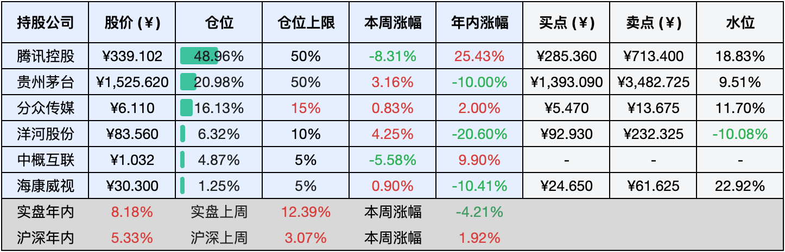
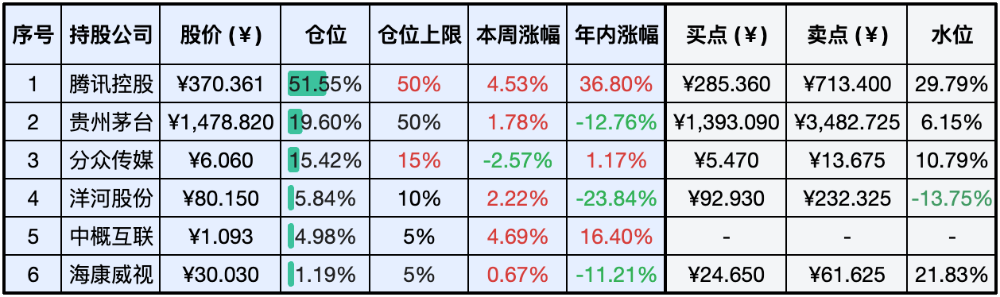

__微信公众号文章地址：[老罗实盘周记-20240720](https://mp.weixin.qq.com/s/C0zpradJyymSrO9W3WpP5A)__

```
老罗实盘周记，每周六更新。专注于股权投资、阅读、学习与个人成长，知行合一、日拱一卒、投资人生。微信公众号【老罗投资】，文章均首发于公众号。
```

### 1. 本周交易

无

### 2. 目前持仓

当前持有的股票包括：腾讯控股48.96%、贵州茅台20.98%、分众传媒16.13%、洋河股份6.32%、中概互联4.87%、海康微视1.25%。

此外还有少量现金，加上少量的恒瑞医药、上海机场、宋城演义等股票，其份额较少，仅作为观察仓不进行记录。

**注1：表底为截止到今日，老罗实盘和沪深300指数今年的收益率。**

**注2：表格中港股已按汇率换算为人民币。**



### 3. 上周数据



### 4. 本周事项

+ 腾讯停止回购及二季报预测
+ 茅台痛失A股市值第一宝座
+ 张坤旗下基金披露二季报
+ 特朗普遭枪击

==只对持股和交易感兴趣的朋友，读到这里就可以退出了。后面是对上述事件的展开，无新内容。==

#### 4.1 腾讯停止回购及二季报预测

因为腾讯8月14号发中报，所以这月进入静默期，从本周开始暂停回购。上半年腾讯回购了56次，累计1.55亿股，花了523.5亿港元。最低价271.2港元/股，最高价399.8港元/股。下半年腾讯还会继续大力回购，每天基本都要花10亿港元买自家股票。到目前为止，今年已经回购了613亿港元。

这周腾讯跌了不少，跌幅超过了8%，有人担心是不是回购停了会一直跌，还有人担心二季度业绩不好。其实回购停不停，跌不跌的，我也不知道，也不太在意。关于业绩，现在不少券商都给出了预测，我给大家简单说说，不过先提醒下，这些都不是正式业绩，只是券商们的预测，大家参考下就好。

瑞银把腾讯的目标价调到483港元，预计二季度收入增长6%，经调整后净利润增长34%到501亿元，主要是由于高利润业务增长和联营公司盈利能力增强。国海证券预估腾讯二季度营收1630亿元，同比增长9%。增值服务795亿元，同比增长7%；在线广告304亿元，同比增长22%；金融科技和企业服务517亿元，同比增长6%。还有国泰君安预计腾讯二季度营收1604亿元，同比增长7.5%。经调整后净利润477亿元，同比增长27%。游戏业务回暖，预计收入465亿元，同比增长4.6%。腾讯二季度游戏回暖、广告业务不错是大家的共识，这两个业务券商能根据各种渠道推算，所以误差不会太大。

腾讯二季度业绩还是很稳的，下半年可能更好，所以不用慌，暂停回购或其他原因带来的短期波动都不重要，业绩好才是核心，现在的腾讯还是低估且赚钱能力强的。

#### 4.2 茅台痛失A股市值第一宝座

最近贵州茅台在A股市值排名上掉了下来，这事儿让大家还挺惊讶的，毕竟茅台之前可是稳稳地坐在第一的位置上，但市场就是市场，变化无常，投资者的喜好也在变。

这次是中国移动冒了出来，市值一下子涨上去了超过了茅台。茅台这边倒是很淡定，他们认为市值波动是市场的事，不影响公司的日常运营和发展策略。茅台还是要坚持做好酒，创新技术，给消费者提供更好的东西。茅台虽然没了市值第一的头衔，但它的基本面没变，品牌影响力还在，市场地位也很稳。只要市场继续发展，消费者需求多样化，茅台还有机会保持稳健的发展。

茅台失去第一的位置，其实是市场变化的一个信号，对茅台来说，这是挑战也是机会。茅台得继续坚持品质，创新模式，应对越来越激烈的市场竞争和消费者需求的变化。

#### 4.3 张坤旗下基金披露二季报

7月18号张坤的基金公布了二季报，看了下持仓，易方达蓝筹精选、易方达优质企业三年持有、易方达优质精选这些基金的变动不大，就是行业之间调了调仓。不过易方达亚洲精选有点意思，加了三星电子和富途控股这两个新面孔。

总体来说，张坤二季度的股票仓位没怎么变，特别是五粮液、茅台、泸州老窖、洋河股份这些，他拿得特别稳，一点儿不受市场那些乱七八糟消息的影响。调整主要在科技和消费行业，还有一部分是因为腾讯、中海油这些已经买到上限的重仓股，二季度涨得有点让人头疼。

张坤现在管理着四只基金，到二季度末总共是616.81亿，比一季度少了30.15亿。就亚洲精选一个基金增加了0.92亿，其他三个都亏了，优质企业三年持有亏了2.64亿，优质精选亏了7.7亿，蓝筹精选最惨，亏了21.08亿。特别提一下，蓝筹精选现在连400亿都不到了，想想2021年6月底那时候，规模可是高达1344.78亿，现在直接快只剩下零头了，还一直在缩水。

再看申购赎回情况，二季度四个基金总共赎回的份额还算稳定，没出现大量赎回，规模减少主要是因为基金净值的下跌。

今年到现在，张坤的三只产品虽然没抓住5月初的那股热乎劲儿，但跌得也不多，都在5%以内。多亏了二季度港股涨了一波，美股也给力，易方达亚洲精选到7月17号为止，今年已经赚了19.11%。得说这是张坤这两年里业绩相对不错的时期了。

张坤在二季度还是高仓位，他管理的基金里股票占比都在93%左右，没啥大变化。调仓嘛，主要是行业间平衡。这个季度，有老朋友重回前十，也有新人加入。

易方达蓝筹变化不大，减持了腾讯和中海油，稍微加了些山西汾酒。新秀丽这新面孔替代了招行进入前十，跟去年底比，持股多了6600万股。

易方达优质企业也迎来了新秀丽，这是上半年开始持续买入的，现在持仓市值快2.3亿了。当然，中海油和腾讯还是减了点，美团也稍微减了点。不过，因为二季度互联网平台涨得不错，这两家的基金净值占比反而升了。

易方达优质精选也调整了港股仓位，腾讯和阿里巴巴虽然卖出了一些，但因为互联网涨得好，占比还是上升了。普拉达和山西汾酒这两个老朋友也进了前十。普拉达在易方达亚洲精选里早有布局，易方达优质精选里则是今年上半年开始持续买入的，现在持仓市值7.1亿。山西汾酒也增持了77万股，持仓市值6.3亿，占基金净值的4.65%。

易方达亚洲精选是张坤今年表现最好的产品，加仓了普拉达和新秀丽，减仓了台积电、中海油、腾讯、阿里。不过，台积电和中海油涨得太多，虽然减了，但占比还是上升了。超威半导体(AMD)跌了10%，港交所也退出了前十。

最大的亮点是新进重仓股，富途控股新买入，二季度涨了21.15%。这公司是做数字化金融科技的，通过富途牛牛和moomoo提供服务，还涉及股票交易、融资融券等。今年6月还入股了香港的天星银行，三星电子也加了仓，最早是去年中报买的，后来清仓了，今年又重新买起来，现在持仓市值2.24亿。其他市场配置上，美股增加了，港股减少了。

市场整体还是很悲观，但张坤在二季报里明确表示，他不这么看：“从国债和内需相关股票的估值来看，市场的悲观可能是基于停滞的担忧。我们可不这么认为。” 他还说，“考虑到消费在经济中的重要地位，还有经济发展带来的老百姓生活水平提高，这些都会带来投资机会，股市里长期最有潜力的还是这些。” 现在市场因为悲观预期，把一些好公司都低估了，就算私有化都能算得过来账。张坤觉得，这时候最重要的是耐心，优质企业的长期回报是很值得期待的。

其实这时候长期投资者最大的风险是优质企业被私有化，但张坤说他持仓的大部分公司风险不大。他的投资框架里，企业得满足各种条件，还得有长期成长性，国内经济发展还是沃土，居民消费占比大，投资机会多。现在市场悲观，把优质公司低估了，但长期回报还是很可观的，咱们还是需要耐心点。

#### 4.4 特朗普遭枪击

美国前总统特朗普在7月13日宾夕法尼亚州的竞选集会上，突然遭遇了惊险一幕，他在演讲中被一枚子弹击中右耳，鲜血瞬间染红了耳朵。幸运的是，在特勤人员的迅速保护下，他安全撤离了演讲台，并被紧急送往当地医院进行全面检查，目前情况已稳定，并无大碍。这起突发事件迅速被定性为暗杀未遂，瞬间引发了广泛的热议。

根据视频显示，特朗普在演讲中突遭袭击，右耳受伤流血，场面惊心动魄。而枪手则藏匿于集会会场旁的一栋高楼之中，利用AR式步枪，在约180至275米的距离内连开数枪，共射出8发子弹。特勤人员反应还是比较迅速，当场将枪手击毙。

此事件无疑给美国即将到来的2024年大选投下了巨大的阴影，其潜在影响深远，甚至可能牵动世界格局的微妙变化。特朗普在遭遇袭击后，第一时间向他的支持者传达了继续战斗、绝不退缩的信息，这一举动被普遍视为对其竞选形势的正面加持，还有很多人认为特朗普“这把稳了”。

如果懂王竞选获胜，可能会对中国带来一系列负面影响，主要体现在贸易、科技和军事方面。他可能会再次发起贸易战，让中美贸易额暴跌，搞得两边企业都难受，全球供应链也会跟着遭殃。他还可能对中国科技巨头下黑手，限制其在美国的发展，让中国企业国际业务受阻。此外，他可能会在敏感地区继续施压中国，让那边更紧张，增加我们的地缘政治压力。

### 5. 本周读书

#### 5.1《作个闲人：苏东坡的治愈主义》

苏轼真是前无古人后无来者，年轻时进士及第，制科考试拿了个百年第一。结果后来乌台诗案爆发，被贬到黄州东坡，那日子可不好过。二十一岁妈妈没了，二十九岁老婆走了，三十岁老爸也去世了，满世界流浪，家都没个固定的。就像他说的，“人生到处知何似，应似飞鸿踏雪泥。”

时间过得飞快，感觉才一晃眼，“十年生死两茫茫，不思量，自难忘。”当年中秋，跟兄弟苏辙分开七年了，只能叹气说“人有悲欢离合，月有阴晴圆缺，此事古难全。”

黄州对于苏轼，可以说是互相成就。在这儿，他看着大江东去，感叹“寄蜉蝣于天地，渺沧海之一粟。”回望过去，“回首向来萧瑟处，也无风雨也无晴。”心里想着，“小舟从此逝，江海寄余生。”后来贬到惠州，东坡先生反而更快乐了，说“日啖荔枝三百颗，不辞长作岭南人。”

临死前，苏东坡最骄傲的就是那些艰难的日子，“问汝平生功业，黄州惠州儋州。”人生的追求是什么？他可能会说，做个闲人挺好，有一溪云、一壶酒、一张琴，随性而为。这世间的一切，都像梦一样虚幻，像露水、闪电一样短暂，得这么看。

最后用他的禅诗来结尾吧：

庐山烟雨浙江潮，未至千般恨不消。

到得还来别无事，庐山烟雨浙江潮。

评分四星半 ⭐️⭐️⭐️⭐️❤️

#### 5.2《半小时漫画故宫：皇家生活篇》

之前看过混子哥的《半小时漫画故宫》，在书里了解了紫禁城的选址和布局，真是美轮美奂，雕梁画栋，感觉之前逛故宫都是走马观花，没看明白。故宫可是咱们中华民族的文化瑰宝，历史文化意义重大。它的建筑风格融合了明清两朝的精髓，展现了古代建筑的高超技艺。

紫禁城这么华丽，里面的人是怎么生活的呢？混子哥的新书《半小时漫画故宫：皇家生活篇》就全方位揭秘了。书里讲了康雍乾三朝皇帝的日常工作，皇子们的权力斗争，还有宫女太监侍卫的宫廷生活。还有宫廷过节那些事和乾隆追星那些事，分别介绍了节日庆祝和乾隆对书法的热爱。

故宫不仅代表了古代中国的繁荣，更是中华民族智慧和精神的结晶。它在中国文化中地位重要，在世界建筑史上也举足轻重。咱们得珍惜这份文化遗产，传承发扬优秀的传统文化，让故宫的光辉永远照耀人类文明。

评分三星半 ⭐️⭐️⭐️❤️

#### 5.3《索罗斯带你走出金融危机》

索罗斯这老头儿，我读过的投资大师里数他最吝啬了。想从他书里找出点具体的投资秘诀？别做梦了！他就说过，谁要是读了他的书就想赚钱，门都没有，他才不会往外泄露。

这书里的反身性理论啊，写得零零散散的，各个章节都有，看得我是云里雾里的。结构混乱，讲起来也没啥条理，一不小心就容易搞错。

这书一共才1.8万字，30分钟就能读完，但读下来感觉就像浪费了半小时人生。说实话，建议大家直接跳过算了。

评分二星 ⭐️⭐

### 6. 本周运动

本周锻炼三次，继续节食中。

祝大家周末愉快，身体健康！

```
老罗实盘周记，每周六更新。专注于股权投资、阅读、学习与个人成长，知行合一、日拱一卒、投资人生。微信公众号【老罗投资】，文章均首发于公众号。
免责声明：本公众号只作为本人的投资日志记录，本文中提及的个股都有腰斩或血本无归的风险，本人不做任何投资建议，投资请坚持独立思考。
```

__微信公众号文章地址：[老罗实盘周记-20240720](https://mp.weixin.qq.com/s/C0zpradJyymSrO9W3WpP5A)__