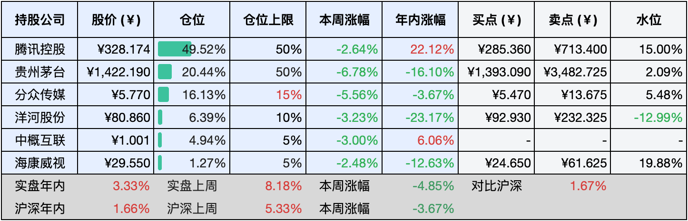

__微信公众号文章地址：[老罗实盘周记-20240803](https://mp.weixin.qq.com/s/vroynoRzZXJenVF77G0stA)__

```
老罗实盘周记，每周六更新。专注于股权投资、阅读、学习与个人成长，知行合一、日拱一卒、投资人生。微信公众号【老罗投资】，文章均首发于公众号。
```

### 1. 本周交易

无

### 2. 目前持仓

当前持有的股票包括：腾讯控股50.26%、贵州茅台19.96%、分众传媒15.94%、洋河股份6.36%、中概互联4.91%、海康微视1.23%。

此外还有少量现金，加上少量的恒瑞医药、上海机场、宋城演义等股票，其份额较少，仅作为观察仓不进行记录。

**注1：表底为截止到今日，老罗实盘和沪深300指数今年的收益率。**

**注2：表格中港股已按汇率换算为人民币。**


### 3. 上周数据



### 4. 本周事项

+ 腾讯收购字节跳动游戏业务
+ 瑞银发布中国白酒行业报告
+ 曙光初现？美联储降息越来越近了

==只对持股和交易感兴趣的朋友，读到这里就可以退出了。后面是对上述事件的展开，无新内容。==

#### 4.1 腾讯收购字节跳动游戏业务

腾讯收购了字节跳动旗下的上海傲爵数码科技有限公司，该公司拥有游戏《龙息：神寂》的iOS游戏及PC游戏软件著作权，通过此次收购，腾讯获得了《龙息：神寂》项目的全部股权，并且可能交由同在上海办公的腾讯北极光工作室负责管理运营。

原全资股东朝夕光年旗下上海墨鹍数码科技有限公司退出，新增腾讯旗下广西腾讯创业投资有限公司为股东并全资持股，同时公司主要人员也均发生变更。朝夕光年是字节跳动旗下的游戏研发与发行机构，‌专门负责游戏的代理和研发，‌去年11月，字节跳动被曝将关闭朝夕光年，全面退出游戏业务。

字节跳动今年在游戏业务上进行了重大调整，包括裁撤部分游戏业务，并将剩余业务进行整合，字节跳动之前已经将深圳引力工作室的二次元战术竞技项目(S1)、江南工作室的二次元开放世界项目(J5)等部分游戏业务转交给了腾讯。

腾讯与字节跳动在游戏领域的合作似乎出现了不小的缓和，例如《元梦之星》在抖音平台大量投放广告，以及《王者荣耀》直播在抖音平台解冻。

通过这些收购和合作，腾讯不仅增强了自身在游戏领域的竞争力，也为字节跳动的游戏业务找到了新的归宿，未来我们可能会看到两家巨头在游戏领域进行更多的合作。

#### 4.2 瑞银发布中国白酒行业报告

瑞银于2024年7月29日发布了一份重磅研报，深入探讨了中国白酒行业的未来走向，标题引人注目：《China Baijiu Sector Will destocking of Moutai 'social inventory' lead to a further sector derating?》（中国白酒行业是否会被茅台“社会库存”的释放拉入衰退？）

瑞银指出，受茅台酒社会库存潜在去化、行业领军企业产能扩张及持续宏观逆风影响，未来一年白酒行业的供需关系预计将进一步紧张。据预测，2023至2025年间，白酒企业平均每股收益的复合年均增长率将从过去三年的19%降至8%。鉴于此，瑞银不得不将茅台、五粮液、老窖、洋河等头部企业的评级从买入调整为中性，主要原因是盈利预期下调且估值已处高位。

该研报发布后，立即引发了市场的剧烈反响。中证白酒指数连续两日刷新年内新低，贵州茅台作为行业龙头，股价更是跌至自2022年11月以来的最低点。考虑到白酒板块是外资重仓的重要领域——茅台股票中就有7%被外资持有，瑞银这份报告的威力不容小觑。

面对市场的剧烈波动，瑞银大中华消费品行业主管彭燕燕赶紧出面安抚，强调白酒行业增长的大趋势并未改变，只是增速有所放缓。她预测到2025年，白酒企业的盈利能力仍将稳步增长，这是基于对宏观经济环境和行业供给状况的综合判断。在行业调整期，头部企业有望抢占更多市场份额，而低端白酒企业则展现出更强的生存韧性。总体来看，预计2023至2025年白酒企业平均每股收益的复合年均增长率将维持在8%的水平。

尽管瑞银的报告一度引发市场恐慌，但其分析师团队始终坚信，白酒行业的增长势头仍在，只是暂时放缓了脚步。老罗也一直认为白酒行业是能赚一辈子钱的地方，虽然近期白酒行业成了不受人待见的牛夫人，但白酒、特别是高端白酒赚钱的底层逻辑并没有变，如果有新增资金，老罗还会继续买入茅台。

#### 4.3 曙光初现？美联储降息越来越近了

如果条件满足，美联储最早可能在9月的会议上宣布降息。在7月31日的新闻发布会上，美联储主席鲍威尔给出了明确的信号，表明美联储的货币政策正在逐步转向。在最新的利率决策中，美联储选择保持按兵不动，维持联邦基金利率在5.25%至5.5%的范围内，这与市场的预期相符，也是美联储连续第八次维持利率稳定。

美联储降息的步伐似乎越来越近，这主要受到美国经济和通胀数据的影响，市场普遍认为，美联储在9月会议上至少会降息25个基点，甚至有可能降息50个基点。展望未来，预计美联储在11月和12月的会议上可能会继续降息，每次25个基点，使得年底的利率区间降至4.50%至4.75%。

美国的通胀压力有所缓解，尽管价格上涨的速度仍高于美联储2%的目标，但与2022年中期的峰值相比，增速已大幅减缓。就业市场也在逐渐冷却，薪资增长速度放缓，劳动力市场的紧张状况得到了一定程度的缓解。2024年是美国大选年，美联储可能会受到来自白宫的压力，通过降息来赢得选民的支持。美联储的降息策略通过降低借贷成本来刺激经济增长，导致美元贬值，投资者对美元资产的兴趣下降，资金可能会流向全球其他市场，从而增加全球市场的流动性。

降息预期对A股市场的影响主要体现在三个方面：首先，海外流动性的宽松将推动美债收益率下降和美元指数回落，减轻人民币贬值的压力，促进A股市场的景气成长和核心资产反弹；其次，海外宽松政策可能减少国内政策的约束，提升经济稳增长的效果，对地产链和银行等板块形成利好；最后，降息有助于缓解通缩压力，推动经济的新一轮行情。

美联储的降息决策提高了市场的风险偏好，通常会导致市场流动性增加，无风险收益率下降，投资者更倾向于投资风险较高的资产，从而推动市场整体估值上升。同时在降息周期，投资债券类标的会有不错的收益，利率每下降1个点，债券类基金可能有5%-8%的收益，在九月份美国100%降息的背景下，投资点美债基金是不错的选择。

可能不止老罗一个人这么想的，从7月中旬开始，美债基金就开始限额了，普遍每天只能投100-1000元，老罗选了几个总份额稍高的美债基金每天固定金额定投，投资期限到美国降息周期结束，到时再复盘复盘收益。

### 5. 本周读书

#### 5.1《一食一味》

警告，千万别在深夜看这书！八方美食，人间美味，尝美食就像看书，得多尝试不同口味，才能让味蕾大开眼界！大家不要一上来就否定那些不熟悉的事物，作品也好，吃的文化也罢，都有它存在的道理，要开放自己的心态，别偏食，对人别有成见，对事情更得客观公正。这样才能看得真切，摸得到，尝得出滋味，想得透彻。

活着多好啊，作者写这些文章，就是想让读者感受到生活的美好，看他都七十多岁了，还热爱美食，到处游玩。人老了腿脚不行了，连以前常爬的山都爬上不去了，这心里头有无奈，也有对人生短暂的感慨。但这个有趣的老头儿，把苦都看作是生活的一味。

评分三星半 ⭐️⭐️⭐️❤️

### 6. 本周运动

本周锻炼两次，以跳操为主，同时继续节食中。

祝大家周末愉快，身体健康！

```
老罗实盘周记，每周六更新。专注于股权投资、阅读、学习与个人成长，知行合一、日拱一卒、投资人生。微信公众号【老罗投资】，文章均首发于公众号。
免责声明：本公众号只作为本人的投资日志记录，本文中提及的个股都有腰斩或血本无归的风险，本人不做任何投资建议，投资请坚持独立思考。
```

__微信公众号文章地址：[老罗实盘周记-20240803](https://mp.weixin.qq.com/s/vroynoRzZXJenVF77G0stA)__