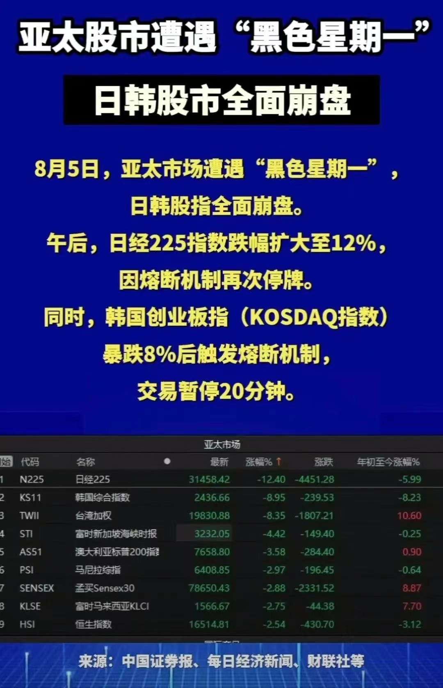

__微信公众号文章地址：[亚太股市遭遇黑色星期一](https://mp.weixin.qq.com/s/PqK3cVNE__Tv8MstacYR9A)__

2024年8月5日，亚太股市遭遇“黑色星期一”，主要股指普遍重挫。日本股市暴跌，日经225指数收盘大跌12.4%，创历史最大跌幅，超越1987年10月的纪录。

韩国股市同样遭受重创，KOSPI200指数和韩国综合指数均跌超8%。澳大利亚股市也未能幸免，基准股指下跌逾3%，创自2022年6月以来的最大单日跌幅。

受亚太股市整体疲弱影响，A股三大指数均下跌超过1%，两市近4700股下跌。离岸人民币兑美元表现坚挺，上涨超400个基点，创1月以来新高。

亚太股市暴跌的主要原因包括：

1）日本央行结束负利率政策后首次加息，引发市场对资本退出和放缓的担忧；

2）美国7月非农就业数据远逊预期，导致投资者对经济衰退的恐慌；

3）日元汇率上升对日本股市造成直接冲击，加息增加企业运营成本，影响盈利能力和股价表现。

亚太股市的暴跌进一步引发全球金融市场连锁反应，投资者对经济衰退的担忧加剧，避开过热的人工智能行情。

同时，多只跨境ETF持续走低，包括纳指科技ETF(159509)跌超9%，日本东证指数ETF(513800)、日经225ETF(513880)跌超7%，以及其他纳斯达克相关ETF跌超5%。

__微信公众号文章地址：[亚太股市遭遇黑色星期一](https://mp.weixin.qq.com/s/PqK3cVNE__Tv8MstacYR9A)__