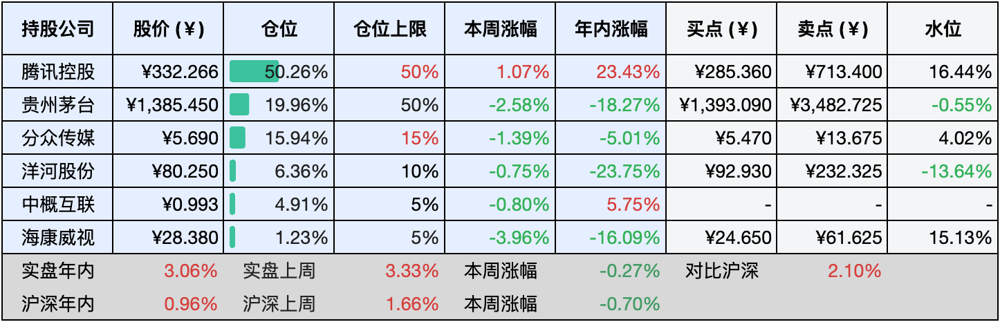

__微信公众号文章地址：[老罗实盘周记-七夕快乐-20240810](https://mp.weixin.qq.com/s/x4xywEjsVuJ7r6vpYZZHyg)__

```
老罗实盘周记，每周六更新。专注于股权投资、阅读、学习与个人成长，知行合一、日拱一卒、投资人生。微信公众号【老罗投资】，文章均首发于公众号。
```

### 1. 本周交易

无

### 2. 目前持仓

当前持有的股票包括：腾讯控股50.29%、贵州茅台20.22%、分众传媒15.82%、洋河股份6.22%、中概互联4.93%、海康微视1.15%。

此外还有少量现金，加上少量的恒瑞医药、上海机场、宋城演义等股票，其份额较少，仅作为观察仓不进行记录。

**注1：表底为截止到今日，老罗实盘和沪深300指数今年的收益率。**

**注2：表格中港股已按汇率换算为人民币。**


### 3. 上周数据



### 4. 本周事项

+ 贵州茅台中报
+ 分众传媒中报
+ 巴菲特抛售一半苹果股票
+ 微信小程序用户规模TOP50榜

==只对持股和交易感兴趣的朋友，读到这里就可以退出了。后面是对上述事件的展开，无新内容。==

#### 4.1 贵州茅台中报

8月8日（周四）晚，贵州茅台发布了2024年半年报。报告显示，在2024年上半年，公司实现营业收入834.51亿元，同比增长17.56%；净利润总额高达416.96亿元，同比增长15.88%。这一成绩不仅刷新了贵州茅台的历史纪录，更实现了双位数的稳健增长，上半年完成了在年初设定的营业收入增长15%的目标。


同日贵州茅台还正式公布了《2024-2026年度现金分红回报规划》，承诺在2024年至2026年期间，每年分配的现金红利总额将不低于当年实现归母净利润的75%，并原则上实行每年度两次分红。分红这个有些超预期，至少特别分红能保持到2026年，也突破了之前每年分红51.9%的固定规律。（据说由于股票代码是600519，所以每年分红51.9%，老板的恶趣味？）

尽管上半年白酒行业面临新一轮调整周期，贵州茅台也遭遇了不少挑战和压力，但公司依然表现出色，超额完成了半年度目标。在诸多不利因素和消费疲软的大环境下，这一成绩充分体现了市场对茅台全系产品的持续认可。

作为A股市场著名的现金奶牛，贵州茅台在今年上半年的经营活动产生的现金流量净额达到了366.22亿元，同比增长20.52%。充足的现金流量不仅彰显了公司的财务稳健，更为其应对行业周期波动提供了有力的冬储粮。这一优势有望助力茅台更加稳定地走出白酒行业周期，同时也为其提高分红比例、加大投资者回报创造了有利条件。

总结，茅台作为一家业务清晰易懂的公司，其营收和净利润均保持了两位数的高速增长。尽管近期面临一些负面消息，但这并未能改变茅台在A股市场中的独特地位（暂时还是A股送钱BUG）。如果近期能有新入资金，在当前的价格水平下，老罗仍会坚定地继续增持茅台股票。

#### 4.2 分众传媒中报

8月8日（周四）晚间，分众发布2024年中报。2024年上半年：营业收入59.7亿，同比+8.2%；归母净利24.9亿，同比+11.8%；扣非净利22亿，同比+11.4%。2024年二季度：营业收入32.4亿，同比+10%；归母净利14.5亿，同比+12.7%；扣非净利12.5亿，同比+6.8%。


分众传媒的业绩表现稳定，完全符合预期。这家企业的成本相对固定，而且经营业绩则随宏观经济波动而起伏。今年上半年公司实现60亿营收、25亿净利润以及29亿经营活动现金流，并宣布中期将拿出14.44亿进行分红。此次半年度分红，每股派发现金0.1元，占上半年归母净利润（24.9亿）的58%，实际上这相当于将二季度的归母净利润（14.5亿）全部回馈给股东。

在国内点位扩张成本较低、日常经营资金充裕、对外投资表现平平的情况下，提高分红率并将账面上的现金回馈给股东，无疑是管理层对股东负责任的最佳选择。此外，江总还可以通过现金分红，合法地将大量现金换汇并汇出境外，为境外子公司提供经营资金。

对于了解中国实体经济现状的人来说，看到分众传媒上半年营收同比增长8%、净利润同比增长12%，都会由衷地为江南春及其管理团队点赞，他们确实做得很好，付出了辛勤的努力。

回顾分众传媒自回A股上市以来的营收和净利润数据，可以发现今年第二季度的业绩已经恢复到仅次于2018年和2021年第二季度的水平，这无疑是一家让人感到非常踏实的企业。

#### 4.3 巴菲特抛售一半苹果股票

上周六，巴菲特旗下公司伯克希尔公布的二季度财报挺有意思的，伯克希尔的现金储备从3月底的1890亿美元一下子飙升到了6月底的2769.4亿美元，创了历史新高，这主要是因为卖出了大量的苹果的股票，二季度的时候，伯克希尔把苹果的股份砍了一半多，现在只剩4亿股了，不过苹果还是伯克希尔最大的持仓股。

早在第一季度，巴菲特就已经减持了13%的苹果股票，并在5月4日的伯克希尔年度股东大会上对此作出了解释，他表示这一举动很大程度上是出于税务考虑。巴菲特认为，如果美国政府为了弥补日益扩大的财政赤字而提高资本利得税，那么伯克希尔通过适量减持苹果股票将能为股东带来长期利益。

但是这次卖的量这么大，感觉不只是为了避税那么简单。巴菲特也说了，他们对苹果、可口可乐和美国运通这些公司可是长情得很，他在股东大会上强调：“在格雷格（伯克希尔现任CEO）的领导下，我们将继续持有这些股票，除非出现极端情况。”

回顾近期的市场表现，苹果作为华丽七巨头中成功跻身3万亿俱乐部的三大成员之一，在美股大幅回调的背景下，依然展现出较为稳健的市场表现。与此同时，伯克希尔的股价也保持了相对稳定，自5月初总市值突破9000亿美元大关后，目前该公司市值已稳定在这个范围附近。

巴菲特在二季度卖出了这么多股票，总不能把钱存银行吃利息吧，那么这位投资大师究竟将这些资金投向何处了呢？截至二季度末，他旗下的伯克希尔哈撒韦公司持有高达2346亿美元的美国短期国库券，其持仓规模甚至超过了美联储。尽管国债券的回报率通常不如股票等高风险投资诱人，但在美联储维持5.25%至5.5%的利率区间下，再加上9月份开始的降息预期，短期国债的收益率有所攀升。

当前，3个月期国债收益率为5.05%，6个月期为4.68%，而12个月期则为4.18%。据估算，这些接近5%的国库券收益率将为伯克希尔哈撒韦持有的巨额美国国库券带来每年约120亿美元的无风险收益。手里握着这么多现金储备，巴菲特或许已经察觉到了美股当前的高估值以及日益增长的经济危机风险，因此他选择出售部分高估的苹果股票，保持充裕的现金流，以便在未来遇到更好的投资机会时能够迅速出击。

#### 4.4 微信小程序用户规模TOP50榜

QuestMobile近日发布的《2024中国移动互联网半年报》揭示了今年上半年中国移动互联网市场的活跃态势。报告显示，截止到今年6月，中国移动互联网月活跃用户数已达到12.35亿，较去年同期增长了1.8%。

该报告还整理了一份微信小程序用户规模的TOP50榜单，里面有不少我们平时经常用的小程序。在TOP50榜单中，腾讯手机充值、滴滴出行、生活缴费、中国移动10086+、京东、美团、饿了么、同城旅行、微邮付、美团优选等小程序位列前十。腾讯手机充值以7.1亿至7.4亿的月活跃用户数量拔得头筹，凸显了腾讯出品的小程序在用户规模上的优势。滴滴出行、生活缴费、中国移动10086+也各自拥有庞大的用户群，月活跃用户数量均超过3亿。京东、美团、饿了么等电商和生活服务平台类小程序同样跻身前十，彰显了它们在日常生活中的重要作用。


此外，TOP50榜单还包括金山文档等办公类小程序，以及同城旅行等生活服务类小程序，这些小程序覆盖了用户生活的方方面面，满足了不同需求。中国移动旗下的10086+小程序也表现出色，月活跃用户近3.2亿至3.3亿，排名第四或第六，体现了中国移动在通信服务领域的广泛影响力。

微信小程序的用户数量正在不断攀升，特别是在生活服务、汽车、教育以及办公等领域，流量的增长尤为显著。小程序正逐渐成为连接线上线下、实现实体与数字融合的关键枢纽，它推动了垂直场景应用的深入发展，从而带动了用户数量的大规模增长。微信小程序的月活跃用户增长势头强劲，用户规模持续扩大，已成为移动互联网市场的重要组成部分，也渐渐成为腾讯护城河的一部分。

### 5. 本周读书

#### 5.1《随机漫步的傻瓜》

本书作者塔勒布认为，许多表面风光的成功者实则是幸运的傻瓜，他们在无数尝试中碰巧走运，如同打字机前的猴子偶然敲出了莎士比亚的杰作。这一观点无疑具有理论上的正确性，现实中也确实存在不少这样的幸运儿，比如国内因拆迁或改革开放意外致富的土豪们，尽管他们取得了成功，但他们的致富经验却往往毫无价值，盲目听从甚至可能让人陷入困境，许多励志书籍亦是如此。

那么究竟有多少人的成功是凭借自身实力而非运气呢？大师们的确拥有超凡的智慧和能力，使得他们成功的概率远超常人。成功并非无迹可循，成功者之间总有共性值得我们学习，如独立思考、深度思考、坚毅力等。然而塔勒布提醒我们，即便学全了这些特质，也不能排除黑天鹅事件的可能性，但这种概率极小，不应成为我们学习成功特质的障碍。正确的态度应如巴菲特、达里奥那些大师一般，尽量降低犯错概率，从而提高成功概率，尽了人事，剩下的便是天命。在中国对应的说法叫但行好事，莫问前程。

那么塔勒布强调的随机性对我们有何启示呢？首先要保持绝对的谦卑，世上没有永恒不变的理论，我们应时刻保持怀疑态度，认识到自身信念的局限性。其次要关注极端事件，以死亡为例，它提醒我们要珍惜当下，思考人生的价值和意义，同样在投资领域也要考虑到出现最坏的情况。最后要尽可能保持理性，情绪和非理性是投资的敌人，成功者都强调理性思考的重要性。在现代社会中，我们需要克服古老的本能习惯，以更理性的态度去面对问题。

评分三星 ⭐️⭐️⭐️

### 6. 本周运动

本周以节食为主，早饭碳水，中午鸡胸肉，晚上健康餐，体重持续下降中。

祝大家七夕节快乐，风有约，花不误，愿今夕何夕，所遇良人，愿两情相悦，天下有情人终成眷属。

```
老罗实盘周记，每周六更新。专注于股权投资、阅读、学习与个人成长，知行合一、日拱一卒、投资人生。微信公众号【老罗投资】，文章均首发于公众号。
免责声明：本公众号只作为本人的投资日志记录，本文中提及的个股都有腰斩或血本无归的风险，本人不做任何投资建议，投资请坚持独立思考。
```

__微信公众号文章地址：[老罗实盘周记-七夕快乐-20240810](https://mp.weixin.qq.com/s/x4xywEjsVuJ7r6vpYZZHyg)__