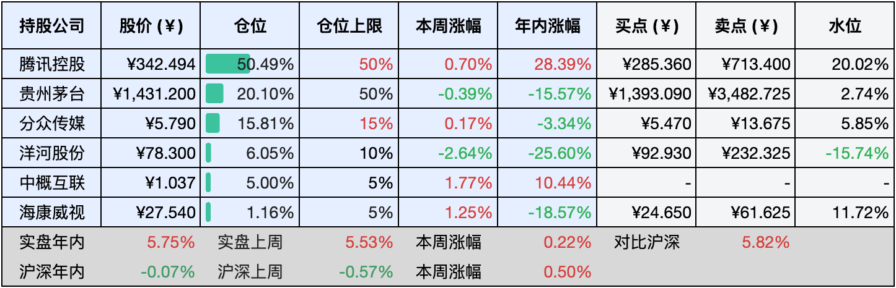

__微信公众号文章地址：[老罗实盘周记-20240817](https://mp.weixin.qq.com/s/NizIBVAWmk1wLr3AYPnFVw)__

```
老罗实盘周记，每周六更新。专注于股权投资、阅读、学习与个人成长，知行合一、日拱一卒、投资人生。微信公众号【老罗投资】，文章均首发于公众号。
```

### 1. 本周交易

无

### 2. 目前持仓

当前持有的股票包括：腾讯控股50.49%、贵州茅台20.10%、分众传媒15.81%、洋河股份6.05%、中概互联5.00%、海康微视1.16%。

此外还有少量现金，加上少量的恒瑞医药、上海机场、宋城演义等股票，其份额较少，仅作为观察仓不进行记录。

**注1：表底为截止到今日，老罗实盘和沪深300指数今年的收益率。**

**注2：表格中港股已按汇率换算为人民币。**



### 3. 上周数据


### 4. 本周事项

+ 腾讯控股中报
+ 七月社融数据

==只对持股和交易感兴趣的朋友，读到这里就可以退出了。后面是对上述事件的展开，无新内容。==

#### 4.1 腾讯控股中报

转眼间我们已经迈入了2024年的第二季度，在这个充满悲观情绪的季度里，腾讯再次用其优秀的财务业绩展示了它在业界的领军地位。

首先从总体数据来看，腾讯在这一季度的总收入高达1611.17亿元人民币，同比增长了8%。这个数字看似不起眼，但在当前全球经济形势复杂多变的大背景下，能够保持如此稳健的增长势头，实属不易。让人眼前一亮的是，腾讯的毛利同比飙升了21%，达到了858.95亿元人民币，这背后无疑是腾讯强大的成本控制能力和高效运营能力的体现。

而在经营利润方面，腾讯同样交出了一份比较令人满意的答卷，Non-IFRS(非国际财务报告准则)经营利润同比增长了27%，达到了584.43亿元人民币。这个数字的背后，是腾讯各个业务板块协同发展的成果，也是公司管理层领导力的体现。

当然最让人惊喜的还是腾讯的归母净利润表现。Non-IFRS(非国际财务报告准则)归母净利润同比大幅增长了53%，达到了573.13亿元人民币,这个数字不仅远超市场预期，更是充分证明了腾讯稳健的盈利能力。那么，腾讯究竟是如何做到的呢？

从各大业务板块的表现来看，增值服务作为腾讯的现金牛业务，依然保持着稳健的增长态势，收入同比增长了6%，达到了788亿元人民币。这主要得益于腾讯在游戏、虚拟物品等领域的持续投入和创新。同时腾讯也在不断优化用户体验，提升用户粘性，从而确保了增值服务业务的持续增长。在游戏业务领域，无论是国内游戏市场还是国际游戏市场，收入均增长了9%。这充分体现了腾讯在全球游戏市场的竞争力持续提升，特别是新发布的《地下城与勇士：起源》和《无畏契约》，以及《PUBG MOBILE》和Supercell游戏的强劲表现，为游戏业务的增长提供了有力支撑。这些成功的游戏作品不仅丰富了腾讯的游戏产品线，也为公司带来了可观的收入。

而网络广告业务则成为了腾讯这一季度的一大亮点，收入同比增长了19%，达到了299亿元人民币。这个数字的背后，是腾讯在广告市场的不断创新和优化，通过引入新的广告形式和技术手段，腾讯成功吸引了更多广告主和用户的关注，从而推动了广告业务的快速增长。视频号用户黏性的增强和小程序交易能力的提升为广告业务的增长提供了源源不断的动力，随着用户对视频号内容的喜爱程度不断加深，以及小程序在购物、支付等方面的便捷性不断提升，越来越多的商家选择在腾讯平台上投放广告，从而推动了广告业务的持续增长，预计未来腾讯的广告业务将继续保持强劲的发展势头。

此外，在金融科技与企业服务领域，腾讯也展现出了巨大的潜力，理财收入的强劲增长和云服务业务的拓展预示着这一板块未来的巨大增长空间。随着金融科技和云计算技术的不断发展，腾讯在这一领域的领先地位将进一步得到巩固，这将为腾讯未来的发展提供更多元化的收入来源和更广阔的市场空间。

腾讯这一季度的财务表现，让人不禁要感叹其强大的实力和巨大的潜力，从增值服务到网络广告，再到游戏业务和金融科技与企业服务，腾讯在各个业务领域都展现出了优秀的竞争力和创新能力。展望未来，随着各业务板块的持续发展和创新，我们有理由相信腾讯将创造更加辉煌的业绩，为股东、员工创造更多的价值。

#### 4.2 七月社融数据

2024年7月末，中国的社会融资规模存量达到了一个相当可观的数字：395.72万亿元，同比增长了8.2%。增幅还算不小，那么，这些钱都去哪儿了呢？

首先得说说对实体经济发放的人民币贷款，这部分余额高达247.85万亿元，同比增长了8.3%，这说明银行还是挺给力的，愿意给实体经济提供支持。不过对实体经济发放的外币贷款折合人民币余额就有点不给力了，同比下降了14.1%，只剩下1.57万亿元，看来外币贷款这块儿的需求有所减少。

再看看委托贷款和信托贷款，委托贷款余额为11.21万亿元，同比微降了1%；而信托贷款余额则同比增长了11.1%，达到了4.21万亿元，这说明信托贷款的需求还是比较旺盛的。

未贴现的银行承兑汇票余额为2.14万亿元，同比下降了16.2%。这个降幅可不小啊！看来企业在使用银行承兑汇票方面变得更加谨慎了。

企业债券余额为32.18万亿元，同比增长了2.6%，虽然增幅不大，但也算是个正增长吧。

政府债券余额比较亮眼，同比增长了15.4%，达到了73.82万亿元，政府债券发行的力度可真是不小。

非金融企业境内股票余额为11.58万亿元，同比增长了3.6%，虽然增幅也不算大，但至少说明股市还是有一定活力的。

从结构上来看，7月末对实体经济发放的人民币贷款余额占同期社会融资规模存量的62.6%，这个比例还是挺高的，其他几项贷款占比有增有减，但总体来说变化不大。

不过要是看前七个月的社会融资规模增量，情况就不太乐观了，累计增量只有18.87万亿元，比上年同期少了3.22万亿元，其中对实体经济发放的人民币贷款增加了12.38万亿元，但同比少增了3.27万亿元。

其他几项贷款增减不一，但总体来说都是同比减少的。企业债券净融资和政府债券净融资倒是同比增加了不少，分别多了3116亿元和2380亿元。

2024年前七个月的社会融资规模增量虽然同比减少了不少，但这其中也有不少亮点，咱们还是得理性看待这个数据，既要看到当前的不足，也要看到希望。

### 5. 本周读书

#### 5.1《巴菲特资产配置法》

这本书实际上与巴菲特没有直接的联系，主要讲解的是资产配置，也许给它加上巴菲特的标签能够吸引到更多的读者？尽管与巴菲特没有直接关系，但它的存在也有其合理性，并非每个人都适合采用巴菲特的投资方法，也不是每个人都能深入理解商业，因此对于普通大众来说，资产配置是更为合理有效的。书中提倡的主要理念包括：多元化资产、再平衡和风险管理。

据说作者是巴菲特的嫡传弟子，但本书的理念与巴菲特不完全相同，它强调不要把所有的鸡蛋放在一个篮子里。作者的独特之处在于，他不仅解决了如何将鸡蛋放入不同篮子的问题，还探讨了如何选择篮子、篮子之间的相关性以及篮子与投资者的自身条件之间的匹配等问题。

本书说实话非常一般，不建议阅读，评分两星 ⭐️⭐️

#### 5.2《行稳致远：价值投资的底层逻辑》

实际上我已经研读了许多价值投资理论的书籍，到如今已不再频繁翻阅，因为价值投资的核心理念本身就颇为简洁，诸多的书籍无非围绕以下四大要点展开：买股票就是买企业、市场先生、能力圈、安全边际。一旦真正地理解了企业，估值便显得轻而易举，评估一家公司，并不需要对其价格了如指掌，只需在显著低估或高估时作出买卖决策即可。因此，唯一需要持续努力提升的便是对企业进行深入研究，真正搞懂它们，这是一条永无止境的道路。

当理解了价值投资的四大核心理念后，再去阅读大量理念书籍便显得有些懒惰，这种行为往往让人误以为自己在学习，实则只是在舒适区内徘徊，用战术上的勤奋来掩饰战略上的懒惰，真正应该做的是学习会计知识，阅读财报、行业分析、企业公告、研报以及商业史和企业史等与分析企业密切相关的资料。然而我并不否认这本书的优秀之处，在我读过的众多价值投资理念书籍中，它是少数几本让我还想再读一遍的作品，尽管其理念并无新意，但作者的思考深度却远超市面上大部分同类书籍。

特别是书中对事实、信息、观点、结论和判断的深入思考颇具价值，在当今信息爆炸的移动互联网时代，如何理性地分析处理海量信息并提炼出事实真相显得尤为重要。特别值得一提的是，这本书的第一部分堪称全书的精华所在。

评分四星半 ⭐️⭐️⭐️⭐️❤️

#### 5.3《咖啡哪有上班苦》

生活充满挑战，时常令人感到窒息，工作堆积如山，唯有咖啡能提神醒脑，即将来临的周一，心情已然沉重，因为下周又将迎来倾盆大雨。

周一周一，疲惫不堪；周二周二，节能为主；周三周三，奋斗不止；周四周四，无所事事；周五周五，生龙活虎。要是每天都是周五，那该多美妙。

为了每餐都有热汤，我们每天振作精神，勤奋工作；为了保持头脑清晰，清晨必定品尝一杯咖啡，充满活力。

15分钟就可以读完，很轻松的漫画，评分三星 ⭐️⭐️⭐️

### 6. 本周运动

本周以节食为主，没有运动，体重持续下降中。

如果觉得本文还不错，那就点个赞或者『在看』吧，祝大家周末愉快！

```
老罗实盘周记，每周六更新。专注于股权投资、阅读、学习与个人成长，知行合一、日拱一卒、投资人生。微信公众号【老罗投资】，文章均首发于公众号。
免责声明：本公众号只作为本人的投资日志记录，本文中提及的个股都有腰斩或血本无归的风险，本人不做任何投资建议，投资请坚持独立思考。
```

__微信公众号文章地址：[老罗实盘周记-20240817](https://mp.weixin.qq.com/s/NizIBVAWmk1wLr3AYPnFVw)__