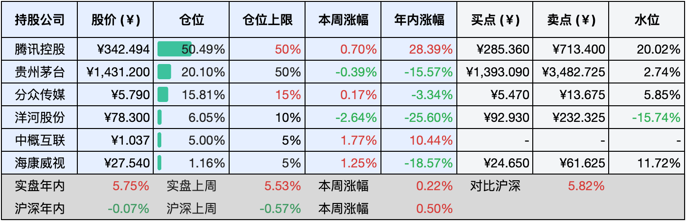

__微信公众号文章地址：[老罗实盘周记-20240824](https://mp.weixin.qq.com/s/0Rm78WnMoJlZZKFtfAKeHw)__

```
老罗实盘周记，每周六更新。专注于股权投资、阅读、学习与个人成长，知行合一、日拱一卒、投资人生。微信公众号【老罗投资】，文章均首发于公众号。
```

### 1. 本周交易

无

### 2. 目前持仓

当前持有的股票包括：腾讯控股51.03%、贵州茅台20.00%、分众传媒15.31%、洋河股份5.99%、中概互联5.06%、海康微视1.13%。

此外还有少量现金，加上少量的恒瑞医药、上海机场、宋城演义等股票，其份额较少，仅作为观察仓不进行记录。

**注1：表底为截止到今日，老罗实盘和沪深300指数今年的收益率。**

**注2：表格中港股已按汇率换算为人民币。**


### 3. 上周数据



### 4. 本周事项

+ 腾讯恢复回购
+ 黑神话悟空爆火

==只对持股和交易感兴趣的朋友，读到这里就可以退出了。后面是对上述事件的展开，无新内容。==

#### 4.1 腾讯恢复回购

腾讯控股近日在港交所发布公告称，8月23日公司斥资10.02亿港元回购了266万股股票，成交价格介于每股373.600港元至378.400港元之间。当日该股收盘价为375.600港元，跌幅为0.58%，全天成交额高达49.16亿港元。

自8月16日起，腾讯已连续六个交易日进行回购，共计回购1610万股，累计回购金额达到60.10亿港元。在此期间，该股累计上涨了1.95%。


从年初至今，腾讯已累计进行了71次回购，共回购1.95亿股股票，累计回购金额高达673.74亿港元，还有300多亿要花出去，今年还剩下四个月，小企鹅还得加油花钱。

#### 4.2 黑神话悟空爆火

近日，黑神话悟空这款游戏犹如一股旋风，席卷了整个网络，无论你是否为游戏玩家，都难以避免地被其深深吸引，自8月20日正式上线以来，它迅速点燃了广大游戏玩家的热情，引发了前所未有的讨论热潮。

这款游戏凭借对传统文化的全面而深入的挖掘，不仅赢得了国内玩家的一致好评，更让国外玩家为之倾倒，体验到了中国传统文化的独特魅力，齐天大圣孙悟空，这个中国人心中永恒的经典形象，如今成为了传播中国传统文化的有力使者。

为了第一时间体验这款国产首个3A级单机游戏，有人急忙购买游戏机，有人清理电脑内存，还有人甚至提前请假。所谓3A，代表着高质量、高体量、高成本，象征着游戏行业的最高水准。

黑神话悟空不仅是中国游戏行业的一大突破，更是满足了无数玩家对于本土高品质游戏的渴望。Steam平台数据显示，8月21日晚间，该游戏在线玩家数近236万，位列Steam历史第二，销量更是近一周全球第一，到23日晚，黑猴在各平台累计售出1000万份，游戏研发投入大约是4-5亿，目前游戏发行仅4天，就已经狂赚了20多亿。

黑神话悟空的成功，让我们看到了优秀传统文化的新生，黑神话悟空的成功给文化创意行业带来了很多启示，强调了打磨精神和内容创新的重要性。黑神话悟空还为文旅产业带来了新的机遇，游戏中的山西场景引发了山西文旅的热烈追捧，他们迅速展开宣传，推出“跟着悟空游山西”活动，发布相关线路及文创产品，这一创新性的文旅联动模式，预示着未来更多的可能性。

黑神话悟空和老罗旗下的非控股公司腾讯也有一些关联，当前公开的是，腾讯持有5%游戏发行方游戏科学的股份，而且有可能也收购了另一股东英雄互娱19%的股份，如果假设成立，那么小企鹅可能最多持有游戏科学多达24%的股权，从目前的情况看，这笔投资已经收回成本并且有了盈利。

### 5. 本周读书

#### 5.1《学会提问》

这本书专注于培养批判性思维，通过各个章节，引领读者逐步深入理解并掌握这一关键能力。书中详尽地阐释了批判性思维的核心要素，包括如何理性地掌控信念和结论，区分海绵式思维与淘金式思维，理解描述性假设的重要性，以及理由和证据在论证中的关键作用。如何识别并规避论证中的常见谬误，如诉诸公众、诉诸可疑权威、诉诸感情等，通过对这些谬误的剖析，读者能够更加清晰地认识到论证过程中的陷阱。

书中还探讨了典型案例的定义及其在论证中的价值，区分了事实与见解的不同，并阐述了平均值在不同情境下的具体意义，还有省略信息对论证的影响，帮助读者学会全面审视问题。此外，详细解释了灰度思维的概念及其重要性，引导读者培养开放、多元的思考方式，也深入剖析了一厢情愿的思维习惯及其带来的负面影响，鼓励读者摆脱这种思维局限。

在统计数据的使用方面，书中提供了深入的分析，揭示了统计数据可能存在的欺骗性，提醒读者在使用统计数据时要保持谨慎，也强调了学会提问的重要性，并讨论了正确提问对于揭示真相和推动思考的价值。

评分三星 ⭐️⭐️⭐️

#### 5.2《半小时漫画中国地理4：丝绸之路篇(新疆、甘肃、陕西、宁夏、山西)》

这本书真的很赞，它把新疆、甘肃、陕西、宁夏、山西这五个省份的风景、历史文化，都讲得特别明白，而且还有不少现代的东西，让人一边读历史，一边还能感觉到现在和未来的变化。这种写法真的挺新鲜的，让人越读越有意思，对地理和历史就更有兴趣了。

我觉得这本书说得特别对，真的是一方水土养一方人，一个地方的风土人情、气候都跟当地人的生活习惯、吃吃喝喝有关系，这些又影响了他们的文化和性格，每个地方都有自己的一套处事方法，城市和人也是互相影响，一起成长的。有时候去个新地方，虽然房子看起来都差不多，但住的人不一样，他们的生活方式和修养就体现出来了，这也是不同城市的独特气质。

评分四星 ⭐️⭐️⭐️⭐️

### 6. 本周运动

本周还是以节食为主，遛弯两次，体重持续下降中。

如果觉得本文还不错，那就点个赞或者『在看』吧，祝大家周末愉快！

```
老罗实盘周记，每周六更新。专注于股权投资、阅读、学习与个人成长，知行合一、日拱一卒、投资人生。微信公众号【老罗投资】，文章均首发于公众号。
免责声明：本公众号只作为本人的投资日志记录，本文中提及的个股都有腰斩或血本无归的风险，本人不做任何投资建议，投资请坚持独立思考。
```

__微信公众号文章地址：[老罗实盘周记-20240824](https://mp.weixin.qq.com/s/0Rm78WnMoJlZZKFtfAKeHw)__