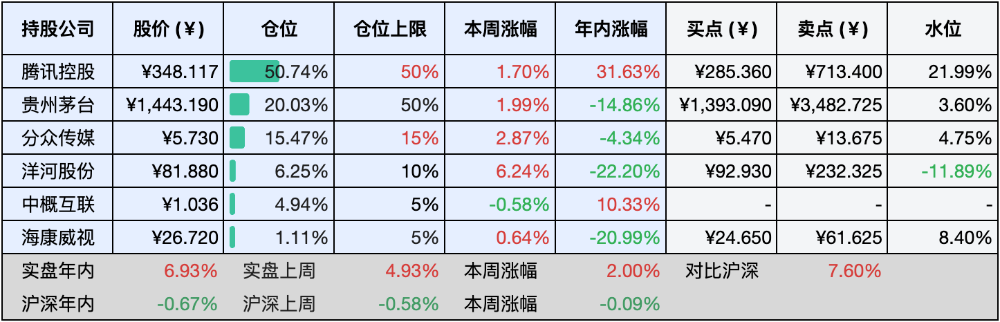

__微信公众号文章地址：[老罗实盘周记-20240831](https://mp.weixin.qq.com/s/_ealPIuoHq8m-cWG7M4oew)__

```
老罗实盘周记，每周六更新。专注于股权投资、阅读、学习与个人成长，知行合一、日拱一卒、投资人生。微信公众号【老罗投资】，文章均首发于公众号。
```

### 1. 本周交易

无

### 2. 目前持仓

当前持有的股票包括：腾讯控股50.74%、贵州茅台20.03%、分众传媒15.47%、洋河股份6.25%、中概互联4.94%、海康微视1.11%。

此外还有少量现金，加上少量的恒瑞医药、上海机场、宋城演义等股票，其份额较少，仅作为观察仓不进行记录。

**注1：表底为截止到今日，老罗实盘和沪深300指数今年的收益率。**

**注2：表格中港股已按汇率换算为人民币。**



### 3. 上周数据


### 4. 本周事项

+ 洋河股份中报
+ 周五八大利好A股暴涨
+ 阿里巴巴三年整改完成
+ 伯克希尔市值超万亿
+ 美联储降息越来越近了

==只对持股和交易感兴趣的朋友，读到这里就可以退出了。后面是对上述事件的展开，无新内容。==

#### 4.1 洋河股份中报

8月29日晚，洋河股份发布了2024年中期报告。财报显示，公司在2024年上半年实现营业收入228.76亿元，同比增长4.58%；归母净利润为79.47亿元，同比增长1.08%；扣非后归母净利润为79.41亿元，同比增长2.96%。

尽管中报业绩表现平淡，增长率仅为个位数，尤其是二季度营收和利润同比分别下降3%和近10%，但报告中仍有一些亮点。首先，公司承诺未来三年每年分红不低于70亿元，股息率高达6%。其次，之前信托理财爆出的风险，今年已成功收回（共计2亿元）。

目前洋河市值为1233亿元，鉴于其较高的分红率，在当前价位投资仍具吸引力。老罗在将大部分洋河股份换成茅台后，洋河的成本拉升得比较高，因此手上的6%洋河仓位短期内不打算变动，将其作为反面教材时刻提醒自己。

#### 4.2 周五八大利好A股暴涨

自本周一起，市场波澜不惊，旗下各公司股票价格波动不大，老罗的实盘也基本保持平稳。然而，周五A股市场迎来八大利好消息，显著提振了市场情绪。

首先，周五是8月最后一个交易日，上证指数月线很可能收阴，形成四连阴格局。回顾历史数据，自1999年以来，上证指数月线四连阴后，次月上涨概率高达75%。例如，1999年9月至12月沪指四连阴，次月上涨12.32%；2001年7月至10月四连阴，次月上涨3.48%；2002年9月至12月四连阴，次月上涨10.47%；2004年4月至7月、2003年6月至9月两次四连阴，次月沪指分别下跌3.18%、1.38%；2012年5月至8月、2015年6月至9月、2022年7月至10月三次沪指四连阴，次月沪指分别上涨1.89%、10.8%、8.91%。

其次，8月29日下午，离岸和在岸人民币兑美元汇率双双突破7.10大关。今日上午，离岸人民币继续攀升，盘中突破7.09。

第三，高股息资产抱团现象有所松动，场内资金重新分配。今日上午，高股息资产明显回调，四大行股票齐跌，中国移动、中国电信、招商公路、宁沪高速等个股亦出现下跌。

第四，根据央行官网8月29日披露，中国人民银行近日召开了专家学者及金融企业负责人座谈会。会议指出，下一阶段，央行将落实中央政治局会议关于“宏观政策要持续用力、更加给力”的要求，维持支持性货币政策立场，加强逆周期调节，运用多种货币政策工具，加大对实体经济的支持。同时，研究储备增量政策举措，增强宏观政策协调配合，支持巩固和增强经济回升向好态势。

第五，上市公司中报披露接近尾声，众多公司业绩呈现良好态势，部分业绩扰动因素将逐渐消退。

第六，市场对基金赎回压力的担忧将在9月得到缓解。有机构预测，今年下半年三年期封闭基金到期规模较上半年有所增加，其中三季度将有338亿份基金集中到期，四季度将有75亿份基金到期，三季度的到期高峰在8月份。

第七，美联储降息时点临近，海外流动性有望改善。

第八，港股市场也迎来利好。尽管前两日中概股拼多多大幅下跌，但并未对港股大型科技股造成太大影响，美团、腾讯控股、阿里巴巴等个股近期持续上涨，显示出资金对市场的信心。

#### 4.3 阿里巴巴三年整改完成

2021年，市场监管总局针对阿里巴巴在中国境内网络零售平台服务市场的二选一垄断行为，依法作出行政处罚并展开行政指导，要求其立即停止违法行为并进行全面自查整改，同时连续三年向总局提交合规自查报告。

8月30日下午，国家市场监督管理总局发布公告，确认阿里巴巴集团已完成为期三年的整改工作。对此，阿里巴巴回应称：“这对阿里巴巴来说是一个崭新的起点。我们将持续立足创新，坚守合规经营原则，加大科技投入，促进平台经济健康发展，为社会创造更多价值。”

阿里巴巴的企业文化带有浓厚的个人特色，江湖气息颇重。然而，在商业领域，低调与诚信才是取得成功的法宝。

#### 4.4 伯克希尔市值超万亿

今年以来，伯克希尔哈撒韦累计涨幅达30%，市值首度突破1万亿美元大关，成为美股第七家跻身“万亿美元俱乐部”的上市公司。据统计，伯克希尔·哈撒韦总市值年内已激增约2300亿美元，这一数字甚至超过了美国运通、麦当劳、思科系统、富国银行等美国各行业代表性企业的总市值。

近期，伯克希尔·哈撒韦向美国证券交易委员会提交的文件显示，在减持苹果和美国银行股份后，公司大举增持美国短期国债，目前持有的债券规模甚至超过了美联储。

秉持长期主义和复利理念的伯克希尔哈撒韦，未来还将展现出怎样的潜力与可能？

#### 4.5 美联储降息越来越近了

对全球投资者而言，9月份的美联储议息会议堪称关注焦点。美联储主席杰罗姆·鲍威尔在今年Jackson Hole全球央行年会上发表演讲，宣称调整政策的时机已然成熟。分析人士据此推测，鲍威尔的言论强烈预示着美联储可能在9月17日至18日（北京时间9月19日凌晨02:00）的会议上作出降息决策。

正如所言，该来的终会来临。在困境中，我们更须坚定信念，保持毅力，方能迎接曙光的到来。

### 5. 本周读书

#### 5.1《半小时漫画中国地理3：江西、安徽、江苏、上海、浙江》

低调的江西、包容的安徽、勤勉的江苏、时尚的上海、精明的浙江——半小时漫画中国地理第三卷，品质一如既往地可靠。

评分四星 ⭐️⭐️⭐️⭐️

#### 5.2《秒懂金融》

这本书是一本浅显易懂的金融学入门书籍，它运用通俗的语言和生活实例，介绍了日常生活中必备的金融知识，涵盖从货币、基金、股票到宏观经济和个人投资理财等诸多领域。

书中探讨了与金融相关的诸多议题，例如货币供应过剩可能引发的负面影响、金钱如何诱发危机、风险分散策略以及投资盈利的方法等。

前几章还不错，关于基金与股票实操的部分，老罗觉得一般，有很多其他书籍的痕迹，看看即可。

评分三星 ⭐️⭐️⭐️

#### 5.3《半小时漫画中共一大》

经典无需多言，轻松了解中国共产党建党故事，感悟建党精神，评分五星 ⭐️⭐️⭐️⭐️⭐️

### 6. 本周运动

本周还是以节食为主，家中有事没有运动，体重持续下降中。

如果觉得本文还不错，那就点个赞或者『在看』吧，祝大家周末愉快！

```
老罗实盘周记，每周六更新。专注于股权投资、阅读、学习与个人成长，知行合一、日拱一卒、投资人生。微信公众号【老罗投资】，文章均首发于公众号。
免责声明：本公众号只作为本人的投资日志记录，本文中提及的个股都有腰斩或血本无归的风险，本人不做任何投资建议，投资请坚持独立思考。
```

__微信公众号文章地址：[老罗实盘周记-20240831](https://mp.weixin.qq.com/s/_ealPIuoHq8m-cWG7M4oew)__