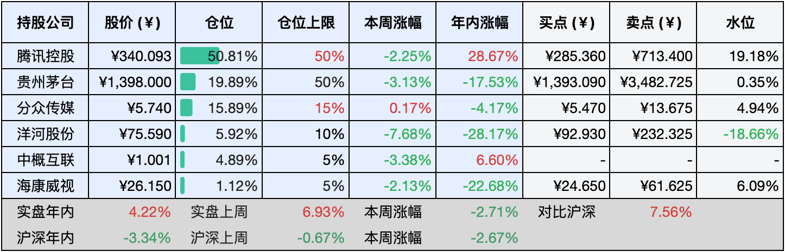
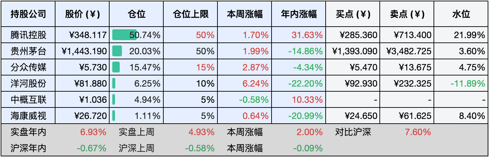

__微信公众号文章地址：[老罗实盘周记-20240907](https://mp.weixin.qq.com/s/6acnL-OFBANtzW0SXkdlBg)__

```
老罗实盘周记，每周六更新。专注于股权投资、阅读、学习与个人成长，知行合一、日拱一卒、投资人生。微信公众号【老罗投资】，文章均首发于公众号。
```

### 1. 本周交易

无

### 2. 目前持仓

当前持有的股票包括：腾讯控股50.81%、贵州茅台19.89%、分众传媒15.89%、洋河股份5.92%、中概互联4.89%、海康微视1.12%。

此外还有少量现金，加上少量的恒瑞医药、上海机场、宋城演义等股票，其份额较少，仅作为观察仓不进行记录。

**注1：表底为截止到今日，老罗实盘和沪深300指数今年的收益率。**

**注2：表格中港股已按汇率换算为人民币。**



### 3. 上周数据



### 4. 本周事项

+ 上证指数再次跌破2800点
+ 阿里巴巴开放微信支付

==只对持股和交易感兴趣的朋友，读到这里就可以退出了。后面是对上述事件的展开，无新内容。==

#### 4.1 上证指数再次跌破2800点

本周大A股再度陷入跌跌不休的模式，上证指数今年再度失守2800点关口。

国足本周以0:7的比分不敌日本，作为几十年的伪球迷，老罗内心毫无波澜，甚至还有一点想笑。国足与大A股市场颇有几分相似之处，都是那种让人又爱又恨的存在。在网上随便吐槽、随便骂，也不需要承担任何后果，这种稀罕事物，只能且行且珍惜了。

目前各种优质公司的市值肉眼可见的便宜，可惜子弹已经打光，手上的钱买得起的公司也到仓位上限了，慢慢存几个月的钱，看看有没有机会再买点茅台吧。

#### 4.2 阿里巴巴开放微信支付

历史性时刻到来了！互联网两大巨头携手合作，淘宝平台计划全面接入微信支付。

淘宝天猫方面表示，淘宝天猫一直秉承开放合作的理念，积极寻求与其他平台的互联互通，旨在不断提升消费者的购物体验，让购物过程更加便捷、愉快和高效。

微信支付方面同日回应称，目前正与淘宝平台商户进行功能适配工作，具体上线时间请留意淘宝平台的公告。微信支付始终秉持开放合作的态度，积极探索与各领域的互通合作。

长期以来，阿里系的支付宝与腾讯系的微信支付一直是竞争对手，在淘宝平台上无法使用微信支付，这是电商行业众所周知的规则。两家公司之间的互联互通传闻已久，但一直未能实现，关键在于淘宝端口的开放问题。如今这一举措即将落地，淘宝将不得不与曾经的竞争对手分享市场份额。

### 5. 本周读书

#### 5.1《养了猫，我就后悔了2.0》

本书以风趣幽默、可爱满溢的漫画形式，讲述了猫主人李小孩儿与她的小猫咪之间的温馨趣事。书中不仅还原了养猫人的生活，还将与小猫咪相关的知识巧妙地融入其中。每一篇漫画故事都独立成篇，精简而富有趣味。

从介绍小猫咪取名宝典开始，本书探讨了人类为何钟情于小猫咪，以及为它们取名的意义。深入剖析了养猫后腿部结构的变化、小猫咪的舔毛习性、社交能力等话题。还详细阐述了小猫咪的记忆类型与特点、生气的原因，以及它们是否能听懂铲屎官的话语等疑问。

书中还探讨了小猫咪的审美标准、猫的特性、对新成员的接纳程度、对打扫卫生的反应、对人类的情感依赖、选择朋友的标准、行为改正方法，以及养猫后铲屎官的快乐与困扰等诸多内容。

评分四星 ⭐️⭐️⭐️⭐️

#### 5.2《中华人民共和国宪法》

宪法作为国家的根本大法，是治国安邦的基石，享有至高无上的法律地位、权威与效力。全面实施宪法，不仅是推进依法治国、构建社会主义法治国家的首要任务，更是奠定国家基础的关键环节。

尽管宪法看似遥不可及，实则它无处不在，构筑了一个国家的基本架构，我们生活在这一框架之下，深切感受到宪法的力量。这种关系恰如鱼与水，鱼虽时刻处于水中，却未必自觉其存在，然而它却离不开水的滋养与庇护。

评分五星 ⭐️⭐️⭐️⭐️⭐️

#### 5.3《猫的自信：治愈系生活哲学绘本》

安住于当下，心境怡然自得。猫咪的世界充满了看似矛盾的特质，它们既谨慎又放松，既满足又充满好奇。同样一个人的性格也是复杂多元的，有好有坏，唯有在内外合一的时刻，才能呈现出完整的自我。

在关键时刻，要如箭在弦，一击即中，就如同站在海浪之上，任凭大海推动自己前行，顺其自然，减少不必要的内心纷扰，心若死寂，道则自生，既要好好休息，也要努力工作。

在追求内心渴望的过程中，休息即是工作，工作亦是休息。擅长休息的人，更懂得如何发挥最大效率，工作亦然。人生如过眼云烟，纷扰不断，起伏不定，如何度过这一生，是每个人自己的课题，无论好坏，都是一段不可复制的人生旅程。

评分三星 ⭐️⭐️⭐️

#### 5.4《人生三千事，淡然一笑间》

小林先生的漫画以诙谐幽默的语调、灵动简约的画风，传递出深刻的人生哲理。

诚然人生是一场漫长的旅程，其间既有艰辛与疲惫，也有欢乐与悲伤，逆境往往多于顺境，我们需要用毕生的努力，让生活变得更加美好。

以入世之心去待人处世，以出世之心去随缘自适，在这纷扰尘世中生存实属不易，唯有修身养性，方能治国平天下。

评分四星 ⭐️⭐️⭐️⭐️

#### 5.5《等一朵花开》

这本书温暖人心，以可爱而温情的漫画搭配风趣且富有才情的文字，穿插着各地的人间烟火与对《诗经》及唐诗宋词的独到解读，还融入了旅游摄影中的趣闻轶事。

不知何时起，旅行似乎演变成一种我去过，我拥有的炫耀，每到一个地方，拍摄当地名胜与美食的照片分享至朋友圈，收获他人的羡慕与点赞，便自认为是一次满意的旅行。然而世界如此广阔，我们不应该仅仅为了向他人炫耀、满足虚荣心而踏上旅途，旅行并不能彻底改变一个人，灵魂的升华源自内心，你原本是什么样的人，就只能看到什么样的世界。旅行的意义在于个人的感悟与成长。

人生如同一场旅行，我们需要放慢脚步，细细品味。这样日子会变得悠长，目光也会更加宽广，才能发现那些曾被忽略的美好。在这个浮躁的世界里，我们需要静下心来，用更多的耐心和微笑，去等待一朵花的绽放。只要我们用心生活，总能在人生的道路上找到属于自己的诗意与远方。生活的花朵，终将绚烂盛开。

评分三星 ⭐️⭐️⭐️

#### 5.6《真富人，假富人》

这是一部深入浅出地讲解个人理财理念的书籍，本书运用会计学作为工具，借助致富公式，引导读者理解财富积累的过程，并协助他们设定并实现可量化的理财目标。书中还深入剖析了资产与负债的区别，教会读者如何区分真正的资产与虚假的资产，以及优质的负债与不良的负债。

着重强调了夫妻共同理财的重要性，并详细阐述了如何通过自动投资和定期定额投资，实现从农村迈向城市的财富积累之路。书中还对股票投资的失败案例进行了深入探讨，从中提炼出宝贵的经验教训，为读者提供了有益的参考。

作者讲解了如何通过创造系统收入来实现财务自由，指出系统收入是一种可持续获取的收入，类似于工厂流水线的模式，使你不需要为每一笔收入而辛勤工作。还详细分析了分红股投资的优势，以及税收和通货膨胀对缩减生活成本的影响。

评分四星 ⭐️⭐️⭐️⭐️

### 6. 本周运动

本周遛弯2次，每次6公里。

如果觉得本文还不错，那就点个赞或者『在看』吧，祝大家周末愉快！

```
老罗实盘周记，每周六更新。专注于股权投资、阅读、学习与个人成长，知行合一、日拱一卒、投资人生。微信公众号【老罗投资】，文章均首发于公众号。
免责声明：本公众号只作为本人的投资日志记录，本文中提及的个股都有腰斩或血本无归的风险，本人不做任何投资建议，投资请坚持独立思考。
```

__微信公众号文章地址：[老罗实盘周记-20240907](https://mp.weixin.qq.com/s/6acnL-OFBANtzW0SXkdlBg)__