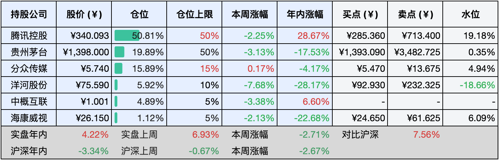

__微信公众号文章地址：[老罗实盘周记-中秋团圆-20240914](https://mp.weixin.qq.com/s/qMQCsMm9abPf-kwR70vGUA)__

```
老罗实盘周记，每周六更新。专注于股权投资、阅读、学习与个人成长，知行合一、日拱一卒、投资人生。微信公众号【老罗投资】，文章均首发于公众号。
```

### 1. 本周交易

周五(9月13日)买入分众传媒(002027)，买入价格为5.350元人民币。

### 2. 目前持仓

当前持有的股票包括：腾讯控股52.51%、贵州茅台19.04%、分众传媒15.15%、洋河股份5.85%、中概互联4.99%、海康微视1.10%。

此外还有少量现金，加上少量的恒瑞医药、上海机场、宋城演义等股票，其份额较少，仅作为观察仓不进行记录。

**注1：表底为截止到今日，老罗实盘和沪深300指数今年的收益率。**

**注2：表格中港股已按汇率换算为人民币。**


### 3. 上周数据



### 4. 本周事项

+ 延迟法定退休年龄
+ 苹果爱尔兰税收案件败诉
+ 沪深全A指数PB跌至历史新低

==只对持股和交易感兴趣的朋友，读到这里就可以退出了。后面是对上述事件的展开，无新内容。==

#### 4.1 延迟法定退休年龄

自2025年1月1日起，我国将逐步调整法定退休年龄。对于原定60周岁的男性职工，退休年龄将每4个月推迟1个月，直至逐步达到63周岁；女性职工方面，原定55周岁的退休年龄将同样每4个月推迟1个月，逐步调整至58周岁；而原定50周岁的女性职工退休年龄，则是每2个月推迟1个月，直至逐步调整至55周岁。

在渐进式延迟法定退休年龄的过程中，将会坚持弹性实施与自愿选择的原则。职工可根据自身情况，在一定条件下选择提前或延迟退休，最长不超过3年，但不得低于原定的法定退休年龄。

鉴于中国老龄化趋势日益明显，推迟退休年龄已成为必然发展。以日本为例，大部分人都在70岁左右才退休，甚至开出租车的也多为满头白发的老者。

因此，尽早实现被动收入超越主动收入，达成真正的“财富自由”，才是明智且可行的生活道路。

#### 4.2 苹果爱尔兰税收案败诉

欧洲法院于10日作出裁决，要求美国苹果公司向爱尔兰补缴高达130亿欧元的税款，并维持对美国谷歌公司因滥用市场垄断地位打压竞争而征收的24亿欧元罚款。

根据欧洲法院的声明，该裁决确认了欧盟委员会2016年的决定，即苹果公司需补缴130亿欧元的税收优惠，约合人民币1020亿元。

同日，欧洲法院还驳回了谷歌的上诉，维持了欧盟委员会2017年对其利用市场优势地位偏袒自家购物服务“谷歌购物”的裁定，罚款金额仍为24亿欧元。

此次终审判决标志着苹果与欧盟之间长达十年的税务纠纷终于画上了句号。

苹果收取“苹果税”，而欧盟再向苹果征税，这真是一桩好生意。

#### 4.3 沪深全A指数PB跌至历史新低

随着市场持续震荡下行，沪深全A指数作为全市场基准，其市净率（PB）已跌至历史新低点1.273，而股息率则攀升至3.27%，创下可统计历史最高纪录。

根据WIND数据显示，截至2024年9月11日收盘，中证全指（000985）的PB值降至1.27，百分位跌至0.00%，其指数股息率亦上升至2.71%，同样达到可统计历史最高水平。

近期市场上遍地皆是价格低廉的优质资产，然而老罗又再次面临有投资机会却缺乏资金的窘境。

### 5. 本周读书

#### 5.1《一本书看透A股》

这本书以通俗易懂的方式剖析了价值投资理念及其在A股市场的应用，通过详细介绍个人普通投资者的投资哲学与策略，使读者对价值投资有更为深刻的认识。

书中不仅详述了定性与定量分析技巧，还揭示了逆向投资的精髓与经验，助读者在投资道路上更加从容不迫。作者还深入探讨了交易心态及市场上关键、常见且热门的行业与板块的投资思考，为投资者提供了宝贵的参考资料。

作者着重强调了价值投资理念的重要性，将其视为一种长期投资策略，其核心观念在于将购买股票视为购买企业本身，投资者通过深入分析企业内在价值，在市场价格低于其真实价值时果断买入，以期在未来实现收益。作者也着重指出逆向投资的关键作用，认为在市场恐慌、股价下跌之际，正是把握买入良机的时刻。

在选股方面，作者提出了运用财务数据排除法初步筛选企业的方法，通过分析企业财务数据来判断其投资价值，作者还提供了投资者选股策略，协助投资者在众多股票中甄选出具有投资潜力的优质股票。

关于熊市中的投资机会，作者认为这些机会主要源于市场整体性下跌，而非仅限于个别行业或企业的问题，这种投资机会与基本面类的逆向投资有所不同，它是基于系统性风险而非个体性风险。

评分三星半 ⭐️⭐️⭐️❤️

### 6. 本周运动

本周遛弯1次，体重有所反弹。

如果觉得本文还不错，那就点个赞或者『在看』吧，祝大家周末愉快！

```
老罗实盘周记，每周六更新。专注于股权投资、阅读、学习与个人成长，知行合一、日拱一卒、投资人生。微信公众号【老罗投资】，文章均首发于公众号。
免责声明：本公众号只作为本人的投资日志记录，本文中提及的个股都有腰斩或血本无归的风险，本人不做任何投资建议，投资请坚持独立思考。
```

__微信公众号文章地址：[老罗实盘周记-中秋团圆-20240914](https://mp.weixin.qq.com/s/qMQCsMm9abPf-kwR70vGUA)__