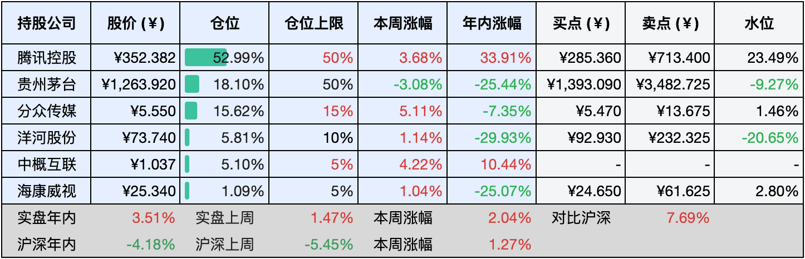
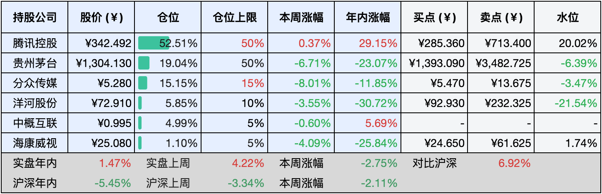

__微信公众号文章地址：[老罗实盘周记-20240921](https://mp.weixin.qq.com/s/8NQtGOuypIfiBJI9z6rQFg)__

```
老罗实盘周记，每周六更新。专注于股权投资、阅读、学习与个人成长，知行合一、日拱一卒、投资人生。微信公众号【老罗投资】，文章均首发于公众号。
```

### 1. 本周交易

无

### 2. 目前持仓

当前持有的股票包括：腾讯控股52.99%、贵州茅台18.10%、分众传媒15.62%、洋河股份5.81%、中概互联5.10%、海康微视1.09%。

此外还有少量现金，加上少量的恒瑞医药、上海机场、宋城演义等股票，其份额较少，仅作为观察仓不进行记录。

**注1：表底为截止到今日，老罗实盘和沪深300指数今年的收益率。**

**注2：表格中港股已按汇率换算为人民币。**



### 3. 上周数据



### 4. 本周事项

+ 美联储降息
+ 贵州茅台首次回购股份注销
+ 分众传媒年中分红方案
+ 马化腾重新成为中国首富
+ 微信朋友圈支持live图片

==只对持股和交易感兴趣的朋友，读到这里就可以退出了。后面是对上述事件的展开，无新内容。==

#### 4.1 美联储降息

9月19日，美联储宣布将联邦基金利率目标区间下调50个基点，从原先的5.25%-5.50%降至4.75%-5.00%，这是美联储自2020年3月以来的首次降息举措。

关于降息的原因，美联储表示通胀压力已显著减轻，尽管仍超出其设定的目标。同时美国就业市场显现疲态，失业率上升，促使美联储采取降息措施以提振就业市场。

市场对此反应复杂，消息公布后美股、美债和黄金价格经历短暂上涨后回落。美联储的降息行动可能引发全球多家央行跟进，进而形成一轮降息潮。

美联储的这一决策将对全球经济和金融市场产生深远影响，不仅可能改变各国货币政策的走向，还可能对股市、债市及商品市场带来显著波动。

#### 4.2 贵州茅台首次回购股份注销

9月20日，贵州茅台发布公告，宣布将使用自有资金回购股份以注销并减少注册资本，回购金额介于30亿至60亿元人民币之间，回购价格上限设定为1795.78元/股，这是该公司自上市23年来首次进行注销式回购。

公告当日，贵州茅台股价微涨0.23%至1263.92元，但自7月22日起，股价总体呈下跌趋势，9月19日跌至1245.83元的阶段性低位，此次回购计划可能为股价提供短期的支撑。

市场普遍认为，此举体现了贵州茅台对公司价值和未来发展前景的坚定信心，历史上茅台在市场低迷时多次增持股份，此次回购延续了这一策略。通过注销回购的股份，公司有望提高每股收益和其他关键财务指标，对投资者来说是个积极信号。当前白酒行业正处于调整期，市场需求和政策变化对企业构成挑战，贵州茅台通过回购和高分红等手段，表现了其在行业中的领导地位和对未来的乐观态度。

根据2024年中期报告，贵州茅台总资产达2792.07亿元，总负债511.62亿元，资产负债率仅为18%，表明公司财务状况稳健，充裕的现金流使其有能力实施大规模回购并且不影响正常的运营。贵州茅台承诺未来三年每年现金分红不少于当年归母净利润的75%，为投资者提供了稳定的收益预期，结合回购计划和高分红政策，公司进一步增强了股东回报。

短期内，回购计划有望提振投资者信心，特别是在股价下滑时，反映了公司对市场和自身情况的洞察及积极应对策略。长期而言，市场仍需关注公司的业绩表现和行业环境的动态变化，贵州茅台的高分红政策和回购计划是其市值管理的重要组成部分，但其效果还需通过实际运营成果来验证。

贵州茅台的首次回购股份注销是一次值得鼓励的市值管理行动，既展示了公司对自身价值的自信，也为投资者带来了实实在在的利益。

#### 4.3 分众传媒年中分红方案

分众传媒24年半年度权益分配方案本周公告，将以总股本144,421.997万股为基础，公司拟向全体股东每10股派发人民币1.00元的现金红利，总计派发现金红利达14.44亿元，占同期归母净利润的57.92%，本方案不涉及红股派送及资本公积转增股本。股权登记日定于9月25日，而除权除息日则为9月26日。

根据分众传媒发布的2024年半年度业绩报告，公司实现营业收入59.67亿元，同比增长8.17%；归属于上市公司股东的净利润达24.93亿元，同比增幅为11.74%；基本每股收益为0.17元，相较于去年同期的0.15元有所提升。

对于老罗而言，分红所得将直接用于再次购入分众传媒股份，实现红利再投资。

#### 4.4 马化腾重新成为中国首富

根据彭博亿万富翁指数，腾讯控股有限公司联合创始人兼CEO马化腾再度荣登中国财富排行榜首位。

榜单显示，马化腾的身家达到436亿美元（约合人民币3099.6亿元），超越了农夫山泉创始人钟睒睒。后者以426亿美元（约合人民币3028.51亿元）的身家降至第三位，而字节跳动创始人张一鸣则以430亿美元（约合人民币3056.94亿元）位居第二。

马化腾财富的增长主要得益于腾讯近期业绩的优异表现，相较于竞争对手有了显著的提升。从《地下城与勇士》手游的成功，到《黑神话：悟空》等热门游戏的推出，加之政策层面的支持，腾讯的业绩已经回升至疫情前互联网行业的巅峰水平。

今年腾讯股价涨幅已达33%，超出买入点位23%以上。目前老罗的持仓中有一半是腾讯股票，已经超出持仓上限，但短期内并没有调整的打算。

#### 4.5 微信朋友圈支持live图片

微信朋友圈现已正式支持Live实况照片功能！live实况照片即苹果手机的特色拍照模式，自从iPhone 6s推出以来，能够捕捉按下快门前后的3秒动态视频，静态时呈现为一张照片，但当用户长按时，照片将自动播放动态效果。

此前微信原生并不直接支持实况照片的动态播放，用户需先将其转换为视频格式再分享至朋友圈，虽然这种方式能保留动态效果，但本质上仍与照片有所不同。现在发布朋友圈的实况照片与普通图片操作相同：打开微信朋友圈-从手机相册选择图片，若为实况照片，左下角会显示live标识，选中即可发布，照片将包含动态画面和效果，并同时支持静态照片与实况照片混合发布。

这个功能属于微信8.0.51及以上版本的热更新内容，目前正在逐步灰度中，未覆盖到的用户还需要耐心等待下。

### 5. 本周读书

#### 5.1《超有趣的大唐漫游记》

月光洒落长安城，梦回大唐盛世，三千繁华尽收眼底。长安这座文化与梦想的殿堂，见证了无数诗人墨客的才情横溢，他们的笔下流淌出无数绚烂诗篇。

长安月下，梦里三千，回回大唐。

评分三星半 ⭐️⭐️⭐️❤️

#### 5.2《万物皆可爱，开心就对了》

这本书有着丰富的想象力和幽默感，它巧妙地将摄影与绘画相融合，为我们日常生活中习以为常的物品赋予了鲜活的角色，让阅读成为一场愉悦的欢笑之旅。

在这本书中，每一个平凡的物品都被巧妙地打造成可爱的角色，比如一个寻常的闹钟化身为穿着睡衣的慵懒家伙，而一个普通的杯子则变身为一位翩翩起舞的舞者，这些充满创意和想象力的描绘，让我们在翻阅的过程中，深切体会到作者对生活的热爱和那份难能可贵的好奇心。

评分三星半 ⭐️⭐️⭐️❤️

#### 5.3《投资大白话》

这本书以通俗易懂的方式剖析了股市投资的本质，提出股市不仅是一个市场，更是由众多企业和人的情感共同构建的，投资者无论是追求盈利还是参与社会财富再创造，其根本的目的都是为了提升生活质量。

书中阐释了股市的三大核心流派：基本分析、技术分析和心理分析，并运用了一些实例逐一解读。书中深入探讨了投资与价值的关系，突显了价值投资的重要性，并介绍了寻找价值投资机会的具体方法。

还对投资与投机进行了明确界定和对比，强调投资是建立在理性分析基础上的长期经济行为，而投机则侧重于利用市场短期波动获利，也介绍了安全投资标的的特征及其重要性，明确指出资产安全性应优先于利润追求。

本书还探讨了幸福感与简单生活的紧密联系，强调投资过程实质上是一种长期规划和生活态度，需要我们像对待其他生活事物一样，进行细致的思考和合理的安排。

评分三星 ⭐️⭐️⭐️

### 6. 本周运动

本周遛弯3次，继续节食中。

如果觉得本文还不错，那就点个赞或者『在看』吧，祝大家周末愉快！

```
老罗实盘周记，每周六更新。专注于股权投资、阅读、学习与个人成长，知行合一、日拱一卒、投资人生。微信公众号【老罗投资】，文章均首发于公众号。
免责声明：本公众号只作为本人的投资日志记录，本文中提及的个股都有腰斩或血本无归的风险，本人不做任何投资建议，投资请坚持独立思考。
```

__微信公众号文章地址：[老罗实盘周记-20240921](https://mp.weixin.qq.com/s/8NQtGOuypIfiBJI9z6rQFg)__