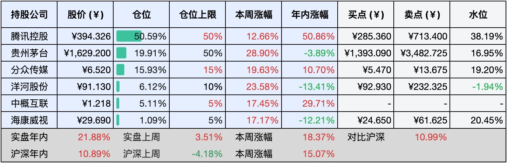

__微信公众号文章地址：[老罗实盘周记-20240928](https://mp.weixin.qq.com/s/xXZlSNdzFIsR0c2Q6P_umw)__

```
老罗实盘周记，每周六更新。专注于股权投资、阅读、学习与个人成长，知行合一、日拱一卒、投资人生。微信公众号【老罗投资】，文章均首发于公众号。
```

### 1. 本周交易

周三(9月25日)分众传媒(002027)年中分红到账，第二天(9月26日)将所有分红买入分众，买入价格为5.810元人民币。

### 2. 目前持仓

当前持有的股票包括：腾讯控股50.59%、贵州茅台19.91%、分众传媒15.93%、洋河股份6.12%、中概互联5.11%、海康微视1.09%。

此外还有少量现金，加上少量的恒瑞医药、上海机场、宋城演义等股票，其份额较少，仅作为观察仓不进行记录。

本周大A和港股受利好影响上涨较多，五个交易日上涨了 <span class="red">+18.37%</span>，实盘年内的收益也随之达到了 <span class="red">+21.88%</span>，所以说闪电劈下来时你一定得在现场，上涨的那几天不在，全年的收益就会受到很大影响。

**注1：表底为截止到今日，老罗实盘和沪深300指数今年的收益率。**

**注2：表格中港股已按汇率换算为人民币。**



### 3. 上周数据


### 4. 本周事项

+ 大利好

==只对持股和交易感兴趣的朋友，读到这里就可以退出了。后面是对上述事件的展开，无新内容。==

#### 4.1 大利好

久旱逢甘霖，这周市场反馈很积极，三大指数均大涨，主要还是重磅新闻发布会，央行给市场带来了不少利好信息：

存款准备金率下调50个基点，政策利率降低20个基点。简而言之，银行需上缴央行的资金减少，使得银行可用资金增加，进而能向更多企业和个人提供贷款。同时，利率下降导致借贷成本降低。降息可视为银行“零花钱”增多，使其更愿意借贷，从而降低企业和个人的借款成本，可能推动消费和投资增长。

下调存量房贷利率，预计降幅为0.5个百分点。此举有助于减轻居民的还款负担，进而激发消费和投资意愿。正如市场所预期，降准和降存量房贷政策均已落地，预计将惠及5000万户家庭、1.5亿人口，每年为家庭节省利息支出约1500亿元。

降低二套房最低首付比例，从25%降至15%。这一措施意在刺激房地产市场需求，降低居民购买二套房的门槛，同时对房地产行业而言，有助于加速存量住房的销售去化。

提高保障性住房再贷款的央行支持比例，从60%升至100%。该政策目的在于将存量房收储转为保障房的资金来源，改由央行全额出资。这样做既可降低银行风险，推动再贷款发放，又能加快存量房收储进程。

实施证券、基金、保险公司互换便利政策，允许这些机构以股票或债券作为抵押向央行借款，所得资金仅限投向股市。目的在于释放流动性，首期操作规模达5000亿元，若效果良好，未来可能进一步扩展至1万亿元。

推出股票回购增持专项再贷款政策，意在引导银行向上市公司及其主要股东提供贷款，以便支持回购和增持股票。首期贷款额度设定为3000亿元，年利率为2.25%，并根据实际运用情况考虑扩大规模，潜在额度可达6000亿元。简单来说，这项政策允许上市公司向银行借款进行股票回购和增持，从而在市场情绪上给予支持。如果上市公司的分红率超过2.25%，则形成无风险套利机会。

目前正研究设立平准基金，这是一种干预基金，政府将通过特定机构（如证监会、财政部、交易所等）依法成立该基金。其主要目标是在证券市场出现剧烈波动时，采取逆向操作策略——市场下跌时买入，市场过热时卖出——以平抑市场波动并维护市场稳定。这将有助于稳定市场情绪，并防止金融系统风险的扩散。

老罗感觉如果空头还不死心，利好政策还会一个接一个的出，央妈出手就是犀利，手动点赞。

### 5. 本周读书

#### 5.1《愿你温柔且有力量》

非常喜欢这句：人类和香蕉的DNA有60％都是相同的，所以从某种意义上说，我们只是个小香蕉。不开心的时候就抱抱自己，别为难一只小香蕉啦！

在医学上，拥抱能够缓解压力、增强免疫力、减轻疼痛、改善睡眠，并提升幸福感。愿你我在悲伤时刻，都能得到一个温暖而有力的拥抱。

评分四星 ⭐️⭐️⭐️⭐️

### 6. 本周运动

本周遛弯1次，继续节食中。

下周只有一个交易日(9月30日)，下周的实盘周记可能就停更了，和10月12日的周记一起更新。

提前祝大家国庆节快乐，万事如意！祝祖国蒸蒸日上，国富民强，欣欣向荣！

如果觉得本文还不错，那就点个赞或者『在看』吧。

```
老罗实盘周记，每周六更新。专注于股权投资、阅读、学习与个人成长，知行合一、日拱一卒、投资人生。微信公众号【老罗投资】，文章均首发于公众号。
免责声明：本公众号只作为本人的投资日志记录，本文中提及的个股都有腰斩或血本无归的风险，本人不做任何投资建议，投资请坚持独立思考。
```

__微信公众号文章地址：[老罗实盘周记-20240928](https://mp.weixin.qq.com/s/xXZlSNdzFIsR0c2Q6P_umw)__