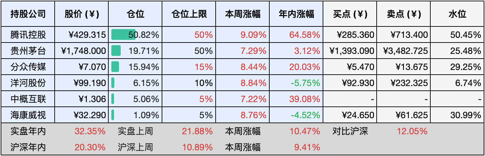
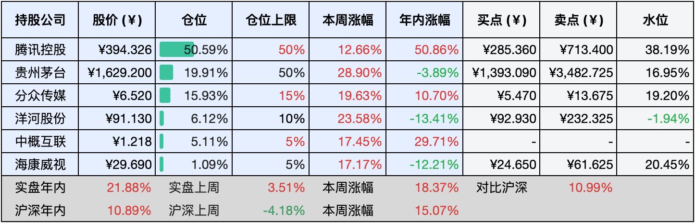

__微信公众号文章地址：[老罗实盘周记-20241005](https://mp.weixin.qq.com/s/3uw29OWKsY5wx1BKB_2qJQ)__

```
老罗实盘周记，每周六更新。专注于股权投资、阅读、学习与个人成长，知行合一、日拱一卒、投资人生。微信公众号【老罗投资】，文章均首发于公众号。
```

### 1. 本周交易

无

### 2. 目前持仓

当前持有的股票包括：腾讯控股50.82%、贵州茅台19.71%、分众传媒15.94%、洋河股份6.15%、中概互联5.06%、海康微视1.09%。

此外还有少量现金，加上少量的恒瑞医药、上海机场、宋城演义等股票，其份额较少，仅作为观察仓不进行记录。

本周大A只开盘一天，港股开盘了四天，虽然时间不长，涨幅可真不小，上涨了<span class="red">+10.47%</span>，实盘年内的收益达到了<span class="red">+32.35%</span>。

老罗本周休假中，这周旗下公司貌似也没发生什么大事，实盘周记仅更新持仓与阅读部分的内容了。

**注1：表底为截止到今日，老罗实盘和沪深300指数今年的收益率。**

**注2：表格中港股已按汇率换算为人民币。**



### 3. 上周数据



### 4. 本周读书

#### 4.1《总有人会拥抱满身带刺的你》

你所经历的一切，无论是喜悦与忧伤，困境中的幸运，焦虑中的恐惧，还是人性的奸诈与善良，这一切都是有意义的。

正是这些经历塑造了你的观念，我们的重点是如何表达这些内心深处的想法，让它们成为心灵深处的对话。

评分三星 ⭐️⭐️⭐️

#### 4.2《一本书看透财报》

尽管作者并非金融专业出身，但是也是一位资深的价值投资者了，并以其贴近普通散户的视角进行讲述，非常适合投资新手阅读。书中有些观点可能与个人见解不同，偶尔也会出现错别字。然而，不能忽视的是，书中确实包含了一些实用的干货。

作为一个拥有十年以上价值投资经验的老股民，他所总结的财务精髓为这本书增色不少，这部分内容值得高度评价，阅读门槛也不高，没有非常晦涩的内容，值得二刷的书。

评分四星半 ⭐️⭐️⭐️⭐️❤️

#### 4.3《唐妞漫画：唐朝原来这么好玩儿》

这部漫画作品颇具趣味性，在轻松幽默的叙述中，向读者展示了唐朝人的生活方式，包括服饰、饮食、居住、节日庆祝以及娱乐活动等多个方面的传统习俗。其中一些习俗已经逐渐消失，而另一些则历经千年，演变成我们今天仍在沿袭的传统。

在回顾历史与现状的同时，尽管古今之间存在差异，但那些深植于我们血脉中的文化传承，却是永恒不变的。

评分三星半 ⭐️⭐️⭐️❤️

#### 4.4《财富脑》

在这本书中，作者不断强调赚钱的重要性。然而，作者观察到，许多人虽然赚到了财富，却无法妥善保管或合理消费。

我们应当认识到，财富来源于当下这个时代和社会，因此作为一个企业家，更应该时刻铭记并践行企业家的责任感和担当精神。

评分三星半 ⭐️⭐️⭐️❤️

#### 4.5《超级大脑在想啥？漫画病菌、人类与历史》

混子哥和张文宏医生生动形象地描绘了那些具有惊人破坏力的病毒，它们引发了人类历史上的九次重大瘟疫。

对于这些瘟疫，我之前已有所耳闻，但此次阅读使我对此有了更深刻的印象。毫不夸张地说，这些瘟疫确实在实质上改变了人类社会的发展轨迹和全球格局。

在颠覆历史进程的同时，它们也催生了现代公共卫生体系和医学技术的飞速发展。

评分四星 ⭐️⭐️⭐️⭐️

### 5. 本周运动

本周出游几天，继续节食中。

祝大家国庆节快乐，万事如意！

如果觉得本文还不错，那就点个赞或者『在看』吧。

```
老罗实盘周记，每周六更新。专注于股权投资、阅读、学习与个人成长，知行合一、日拱一卒、投资人生。微信公众号【老罗投资】，文章均首发于公众号。
免责声明：本公众号只作为本人的投资日志记录，本文中提及的个股都有腰斩或血本无归的风险，本人不做任何投资建议，投资请坚持独立思考。
```

__微信公众号文章地址：[老罗实盘周记-20241005](https://mp.weixin.qq.com/s/3uw29OWKsY5wx1BKB_2qJQ)__