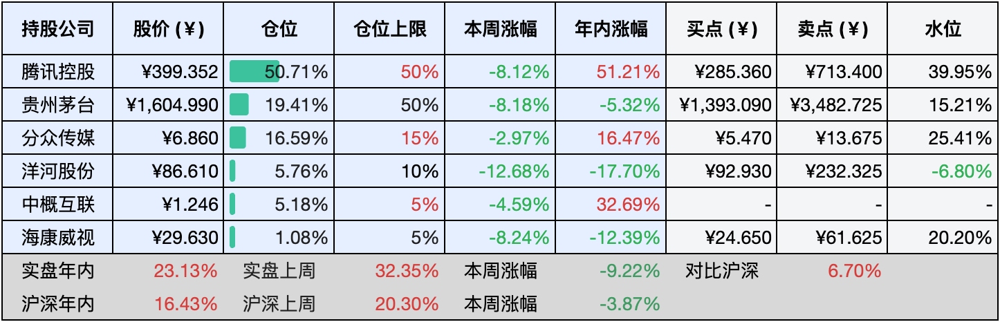

__微信公众号文章地址：[老罗实盘周记-20241012](https://mp.weixin.qq.com/s/m4G27yFR7x6_KJgzkLCjgw)__

```
老罗实盘周记，每周六更新。专注于股权投资、阅读、学习与个人成长，知行合一、日拱一卒、投资人生。微信公众号【老罗投资】，文章均首发于公众号。
```

### 1. 本周交易

无

### 2. 目前持仓

当前持有的股票包括：腾讯控股50.71%、贵州茅台19.41%、分众传媒16.59%、洋河股份5.76%、中概互联5.18%、海康微视1.08%。

此外还有少量现金，加上少量的恒瑞医药、上海机场、宋城演义等股票，其份额较少，仅作为观察仓不进行记录。

本周大盘普跌，上周的涨幅基本都跌没了，回到了十一节前的水平，本周实盘下跌了<span class="green">-9.22%</span>，年内的收益<span class="red">+23.13%</span>。

**注1：表底为截止到今日，老罗实盘和沪深300指数今年的收益率。**

**注2：表格中港股已按汇率换算为人民币。**



### 3. 上周数据


### 4. 本周事项

+ 腾讯回购破中国公司最高纪录
+ 财政部新闻发布会
+ 银行发布存量房贷下调公告
+ 股市剧烈波动更加考验心态

==只对持股和交易感兴趣的朋友，读到这里就可以退出了。后面是对上述事件的展开，无新内容。==

#### 4.1 腾讯回购破中国公司最高纪录

截至10月9日，腾讯今年已回购逾900亿港元股份，刷新了其自身保持的中国企业年度回购金额纪录。为迎接即将发布的三季度财报，腾讯自本周起暂停回购，进入静默期。

自年初以来，腾讯的回购步伐基本保持在每天十亿港元的水平，全年累计投入905.55亿港元，回购了2.55亿股，使公司总股本从94.83亿股减少至92.79亿股。其中，0.52亿股的差额源于股权激励计划的新增股本。

自2005年起，近20年间，腾讯累计回购了5.9亿股股票，耗资约1827亿港元。今年的回购金额已达到历史总额的一半。在股价显著低估之际，通过回购并注销股票，既可以规避分红税，又能实质性地提升股东价值。

#### 4.2 财政部新闻发布会

今日上午10点，备受瞩目的财政部新闻发布会如期举行，信息量巨大，干货满满。

除了对工作的总结与展望，与会者最为关注的莫过于未来政策动向。其中，几项关键措施备受瞩目：力度空前的化债支持政策；发行特别国债以助力大型商业银行资本补充；采取措施稳定房地产市场；以及加大对困难群众和学生群体的补贴力度。

这些政策措施仅是冰山一角，还有更多政策工具正在酝酿之中，中央财政拥有广阔的举债与赤字提升余地。尽管未透露具体数字，但发布会充分展现了坚定的政策立场与广阔的操作空间。

值得一提的是，会议中的一段两位部长的私下对话被意外捕捉到，副部长询问是否公布具体发行量，蓝部长回应道：“先不要说，量会比较大。”

品，你细品......难道战忽局的同志入职了财政部？哈哈！

#### 4.3 银行发布存量房贷下调公告

今天一大早，工商、农行、中行、建行等多家银行相继发布关于批量调整存量房贷利率的公告，一致宣布将从10月25日起执行批量调整，并于当日即按照新利率水平执行。

当前，北京存量首套房贷利率为LPR减30个基点，即3.55%；五环内二套房贷利率为LPR减5个基点，即3.8%；五环外二套房贷利率为LPR减25个基点，即3.6%。此次调整仅涉及LPR加减点，贷款重定价日保持不变。

以存量首套房贷为例，若之前为LPR加40个基点，那么25日调整后，利率将变为LPR减30个基点。需要注意的是，近一年来LPR有所变动，且贷款重定价日周期为一年，具体日期因人而异，因此LPR数值需等到重定价日才会更新。

从26日开始，用户就可以通过银行APP查询房贷调整记录。若需调整固定利率、基准利率或二套转首套，多家银行表示可在10月24日前通过手机银行或贷款服务行提交申请，审核通过后，将于10月25日集中批量调整。

据统计，截止到今年二季度末，我国存量房贷规模高达38万亿元，降低30个基点将为1.5亿家庭减负，预计每年减少利息支出大约1500亿元。近年来银行业确实有不少让利于民的举措，但也说明投资银行业并不是一个好想法？

还有，去年提前还贷的人，此刻会不会哭晕在厕所？

#### 4.4 股市剧烈波动更加考验心态

在节前节后的两周内，股市经历了剧烈的波动，让投资者们体验了一把如同坐过山车般的刺激，在这种形势下，投资者的心态显得尤为重要。

当下中国股市的投资者主要呈现出两种心态：一种是处置效应，即在股价上涨时急于抛售，而在股价下跌时却不愿放手；另一种则是羊群效应，盲目跟随他人的选择，不加以判断，类似模仿精的行为。

要在股市中获得收益，其实关键在于两点：一是如何正确面对市场波动；二是如何评估企业内在价值。其中，正确看待波动的重要性甚至超过了企业估值。第一点解决赚不赚钱的问题，第二点解决赚多少钱的问题。

老罗的投资策略始终如一：在买点买入，在卖点卖出，其余时间则专注于储蓄、阅读、学习和分析企业，呆坐不动，静待花开。

### 5. 本周读书

#### 5.1《指数基金定投(手绘版)》

对于投资新手、财报阅读困难并且时间紧张的普通大众而言，如何妥善保管并增值辛勤积累的财富呢？这本书推荐了一种简易、安全且高效的投资策略：指数基金定投。

为了使复杂的投资理论变得易于理解和直观，这本书运用了手绘漫画和生活实例，阐释了一些关键的理财概念，内容涵盖了指数基金定投的实际操作技巧和所需要的工具，本书以实用为主线，特别适合投资初学者。

评分三星半 ⭐️⭐️⭐️❤️

#### 5.2《半小时漫画经济学4：理财篇》

俗话说：你不理财，财不理你。看着其他人轻松实现财富增值，你是否也跃跃欲试？然而面对纷繁复杂的理财网站和信息，你是否感到困惑和无从下手？担心投资选择不当甚至亏损？

本书将从零开始，深入浅出地了解九大理财方式的原理、优点及风险，帮助你明智地进行理财决策，避免盲目跟风。

评分三星半 ⭐️⭐️⭐️❤️

### 6. 本周运动

本周工作较忙，没有运动，继续节食中。

如果觉得本文还不错，那就点个赞或者『在看』吧，祝大家周末愉快！

```
老罗实盘周记，每周六更新。专注于股权投资、阅读、学习与个人成长，知行合一、日拱一卒、投资人生。微信公众号【老罗投资】，文章均首发于公众号。
免责声明：本公众号只作为本人的投资日志记录，本文中提及的个股都有腰斩或血本无归的风险，本人不做任何投资建议，投资请坚持独立思考。
```

__微信公众号文章地址：[老罗实盘周记-20241012](https://mp.weixin.qq.com/s/m4G27yFR7x6_KJgzkLCjgw)__