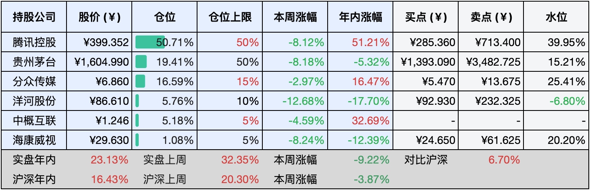

__微信公众号文章地址：[老罗实盘周记-20241019](https://mp.weixin.qq.com/s/tgk7sFStF5pEk8GPjSUcVg)__

```
老罗实盘周记，每周六更新。专注于股权投资、阅读、学习与个人成长，知行合一、日拱一卒、投资人生。微信公众号【老罗投资】，文章均首发于公众号。
```

### 1. 本周交易

无

### 2. 目前持仓

当前持有的股票包括：腾讯控股50.82%、贵州茅台18.83%、分众传媒17.08%、洋河股份5.71%、中概互联5.22%、海康微视1.06%。

此外还有少量现金，加上少量的恒瑞医药、上海机场、宋城演义等股票，其份额较少，仅作为观察仓不进行记录。

本周大盘盘中波动较大，先跌后涨，周末一统计，基本回到上周五的原点，这盯一周盘属于白看，笑。

本周实盘下跌了<span class="green">-1.30%</span>，年内的收益<span class="red">+21.83%</span>。

**注1：表底为截止到今日，老罗实盘和沪深300指数今年的收益率。**

**注2：表格中港股已按汇率换算为人民币。**


### 3. 上周数据



### 4. 本周事项

+ 三季度经济数据发布
+ 今年第二次下调人民币存款利率

==只对持股和交易感兴趣的朋友，读到这里就可以退出了。后面是对上述事件的展开，无新内容。==

#### 4.1 三季度经济数据发布

国家统计局于18日发布数据，经初步核算，前三季度我国国内生产总值近95万亿元，按不变价格计算，同比增长4.8%。国民经济呈现出稳中有进的良好态势，积极向好的因素不断累积增多。

农业生产状况良好，工业生产保持平稳增长，服务业也在持续恢复之中。前三季度，农业（种植业）增加值同比增长3.7%。全国夏粮早稻的总产量达到17795万吨，比上年增加346万吨，增长了2.0%。全国规模以上工业增加值同比增长5.8%。

前三季度，社会消费品零售总额达353564亿元，同比增长3.3%。全国固定资产投资（不含农户）为378978亿元，同比增长3.4%；若扣除房地产开发投资，全国固定资产投资增长7.7%。从前三季度的经济运行状况以及增量政策的实施效果来看，助力经济企稳回升的有利条件在增多，实现5%左右预期目标的信心也在增强。

全篇都是不断向好，但离全年GPD增涨5%的目标还有一定差距，在只剩下2个半月的情况下，各种利好政策估计会尽快地落地。

#### 4.2 今年第二次下调人民币存款利率

中国银行、中国工商银行、中国农业银行、中国建设银行、交通银行以及中国邮政储蓄银行等多家知名银行联合发布公告称，自10月18日起，将下调人民币存款挂牌利率。

具体而言，活期存款利率下调5个基点，由0.15%降至0.1%；三个月、六个月、一年、两年、三年以及五年期定期存款利率均下调25个基点。调整之后，一年定期存款利率变为1.1%。这也是今年主要商业银行第二次对人民币存款利率进行下调。

利率下降，存款收益进一步下降，9月份M0(现金)和M2(定期)增加，M1(活期)下降，降息后估计M2也会有所下降。

从目前的情况来看，降息以提振经济的大方向已然确定，持有现金或许并非明智之举，提前偿还房贷也难占到少还利息的便宜了。

### 5. 本周读书

#### 5.1《格里格外》

微信读书上的神作漫画，可能不在老罗阅读兴趣范围之内吧，感觉并没有什么共鸣。

评分三星 ⭐️⭐️⭐️

#### 5.2《张新民教你读财报》

读过老唐、肖星、腾腾爸的财报书。老唐和腾腾爸更侧重投资分析，读财报用来排除企业，肖星学院派，属于大学财务课程。

最近翻找微信读书神作榜找好书，不经意就找到了这本《张新民教你读财报》，好像是唯一上神作榜的财报类书籍。此书颇具特色，其一，所选案例皆具时效性，且典型性强、涵盖面广。其二，它突破科目界限，聚焦深度分析，展现出卓越的学术和实践能力，其分析框架更是功力非凡。其三，独特地将母公司报表与合并报表相结合进行剖析，这一视角在其他作者的作品中堪称罕见。

属于值得多刷的好书，评分四星半 ⭐️⭐️⭐️⭐️❤️

### 6. 本周运动

本周没有运动，继续节食中，体重下降一公斤，减肥还是七分靠吃，三分运动。

如果觉得本文还不错，那就点个赞或者『在看』吧，祝大家周末愉快！

```
老罗实盘周记，每周六更新。专注于股权投资、阅读、学习与个人成长，知行合一、日拱一卒、投资人生。微信公众号【老罗投资】，文章均首发于公众号。
免责声明：本公众号只作为本人的投资日志记录，本文中提及的个股都有腰斩或血本无归的风险，本人不做任何投资建议，投资请坚持独立思考。
```

__微信公众号文章地址：[老罗实盘周记-20241019](https://mp.weixin.qq.com/s/tgk7sFStF5pEk8GPjSUcVg)__