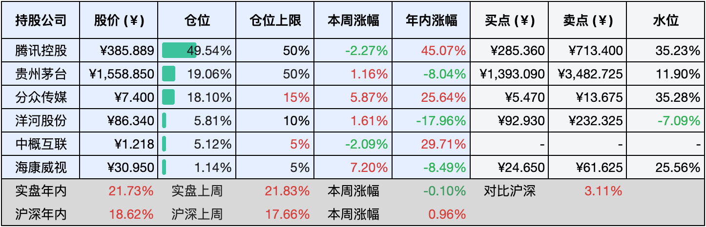
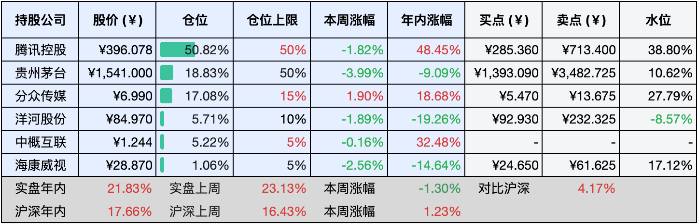

__微信公众号文章地址：[老罗实盘周记-20241026](https://mp.weixin.qq.com/s/M2feLJzj0fw5er06op5DTA)__

```
老罗实盘周记，每周六更新。专注于股权投资、阅读、学习与个人成长，知行合一、日拱一卒、投资人生。微信公众号【老罗投资】，文章均首发于公众号。
```

### 1. 本周交易

无

### 2. 目前持仓

当前持有的股票包括：腾讯控股49.54%、贵州茅台19.06%、分众传媒18.10%、洋河股份5.81%、中概互联5.12%、海康微视1.14%。

此外还有少量现金，加上少量的恒瑞医药、上海机场、宋城演义等股票，其份额较少，仅作为观察仓不进行记录。

本周实盘下跌了<span class="green">-0.10%</span>，年内的收益<span class="red">+21.73%</span>。

**注1：表底为截止到今日，老罗实盘和沪深300指数今年的收益率。**

**注2：表格中港股已按汇率换算为人民币。**



### 3. 上周数据



### 4. 本周事项

+ 贵州茅台三季报
+ 海康回购注销股票
+ 降息

==只对持股和交易感兴趣的朋友，读到这里就可以退出了。后面是对上述事件的展开，无新内容。==

#### 4.1 贵州茅台三季报

前三季度实现营业总收入1231.23亿元，同比增长16.91%；归母净利润608.28亿元，同比增长15.04%；茅台酒营收1011.26亿元，同比增长15.88%；系列酒营收193.93亿元，同比增长24.36%，在酒类收入占比达到了16.09%；海外营收34.83亿元，同比增长16.71%。

贵州茅台业绩依然是明牌，让人十分放心的企业，A股最稳定的印钞机。然而即便如此稳健的企业，在股市中仍遭遇不少投资者的不满与抱怨，他们认为其公司规模太大，增长速度较慢，缺乏足够的成长潜力，哈哈哈。

#### 4.2 海康回购注销股票

在完成近29亿元回购仅两个月后，海康威视董事长胡扬忠再次提议发起不超过25亿元的大额回购计划。10月18日晚，海康威视发布公告称，董事会已于当日收到董事长的提议，建议通过集中竞价交易方式，以不低于20亿元且不超过25亿元的资金回购部分已发行的A股股票，并计划将回购股份全部用于依法注销以减少注册资本。

根据提议，回购资金总额的上限为25亿元，下限为20亿元，回购价格上限设定为40元/股，具体价格将根据市场情况、公司财务状况及经营状况综合确定，且不超过董事会审议回购方案前三十个交易日股票交易均价的150%。

公司预计，在回购价格不超过40元/股的情况下，若按最高回购金额25亿元计算，则回购股份数量将不超过6250万股，占公司已发行总股本的约0.68%；若按最低回购金额20亿元计算，则回购股份数量将不少于5000万股，占比约0.54%。

受回购注销股票的积极影响，本周海康威视股价涨幅超过7%。然而，近期有关公司大规模裁员的传闻不断，反映出企业在经营层面可能遭遇挑战，尤其是其主要客户预算缩减对公司造成了显著影响。

在六月份老罗将大部分海康换成了茅台，目前海康只占1%的仓位，对整体影响几乎可以忽略不计了。

#### 4.3 降息

10月21日，人民银行授权全国银行间同业拆借中心发布了新一期的贷款市场报价利率（LPR）。具体来看，1年期LPR下调至3.10%，较上月下降25个基点，上月为3.35%；5年期以上LPR也降至3.60%，较上月下降25个基点，上月为3.85%。此次LPR的下调，标志着时隔三个月后的再次下降，有助于进一步稳定并降低实体经济的融资成本，特别是减轻购房者的置业负担。

自10月25日起，存量房贷利率将进行批量调整，大多数借款人的存量房贷利率预计将调整为“LPR-30个基点”。若后续LPR保持不变，多数借款人的存量房贷利率将在下一次贷款重定价日调整为“3.60%-30个基点”，即3.30%。

打个比方，假如老罗在某个一线城市的住房存量房贷利率原为4.4%（LPR+55个基点），调整后将变为LPR-30个基点。随着5年期以上LPR降至3.60%，在下一次贷款重定价日后，其房贷利率将降至3.30%，较调整前降低110个基点。假设房贷本金为100万元、期限30年、采用等额本息还款方式，调整前每月还款额约为5007元，调整后则降至约4546元，每月节省约461元，总计可以节省利息约16.60万元。

降息作为货币政策宽松的明确信号，能有效降低企业融资成本和投资者机会成本，对资本市场形成实质性利好，对于老罗来说，首选当然是公司股权类的投资，房产类资产应该也会企稳，但房产流动性太差，价格也并不美丽，暂时不会考虑。

### 5. 本周读书

#### 5.1《难过的话我可以把你吃掉》

要成为自己心中的理想模样，而非迁就他人，无需畏惧打扰他人，因为真诚和个性才是生活的真谛。

人们常常为了掩饰真实自我，在不同场合扮演不同角色，换上不同的外表，仅仅是为了取悦他人。然而，这样做只会让我们失去本真，感到疲惫不堪。

在日常生活中，我们应该坚守个性，讲求原则，不做作、不迎合，勇敢地做回自己！

评分四星⭐️⭐️⭐️⭐️

#### 5.2《半小时漫画中国航天.航天奠基篇》

从两弹一星到北斗导航，我国航天事业实现了飞跃式发展，航天精神值得我们学习和借鉴。

评分四星⭐️⭐️⭐️⭐️

#### 5.3《半小时漫画中国航天.探索宇宙篇》

向那些默默无闻的英雄先辈们表达最崇高的敬意，正是他们的伟大付出，才铸就了今日我国航天事业的辉煌成就。

花费一个多小时，跟随混子哥一同探索航天知识的奥秘，不得不说，《半小时漫画》系列真正做到了寓教于乐，让人在轻松愉快的氛围中收获满满的知识。

评分四星⭐️⭐️⭐️⭐️

### 6. 本周运动

本周依然没有运动，天冷了也变懒了，继续节食中。

如果觉得本文还不错，那就点个赞或者『在看』吧，祝大家周末愉快！

```
老罗实盘周记，每周六更新。专注于股权投资、阅读、学习与个人成长，知行合一、日拱一卒、投资人生。微信公众号【老罗投资】，文章均首发于公众号。
免责声明：本公众号只作为本人的投资日志记录，本文中提及的个股都有腰斩或血本无归的风险，本人不做任何投资建议，投资请坚持独立思考。
```

__微信公众号文章地址：[老罗实盘周记-20241026](https://mp.weixin.qq.com/s/M2feLJzj0fw5er06op5DTA)__