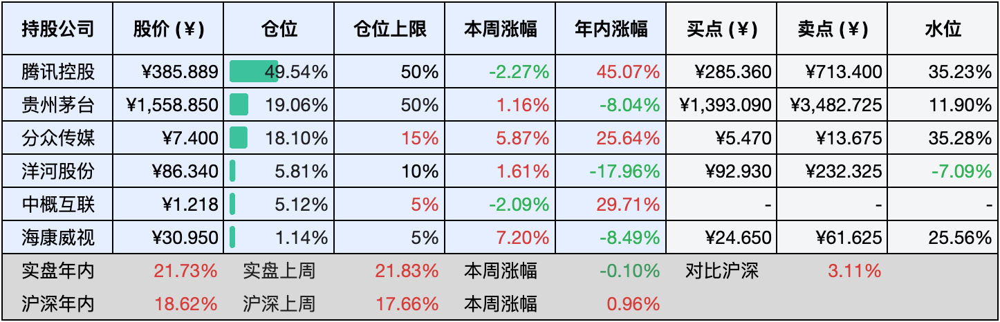

__微信公众号文章地址：[老罗实盘周记-20241102](https://mp.weixin.qq.com/s/J8VasFpdwHs1kILmie_lhA)__

```
老罗实盘周记，每周六更新。专注于股权投资、阅读、学习与个人成长，知行合一、日拱一卒、投资人生。微信公众号【老罗投资】，文章均首发于公众号。
```

### 1. 本周交易

无

### 2. 目前持仓

当前持有的股票包括：腾讯控股49.67%、贵州茅台18.88%、分众传媒17.82%、洋河股份5.45%、中概互联5.15%、海康微视1.11%。

此外还有少量现金，加上少量的恒瑞医药、上海机场、宋城演义等股票，其份额较少，仅作为观察仓不进行记录。

本周实盘下跌了<span class="green">-1.68%</span>，年内的收益<span class="red">+20.05%</span>。

本周，除了腾讯的财报需等到11月13日公布外，旗下其他公司的第三季度财报已陆续披露。

**注1：表底为截止到今日，老罗实盘和沪深300指数今年的收益率。**

**注2：表格中港股已按汇率换算为人民币。**


### 3. 上周数据



### 4. 本周事项

+ 分众传媒三季报
+ 洋河股份三季报
+ 海康威视三季报
+ LPR调整重新定价周期
+ 下周关注几件重要事项

==只对持股和交易感兴趣的朋友，读到这里就可以退出了。后面是对上述事件的展开，无新内容。==

#### 4.1 分众传媒三季报

分众传媒于10月29日发布了2024年第三季度财报。今年前九个月，公司实现营收92.61亿元，同比增长6.76%；归属于母公司的净利润为39.68亿元，同比增长10.16%；扣非净利润为35.41亿元，同比增长8.71%。尽管经营活动产生的现金流量净额有所下降，为46.48亿元，同比减少12.08%，报告期内的基本每股收益0.2748元，加权平均净资产收益22.61%。

考虑到当前复杂的经济形势，分众传媒能够实现这样的业绩实属不易，值得肯定与赞扬。

#### 4.2 洋河股份三季报

10月30日，江苏洋河酒厂股份有限公司（洋河股份，股票代码：002304）发布了第三季度财报。数据显示，2024年前三季度公司实现营业收入275.16亿元，同比减少9.14%；归属于上市公司股东的净利润为85.79亿元，同比下降15.92%。特别是在第三季度，公司营业收入仅为46.41亿元，同比大幅下降44.82%；归属于上市公司股东的净利润降至6.31亿元，同比骤减73.03%。

虽说今年白酒行业整体表现不佳，但洋河在营业额超百亿的酒企中差得尤为突出，投入巨大却未能实现收入增长，第三季度的经营数据尤为严峻，堪称惨淡。

此前，老罗已将部分洋河股份卖出并换成了茅台，仅保留5%的仓位作为反面教材，时刻提醒自己警惕类似风险。

#### 4.3 海康威视三季报

海康威视于10月25日晚间发布了第三季度财报，显示公司在2024年前三季度实现营业收入649.91亿元，同比增长6.06%；然而，净利润录得81.08亿元，同比下降8.4%，基本每股收益为0.878元。特别值得注意的是，第三季度净利润仅为30.44亿元，同比下滑13.37%。

目前，公司的最大甲方元气尚未完全恢复，海康威视的增长道路依旧充满挑战，就看管理层如何破局了。

#### 4.4 LPR调整重新定价周期

自2024年11月1日起，央行宣布取消个人住房贷款重定价周期最短为1年的限制，允许浮动利率贷款的借款人根据市场情况与银行协商确定重定价周期，重定价周期是指贷款利率随市场基准调整的时间间隔，通常每年重定价一次。

新政策下，存量房贷借款人可以缩短重定价周期，以更快享受利率下调的好处，而新发放贷款的借款人则有权自主选择重定价周期。银行通常提供三个月、半年和一年三种选项，分别对应每年重定价4次、2次和1次。

按发达国家的经验，利率长期是下行的，老罗的建议是可以调整为三个月。但大多数银行规定，存量房贷借款人在整个贷款存续期内，重定价周期只能调整一次，不能多次调整，调整前还是要慎重。

#### 4.5 下周关注几件重要事项

下周有几件大事会比较重要，记录一下：

11月6日美国大选结果出炉，2024年美国大选投票日为11月5日，预计北京时间6日中午可基本敲定大选结果。参考2016年、2020年两轮大选流程，美东时间11月5日6:00点起，各州投票站陆续开放，当日19:00后投票站逐渐关闭，随后产生选情预测，一般当日半夜左右可以基本确定大选结果，对应北京时间6日中午左右。最终不管是贺经理还是川普获胜，美帝肯定会继续对中国打压，所以还是放弃幻想，准备战斗。

11月7日美国大概率降息，主要原因在于昨晚公布的非农数据远低于预期。美国劳工统计局的数据显示，10月非农新增就业人数急剧下降至1.2万人，较9月的22.3万（原数据25.4万下修）大幅减少，创下2020年以来的最低增速，远低于市场预期的10万人。失业率，10月失业率保持在4.1%，符合预期并与前值一致。历史数据修正，9月数据从25.4万下修至22.3万，8月数据从15.9万下修至7.8万，两个月总计减少了11.2万个就业岗位。CME美联储观察的最新数据显示，非农就业报告公布后，市场对美联储在11月降息25个基点的预期概率飙升至99.7%，显示出市场对降息的预期显著增强。

11月8日确定发债规模，中国可能在未来几年内批准发行超过10万亿元人民币的债券，作为一项重要的财政刺激措施，目标是提振当前的经济状况，这项决定预计将在全国人大常委会第十二次会议上讨论，并很可能获得通过。

### 5. 本周读书

#### 5.1《邻家的百万富翁》

开豪车、住豪宅的真的是富人吗？本书揭示了一个颠覆性的真相！在美国，作者观察到一种反常现象，许多豪宅和豪车的主人实际上财务状况平平，更令人惊讶的是，许多真正的富人并不选择高档社区居住。那么，净资产百万以上的富人究竟是谁呢？在美国，他们大多是自主经营的专业人士和企业主。

以下是关于美国百万富翁的真实数据：80%的百万富翁是白手起家的；大部分百万富翁在手表上的花费从未超过500美元；他们中的大多数人没有豪华汽车，而是驾驶普通或二手车；大部分百万富翁的衣物价值不超过1000美元；典型百万富翁的家庭净资产中位数为160万美元。

用三个词来概括这些富人的特点：节俭、节俭、再节俭！他们的生活方式远低于收入水平，致富原则简单明了：多挣少花，投资结余，让财富随时间增长。如果计划你在当前应该拥有多少净资产呢？一个简单的计算方法是：用年龄乘以除继承外所有来源的税前家庭年收入，再除以10，然后减去所有继承财产。

追求表面光鲜往往导致经济困境，事实上，开豪车、住豪宅的人可能并不富裕，大众媒体宣扬的消费观念误导了年轻人，让他们误以为富人过着高消费的生活。然而，真正的富人懂得规划和控制消费，这是构建财富基础的关键。

对于实现财务自由来说，许多彰显社会地位的物品反而成为负担，因此，不要被豪车、豪宅和高档衣物所迷惑。这类人如果依赖固定收入生活，很可能负债累累，为了维持表面上的体面而背负沉重的贷款和信用卡债务，实际上并没有积累真正的财富。

评分三星半⭐️⭐️⭐️❤️

### 6. 本周运动

本周出门遛弯一次，继续节食中，下一步需要尝试戒糖了。

如果觉得本文还不错，那就点个赞或者『在看』吧，祝大家周末愉快！

```
老罗实盘周记，每周六更新。专注于股权投资、阅读、学习与个人成长，知行合一、日拱一卒、投资人生。微信公众号【老罗投资】，文章均首发于公众号。
免责声明：本公众号只作为本人的投资日志记录，本文中提及的个股都有腰斩或血本无归的风险，本人不做任何投资建议，投资请坚持独立思考。
```

__微信公众号文章地址：[老罗实盘周记-20241102](https://mp.weixin.qq.com/s/J8VasFpdwHs1kILmie_lhA)__