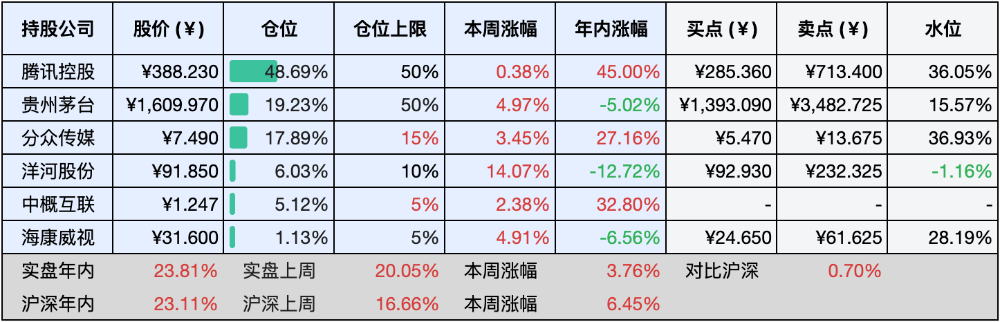
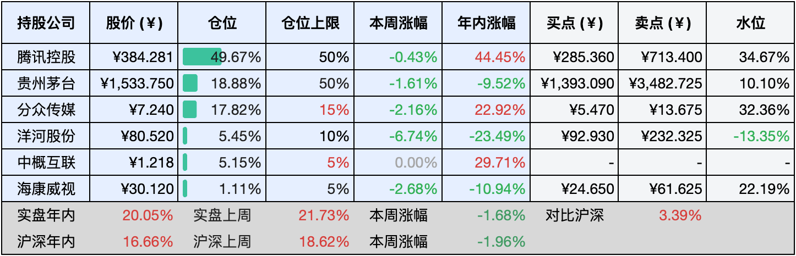

__微信公众号文章地址：[老罗投资周记-20241109](https://mp.weixin.qq.com/s/rfZYJqBMIcYdS35sJfvvPg)__

```
老罗投资周记，每周六更新。专注于股权投资、阅读、学习与个人成长，知行合一、日拱一卒、投资人生。微信公众号【老罗投资】，文章均首发于公众号。
```

### 1. 本周交易

无

### 2. 目前持仓

当前持有的股票包括：腾讯控股48.69%、贵州茅台19.23%、分众传媒17.89%、洋河股份6.03%、中概互联5.12%、海康微视1.13%。

此外还有少量现金，加上少量的恒瑞医药、上海机场、宋城演义等股票，其份额较少，仅作为观察仓不进行记录。

本周投资上涨了<span class="red">+3.76%</span>，年内的收益<span class="red">+23.81%</span>。

**注1：表底为截止到今日，老罗和沪深300指数今年的收益率。**

**注2：表格中港股已按汇率换算为人民币。**



### 3. 上周数据



### 4. 本周事项

+ 茅台中期分红与股份回购
+ 本周三件要事结果
+ 什么是财富和成功？

==只对持股和交易感兴趣的朋友，读到这里就可以退出了。后面是对上述事件的展开，无新内容。==

#### 4.1 茅台中期分红与股份回购

贵州茅台中期分红方案出炉，11月8日晚间公告，公司拟向全体股东每股派发现金红利23.882元（含税），合计拟派发现金红利超300亿元（含税）。

截至9月30日，贵州茅台未分配利润为1929.04亿元。经董事会决议，公司拟以实施权益分派股权登记日公司总股本为基数，实施2024年中期利润分配方案。

此外，贵州茅台将在本月27日下午两点半开始召开临时股东会审议中期分红和股份回购等事项。若上述事项通过，公司最快或可在次日（28日）开启回购，回购额度为30亿元-60亿元。

回购方案肯定会被通过，但不知道届时会不会超过1795.78元/股的回购限价，这次回购属于茅台开天辟地第一回，虽然额度不高，但也希望能顺利进行。

#### 4.2 本周三件要事结果

上周预告了本周会有三件要事：

第一，美国大选结果出炉，特朗普以绝对优势获胜，哈姐完全不堪一击。同时共和党在众参两院也全部获胜，加上最高法院也是共和党，特朗普这第二个任期的头两年，权力达到了巅峰，类似的只有二战时的罗斯福总统。特朗普也成为了美国历史上第二位两届任期，但任期不相连的总统，第一位是美国第22任和第24任总统格罗弗·克利夫兰。

第二，美联储降息，没有任何意外，降息25BP，这也是美联储继9月18日降息50个基点后，连续第二次降息，预计下个月，可能还会有一次降息25BP。

第三，人大常委会通过10万亿发债规模，财政部表示，从2024年开始，连续五年每年从新增地方政府专项债券中安排8000亿元，补充政府性基金财力，用于化债，两者合计，共增加10万亿元化债资源。隐性债务大部分集中在城投债务中，从目前城投债务到期量来看，2022年-2027年是债务集中到期还本的高峰期，每年到期量均在2万亿元以上，而此后偿债压力将大幅降低，到2028年之前，地方需消化的隐性债务总额从14.3万亿元大幅降至2.3万亿元。利用当前的低利率，帮助地方政府解决债务问题，长期来说是极大的利好。

#### 4.3 什么是财富和成功？

真正的财富，并非简单地以货币或现金流来衡量，而是体现在个人的解放和自由之上，这是一种更深层次、更全面的财富观，它超越了物质的束缚，更多地关注人的精神层面和生活的质量。

金钱，虽然在生活中扮演着重要的角色，但它并不等同于独立。一个人可能拥有大量的财富，但如果这些财富并未给他带来真正的自由和时间上的自主，那么他仍然不能算是真正的独立。因为真正的独立，是对自己时间的掌控力，是能够自由地安排自己的生活，不受外界干扰。

那么，什么是成功的定义呢？成功并不是单纯地以金钱或地位来衡量，而是看一个人是否能够按照自己想要的方式度过一生。这是成功的唯一定义，也是最具价值的定义，每个人都有自己的梦想和追求，只有能够实现自己的梦想，过上自己想要的生活，才能算是真正的成功。

我们应该更加注重个人的成长和发展，不断提升自己的能力和素质，以便更好地掌控自己的时间和生活。同时，我们也应该树立正确的财富观，认识到金钱并不是生活的全部，真正的幸福和满足来自于内心的充实。

### 5. 本周读书

#### 5.1《复利：全球顶尖投资者的31节认知与决策思维课》

这位印度裔的作者知识相当渊博，他坚定地信仰着芒格、巴菲特以及费雪的价值投资理念。

复利的力量在于其潜移默化中带来的巨大变化，只要我们坚持不懈，随着时间的推移，微小的努力将汇聚成非凡的成就。这种力量在投资、持续学习和个人成长的道路上尤为显著。

正如书中所言：“保重身体，保持好奇心，不断追求新知！”这句话是对每一位渴望不断进取、力求自我提升的读者的真挚寄语，无论他们是否身为职业投资者。

评分四星⭐️⭐️⭐️⭐️

### 6. 本周运动

本周遛弯一次，继续节食中。

如果觉得本文还不错，那就点个赞或者『在看』吧，祝大家周末愉快！

```
老罗投资周记，每周六更新。专注于股权投资、阅读、学习与个人成长，知行合一、日拱一卒、投资人生。微信公众号【老罗投资】，文章均首发于公众号。
免责声明：本公众号只作为本人的投资日志记录，本文中提及的个股都有腰斩或血本无归的风险，本人不做任何投资建议，投资请坚持独立思考。
```

__微信公众号文章地址：[老罗投资周记-20241109](https://mp.weixin.qq.com/s/rfZYJqBMIcYdS35sJfvvPg)__