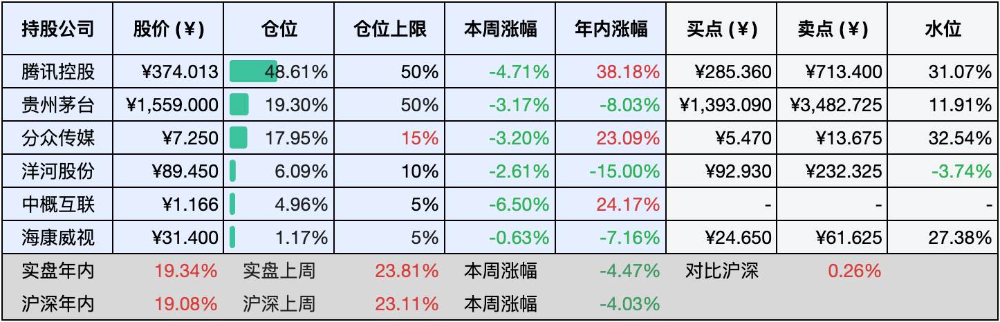
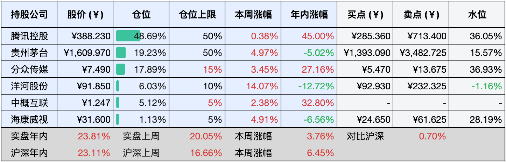

__微信公众号文章地址：[老罗投资周记-20241116](https://mp.weixin.qq.com/s/MBYiRbDqaRTS0_dZ2GtCBA)__

```
老罗投资周记，每周六更新。专注于股权投资、阅读、学习与个人成长，知行合一、日拱一卒、投资人生。微信公众号【老罗投资】，文章均首发于公众号。
```

### 1. 本周交易

无

### 2. 目前持仓

当前持有的股票包括：腾讯控股48.61%、贵州茅台19.30%、分众传媒17.95%、洋河股份6.09%、中概互联4.96%、海康微视1.17%。

此外还有少量现金，加上少量的恒瑞医药、上海机场、宋城演义等股票，其份额较少，仅作为观察仓不进行记录。

本周旗下公司整体下跌了<span class="green">-4.47%</span>，年内的收益<span class="red">+19.34%</span>。

**注1：表底为截止到今日，老罗和沪深300指数今年的收益率。**

**注2：表格中港股已按汇率换算为人民币。**



### 3. 上周数据



### 4. 本周事项

+ 腾讯三季报
+ 购房减税新政出台

==只对持股和交易感兴趣的朋友，读到这里就可以退出了。后面是对上述事件的展开，无新内容。==

#### 4.1 腾讯三季报

在2024年第三季度，腾讯实现营收1672亿元，同比增长8%，环比增长4%；Non-IFRS归母净利润(非国际准则净利润)达到598亿元，同比增长33%，环比增长4%。今年前三季度，腾讯累计营收达4878亿元，同比增长7%；Non-IFRS归母净利润1674亿元，同比增长46%，营收及非国际标准净利润均超出市场大多数机构的预期。

增长的主要驱动力来自游戏与营销服务业务（原网络广告业务），二者均表现出色，尤其是游戏业务增长迅猛。第三季度游戏业务收入达到518亿元，同比增长13%，其中本土游戏收入为373亿元，同比增长14%，甚至超过了海外游戏的增速(145亿元，同比增长9%)。

营销服务在第三季度实现收入300亿元，同比增长17%。增长主要得益于视频号、搜一搜、小程序等新增广告资源位的贡献，视频号当前的adsload(广告加载率)仅为3%左右，远低于抖音和快手，未来仍有着较大的提升潜力。

财报公布后，腾讯于周五恢复股票回购，当日耗资7亿港元回购了175万股。

#### 4.2 购房减税新政出台

13日，财政部联合三部门发布《关于促进房地产市场平稳健康发展有关税收政策的公告》，明确了若干支持房地产市场发展的税收优惠措施。

新政策加大了住房交易环节契税的优惠力度，将享受1%契税优惠的住房面积标准从90平方米提升至140平方米。具体而言：购买首套住房的家庭，若购房面积在90至140平方米之间，契税率将从1.5%降至1%，降低0.5个百分点。对于购买第二套住房的家庭，若购房面积不超过140平方米，契税率统一调整为1%；若超过140平方米，则从3%降至2%。

根据新政策，北京、上海、广州、深圳四个城市将与其它地区一致实施家庭第二套住房契税优惠政策。以在北京购买总价为500万元的二套房为例，原先需缴纳的契税为3%，即15万元。新政策实施后，若房屋面积不超过140平方米，契税将降至1%，仅需缴纳5万元，节省了10万元，这对于刚需购房者而言，无疑降低了不少的购房成本。

### 5. 本周读书

#### 5.1《半小时漫画青春期：社交篇》

青春期是孩子成长的关键阶段，生理和心理均经历显著变化。此阶段的孩子社交特征显著：渴求独立、寻求认同、情感多变且丰富。

他们日益重视同伴关系，期望获得同龄人的接纳与肯定，同时，情感表达更为直接且强烈，容易因为小事而产生情绪波动。

适当的引导可培养孩子的社交能力，帮助他们妥善处理人际关系，顺利度过青春期，为其未来社交奠定坚实基础。

评分四星⭐️⭐️⭐️⭐️

#### 5.2《巴菲特的投资组合》

集中投资，简而言之，强调避免过度地分散，需要远离普遍的投资路径，实现集中投资的关键在于专注于一到数个行业和企业，达到深入理解同时心态稳健，即便无法做到百分之百的精确判断，也应该追求大致的正确方向。

在模糊正确的基础上，投资者需要执行买入并持有策略，并且持续地跟踪分析公司经营状况，以验证初始判断的正确性，此外，市场的挑战也不可以忽视。专注于特定行业或公司时，面对其他行业或公司的上涨，投资者需避免盲目跟风，坚持对公司价值的深度认知以保持冷静。

当然投资过程中难免会出现误判与错误，此时应该勇于承认错误并及时地退出，毕竟没有人可以确保百分之百的投资成功率，60%的成功率，足够让我们这一生过得很富足了。

评分四星半⭐️⭐️⭐️⭐️❤️

#### 5.3《比小说更好看的理财故事书：巴比伦富翁的秘密》

书中反复强调的核心观点包括：培养储蓄习惯，践行勤俭节约并合理地规划支出；谨慎管理个人财务，防止借贷与受骗，并通过保险规避潜在风险；进行投资理财以实现财富增长；坚守信念并付出持续地努力。

评分三星半⭐️⭐️⭐️❤️

### 6. 本周运动

本周没有运动犯懒中，继续节食。

如果觉得本文还不错，那就点个赞或者『在看』吧，祝大家周末愉快！

```
老罗投资周记，每周六更新。专注于股权投资、阅读、学习与个人成长，知行合一、日拱一卒、投资人生。微信公众号【老罗投资】，文章均首发于公众号。
免责声明：本公众号只作为本人的投资日志记录，本文中提及的个股都有腰斩或血本无归的风险，本人不做任何投资建议，投资请坚持独立思考。
```

__微信公众号文章地址：[老罗投资周记-20241116](https://mp.weixin.qq.com/s/MBYiRbDqaRTS0_dZ2GtCBA)__