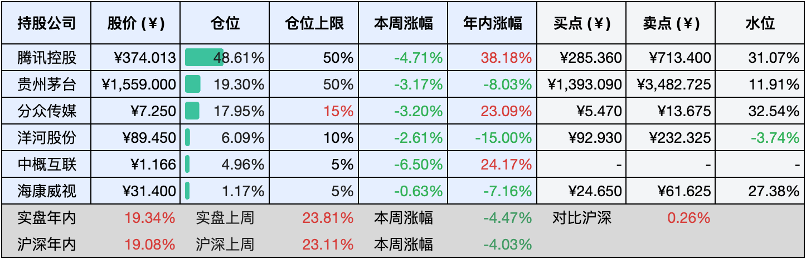

__微信公众号文章地址：[老罗投资周记-20241123](https://mp.weixin.qq.com/s/1Q-LmgSVX4eBMzHt9ugu8A)__

```
老罗投资周记，每周六更新。专注于股权投资、阅读、学习与个人成长，知行合一、日拱一卒、投资人生。微信公众号【老罗投资】，文章均首发于公众号。
```

### 1. 本周交易

无

### 2. 目前持仓

当前持有的股票包括：腾讯控股49.06%、贵州茅台18.89%、分众传媒17.54%、洋河股份5.82%、中概互联4.91%、海康微视1.13%。

此外还有少量现金，加上少量的恒瑞医药、上海机场、宋城演义等股票，其份额较少，仅作为观察仓不进行记录。

本周旗下公司整体下跌了<span class="green">-2.34%</span>，年内的收益<span class="red">+17.00%</span>。

**注1：表底为截止到今日，老罗和沪深300指数今年的收益率。**

**注2：表格中港股已按汇率换算为人民币。**


### 3. 上周数据



### 4. 本周事项

+ 贵州茅台2024年第一次临时股东大会
+ 本周依然波澜不惊

==只对持股和交易感兴趣的朋友，读到这里就可以退出了。后面是对上述事件的展开，无新内容。==

#### 4.1 贵州茅台2024年第一次临时股东大会

公司定于2024年11月27日14点30分，在贵州省仁怀市茅台镇的茅台国际大酒店举行2024年第一次临时股东大会。本次会议将结合现场投票和网络投票的方式进行决策，主要审议《2024－2026年度现金分红回报规划》、《2024年中期利润分配方案》以及《关于以集中竞价交易方式回购公司股份的方案》等重要议题。

这次临时大会的内容主要是首次股份回购以及300亿中期分红计划，只需要在投票时直接选择赞成即可。网络投票将通过上海证券交易所网络投票系统进行，具体分为交易系统投票平台和互联网投票平台两种方式。交易系统投票平台的投票时间为2024年11月27日的交易时段，即上午9:15至9:25、9:30至11:30，下午13:00至15:00；互联网投票平台的投票时间为同一天的9:15至15:00。

#### 4.2 本周依然波澜不惊

本周貌似没什么重要的事，前四天在平平静静中度过了，也就周五大盘有较大的下跌。但周末一统计数据，本周沪深300下跌3%，都没有上周4%的跌幅大，近因效应确实很容易让人产生认知偏差。

近因效应描述的是最新出现的刺激物对印象形成的显著心理影响，1957年，心理学家A·卢琴斯通过精心设计的实验首次阐述了这一现象，并证实当多个意义不同的刺激物依次呈现时，新近出现的刺激物往往成为印象形成的主导因素。

以人际交往为例，无论是初次相识还是久别重逢，第一次和最后一次的互动往往在对方心中留下深刻的印记，比如与多年未见的朋友重逢时，我们最难忘的往往是分别时的情景。

在回忆一系列信息时，我们往往对末尾部分的内容记忆犹新，而中间部分的记忆则相对模糊。随着时间的推移，近因效应变得越来越明显，早期的记忆逐渐淡去，而近期的记忆则在我们的短时记忆中保持得更为持久。

### 5. 本周读书

#### 5.1《金钱的背后是人：高盛交易员眼中的货币经济》

它从一个孩子的好奇提问出发：既然钱能换来东西，为什么我们不能在自己的家里印钱呢？通过一系列问题，层层深入，引导读者了解货币的起源、价值所在以及整个经济体系如何在货币的驱动下运作。这本书以孩子的视角，用通俗易懂的文字揭示了复杂的货币经济原理，书中还串联了中央银行、银行、政府、企业及债券等现代经济核心概念。

评分三星半⭐️⭐️⭐️❤️

#### 5.2《多赚一倍》

短短一个多小时就读完了，对于初学者而言，这本书相当友好，语句通顺易懂，并且不会涉及过多复杂的专业术语。阅读完毕后，了解了企业的商业逻辑、三种盈利模式、营销策略，以及关于产品的更广泛定义和企业定价等方面的知识。特别是最后一部分关于企业管理者如何迅速成长的讨论，实际上也对我们每个人如何更有效地提升自我和管理自己，提供了宝贵的启示。

评分三星半⭐️⭐️⭐️❤️

#### 5.3《财富觉醒》

这本书并非单纯地传授财富技巧，而是独辟蹊径，从全新的视角引导读者探索如何创造财富，让财富自然降临。我认为它适合所有人阅读，无论你来自何种家庭背景，即使出身平凡，也能掌握财富的奥秘，拥抱富裕的人生。我之前已经阅读过不少相关书籍，并始终坚持知行合一的原则，在实践中不断体悟，但仍有一些不足之处或有待改进的地方。

评分四星⭐️⭐️⭐️⭐️

### 6. 本周运动

本周继续节食，下周得开始锻炼锻炼了，要不然身体越呆越懒。

如果觉得本文还不错，那就点个赞或者『在看』吧，祝大家周末愉快！

```
老罗投资周记，每周六更新。专注于股权投资、阅读、学习与个人成长，知行合一、日拱一卒、投资人生。微信公众号【老罗投资】，文章均首发于公众号。
免责声明：本公众号只作为本人的投资日志记录，本文中提及的个股都有腰斩或血本无归的风险，本人不做任何投资建议，投资请坚持独立思考。
```

__微信公众号文章地址：[老罗投资周记-20241123](https://mp.weixin.qq.com/s/1Q-LmgSVX4eBMzHt9ugu8A)__