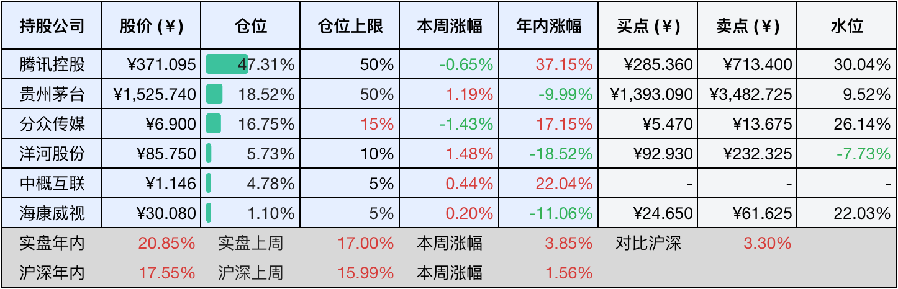
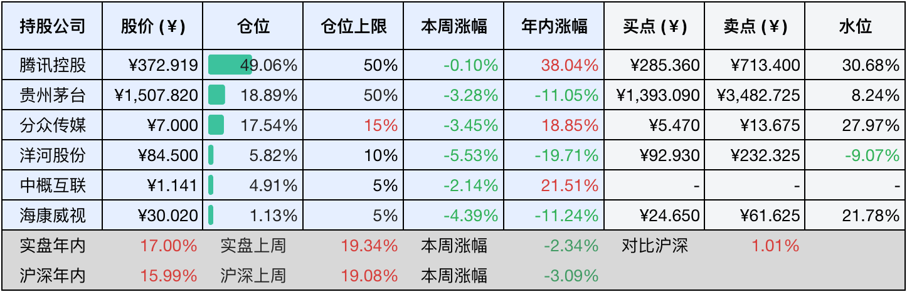

__微信公众号文章地址：[老罗投资周记-20241130](https://mp.weixin.qq.com/s/N3r3uwwNfyIzUVAnPJRFpw)__

```
老罗投资周记，每周六更新。专注于股权投资、阅读、学习与个人成长，知行合一、日拱一卒、投资人生。微信公众号【老罗投资】，文章均首发于公众号。
```

### 1. 本周交易

无

### 2. 目前持仓

当前持有的股票包括：腾讯控股47.31%、贵州茅台18.52%、分众传媒16.75%、洋河股份5.73%、中概互联4.78%、海康微视1.10%。

此外还有少量现金，加上少量的恒瑞医药、上海机场、宋城演义等股票，其份额较少，仅作为观察仓不进行记录。

本周旗下公司整体上涨了<span class="red">+3.85%</span>，年内的收益<span class="red">+20.85%</span>。本周实际上涨得并不多，主要得益于中签的新股上市卖出的收益，打新获得的少量现金暂时还没有想好去处。

**注1：表底为截止到今日，老罗和沪深300指数今年的收益率。**

**注2：表格中港股已按汇率换算为人民币。**



### 3. 上周数据



### 4. 本周事项

+ 贵州茅台临时股东大会投票
+ 11月份PMI公布
+ 巴菲特更新遗嘱

==只对持股和交易感兴趣的朋友，读到这里就可以退出了。后面是对上述事件的展开，无新内容。==

#### 4.1 贵州茅台临时股东大会投票

11月27日下午，贵州茅台2024年第一次临时股东大会召开，2024-2026年度现金分红回报规划、2024中期利润分配、回购注销公司股票等五个提案高票通过，投赞成的票数超过99%。

这种分钱的事正常人都会投赞成票的吧，老罗也去凑了个热闹，在券商APP上全部投了赞成票，第一次行使了股东权力，虽然目前还是纳米级股东，笑。

#### 4.2 11月份PMI公布

11月份，我国经济景气水平总体保持稳定扩张，制造业采购经理指数（PMI）为50.3%，较上月上升0.2个百分点；非制造业商务活动指数为50.0%，略低于上月的0.2个百分点；而综合PMI产出指数保持在50.8%，与上月持平。

供需两端均呈现回升态势，生产指数和新订单指数分别达到52.4%和50.8%，较上月分别上升0.4和0.8个百分点。值得一提的是，新订单指数自今年5月以来首次回归扩张区间，显示出制造业市场活力得到增强。在通用设备、汽车等行业，生产指数和新订单指数均超过54.0%，产需得到快速释放。受制造业生产和市场需求改善的影响，企业采购活动近期有所加快，采购量指数进入扩张区间，达到51.0%。

此外中小型企业景气度也有所改善，大型企业PMI为50.9%，虽然较上月下降0.6个百分点，但仍位于临界点以上，继续保持扩张态势。而中型和小型企业PMI分别为50.0%和49.1%，较上月上升0.6和1.6个百分点，景气水平均得到提升。

市场预期持续向好，生产经营活动预期指数攀升至54.7%，较上月上升0.7个百分点，实现连续两个月回升，这表明大多数的制造业企业对未来市场信心不断增强。在食品及酒饮料精制茶、造纸印刷及文教体美娱用品、汽车、铁路船舶航空航天设备、电气机械器材等行业，生产经营活动预期指数均处于58.0%以上的较高景气区间，反映出企业对行业发展前景持更为乐观的态度。

#### 4.3 巴菲特更新遗嘱

94岁巴菲特披露后事规划：捐赠股份，仅留0.5%财富予子女，“死亡总是会来，它会让人生变得无常而残酷。有时候它会造访襁褓中的婴儿，有时候它时隔一个世纪才来找你。回首往事，我已经非常幸运了，不过代价就是现在我的孩子都已经时日无多了，他们分别是71岁、69岁和66岁。”

这位94岁高龄的投资大师在当地时间25日致伯克希尔哈撒韦公司股东的信件开头如此写道，这次，他将1600股伯克希尔A类股转为240万股B类股，并将这些B类股分别捐赠给四个家族慈善基金。

这仅仅是巴菲特后事安排的开端，他在信中详尽地披露了自己的遗产规划。巴菲特强调，富裕的父母应为子女留下一笔适量的财产，足以支持他们实现梦想，但不足以让他们懒散度日。他重申将履行2006年的承诺，将自己所持伯克希尔股份全部捐献给家族慈善基金，伯克希尔股份占其个人总财富的99.5%，意味着他留给三个孩子的遗产仅占其个人财富的0.5%。

将大部分财富捐赠给慈善事业，一方面有助于规避税收，另一方面则是为了避免子女，因为突然继承巨额财产而打乱他们原有的生活节奏，或是丧失独立奋斗的动力，这么做确实比较明智。

### 5. 本周读书

#### 5.1《巴菲特最有价值的8条投资商律》

沃伦·巴菲特被誉为股神，其缔造的投资传奇在投资领域广为流传，巴菲特独树一帜、深邃且通俗易懂的投资智慧与哲学，已然成为全球股票投资者的宝典，全书划分为八个章节，详尽地阐释了巴菲特最具特色、实操性强的八大投资法则。

评分三星半⭐️⭐️⭐️❤️

#### 5.2《我们会在爱的宇宙里重逢》

本书记载了作者文文与爸爸共度的欢乐童年时光，同时也展现了爸爸从患病到离世的悲喜交集，爸爸宛如一部珍贵的摄像机，捕捉并记录了文文成长的点点滴滴。

她从一个天真烂漫、粗心大意的孩童，逐渐蜕变为一个依赖母亲、懂得担当的青年，曾经，每当想起与爸爸相关的回忆，她都会泪流满面。

然而随着时间的流逝，她终于鼓起勇气描绘出爸爸的模样，坦然面对他的照片，甚至笑着讲述他的故事。

生死面前无大事，健康和家人第一，财富、事业并没有那么重要。

评分四星半⭐️⭐️⭐️⭐️❤️

### 6. 本周运动

本周遛弯两次+继续节食，周末有时间就补觉，颈椎疼的情况有所好转。

如果觉得本文还不错，那就点个赞或者『在看』吧，祝大家周末愉快！

```
老罗投资周记，每周六更新。专注于股权投资、阅读、学习与个人成长，知行合一、日拱一卒、投资人生。微信公众号【老罗投资】，文章均首发于公众号。
免责声明：本公众号只作为本人的投资日志记录，本文中提及的个股都有腰斩或血本无归的风险，本人不做任何投资建议，投资请坚持独立思考。
```

__微信公众号文章地址：[老罗投资周记-20241130](https://mp.weixin.qq.com/s/N3r3uwwNfyIzUVAnPJRFpw)__