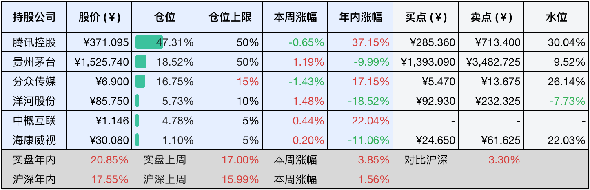

__微信公众号文章地址：[老罗投资周记-20241207](https://mp.weixin.qq.com/s/shEnsuvc1NPBiA1eS0-8Og)__

```
老罗投资周记，每周六更新。专注于股权投资、阅读、学习与个人成长，知行合一、日拱一卒、投资人生。微信公众号【老罗投资】，文章均首发于公众号。
```

### 1. 本周交易

无

### 2. 目前持仓

当前持有的股票包括：腾讯控股47.79%、贵州茅台17.96%、分众传媒16.60%、洋河股份5.56%、中概互联4.77%、海康微视1.09%。

此外还有少量现金，加上少量的恒瑞医药、上海机场、宋城演义等股票，其份额较少，仅作为观察仓不进行记录。

本周旗下公司整体上涨了<span class="red">+2.77%</span>，年内的收益<span class="red">+23.62%</span>。

**注1：表底为截止到今日，老罗和沪深300指数今年的收益率。**

**注2：表格中港股已按汇率换算为人民币。**


### 3. 上周数据



### 4. 本周事项

+ 腾讯今年回购超过1000亿港币
+ 腾讯版sora发布
+ 比特币史上首次突破十万美元
+ 美国非农数据公布 12月降息可能性增加

==只对持股和交易感兴趣的朋友，读到这里就可以退出了。后面是对上述事件的展开，无新内容。==

#### 4.1 腾讯今年回购超过1000亿港币

截止到12月4日，港股交易了229个交易日，腾讯回购了112天，累计回购2.79亿股，回购耗资达到1003.9亿港币，今年回购总额正式突破1000亿港币。

今年大约还剩十几个回购日，按每天7亿回购计算，还可以回购119亿港币，差不多全年回购额将达到1123亿港币，超过管理层年初给出的1000亿回购目标。

管理层言出必行，公司现金流充足，之前的一些负面影响也已经消失，腾讯依然可以安心持有。

#### 4.2 腾讯版sora发布

年终发力AI领域的腾讯，在多个细分市场迅速追赶，继11月推出AI工作台ima.copilot后，12月3日，备受期待的AI视频生成功能终于由腾讯发布，官方命名为混元（HunYuan Video），现在可以在腾讯元宝APP内体验。

发布首日，用户只有三次体验机会，其中包括一次高品质生成；第二天，腾讯就将体验次数增至每日四次标准+两次高品质，共计六次，实现翻倍。老罗实际体验后，生成的视频效果还是挺令人满意的。


> 提示词：一个年轻女士，在伦敦的广场上喂鸽子。

相较于市场上已有的快手可灵、字节即梦、MiniMax海螺和智谱清影等竞品，腾讯混元在高级指令中提供的调节选项最为丰富，涵盖风格、比例、景别、光线和运镜五个类别。尽管其他同类产品也提供了一定程度的预设选项，但与混元相比仍显有限，不得不说，大厂的技术实力确实令人放心。

但是，鉴于当前视频模型所能生成的短暂内容（仅五秒钟），包括画面和时长，AI视频在未来一段时间内仍将主要侧重于技术探索，或作为广告片设计等领域的补充元素，距离独立承担重要任务还有比较大的差距，实现大规模商业化仍然有很多挑战。

#### 4.3 比特币史上首次突破十万美元

本周，比特币价格持续上涨，在12月5日当天涨幅超过6%，涨破10万美元，在单枚价格突破10万美元后，比特币总市值接近2万亿美元，仅次于英伟达、苹果、谷歌母公司字母表等上市企业巨头。今年以来，比特币已经累计上涨156%。11月以来，比特币直接从6.8万美元上涨至10万美元，仅仅用时一个月。

老罗曾在18年花了少量钱(五位数)试水了下比特币，结果是竹篮打水一场空，最后连一个响都没听到，还不如都换成硬币丢水里。自此之后，老罗一直远离这种虚拟货币。

查理·芒格对比特币的态度也相同，他曾说过“不要让我开始谈论比特币，那是我见过的最愚蠢的投资。这些投资中的大多数都将变成零”。芒格指出，加密货币既不是货币，也不是商品或证券，实际上它更像是一个庄家几乎百分之百胜率的赌博契约。

老罗一直觉得在虚拟币圈，一般人连韭菜都算不上，只能算作韭菜肥料。现在比特币让一些人暴富了千万不能眼红，而一头扎进币圈做了“接盘侠”。坚持投资优秀的公司，陪伴公司成长，一年能赚上个15%，享受慢慢变富的过程，才是胜率更高的事。

#### 4.4 美国非农数据公布 12月降息可能性增加

美国11月季调后非农就业人口22.7万人，预期20万人，前值由1.2万人修正为3.6万人。美国11月失业率4.2%，预期4.2%，前值4.10%。这些数据直接让美联储12月降息的概率升至87%，基本12月降息25BP又稳了。

无论鲍威尔如何死鸭子嘴硬，降息也在预期之中，面对35万亿美元的国债和沉重的利息负担，任何政府都难以承受，降息成为减轻财政压力的必要手段。此外，任命马斯克为拟设立的政府效率部部长，显示出美国应对巨额债务的策略：通过降息降低国债利息支出，并精简政府机构人员以减少财政开支。

对于中国股市而言，美国降息肯定是个利好消息，这将吸引大量投资者关注并投资这个便宜的优质资产，老罗对明年的市场前景任然保持乐观态度。

### 5. 本周读书

#### 5.1《不被大风吹倒》

无论是卷还是躺，关键在于不被大风吹倒！莫言的新书，讲述了人生在艰难时刻的应对之道。

这本书汇集了莫言40篇精选散文，从家庭、友谊、童年成长到读书写作等多个维度，展现了莫言独特的人生态度及对人生挑战的深刻洞察。其中《不被大风吹倒》一文，作为莫言在五四青年节对学生们的寄语，讲述了他在少年时，与爷爷在大坝上勇敢面对大风的往事，激励年轻人在面对人生的困境时，要始终保持坚韧不拔的精神。

书中收录了《我的室友余华》，讲述了莫言与余华之间既竞争又合作的友情故事；《忆史铁生》重温了他与余华陪伴史铁生度过的一段难忘时光，包括偷黄瓜、踢足球的欢乐经历，以及史铁生担任守门员的趣事，三个人之间的友谊让人会心一笑。

本书看完之后和余华老师一样的感觉，就是妒忌，MD，怎么写得那么好？笑。

评分四星半⭐️⭐️⭐️⭐️❤️

### 6. 本周运动

本周遛弯一次，吃得有点多体重反弹了一点。

如果觉得本文还不错，那就点个赞或者『在看』吧，祝大家周末愉快！

```
老罗投资周记，每周六更新。专注于股权投资、阅读、学习与个人成长，知行合一、日拱一卒、投资人生。微信公众号【老罗投资】，文章均首发于公众号。
免责声明：本公众号只作为本人的投资日志记录，本文中提及的个股都有腰斩或血本无归的风险，本人不做任何投资建议，投资请坚持独立思考。
```

__微信公众号文章地址：[老罗投资周记-20241207](https://mp.weixin.qq.com/s/shEnsuvc1NPBiA1eS0-8Og)__