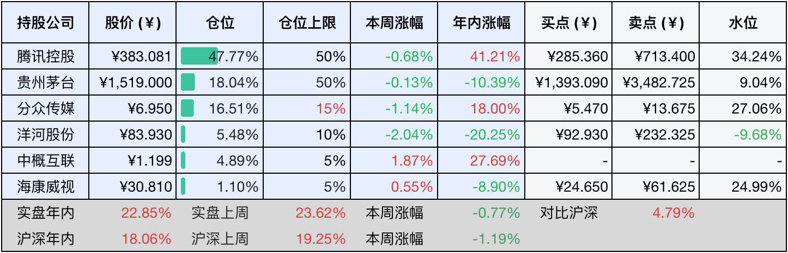

__微信公众号文章地址：[老罗投资周记-20241214](https://mp.weixin.qq.com/s/C3wGWe9X3tPGfLfysjOORA)__

```
老罗投资周记，每周六更新。专注于股权投资、阅读、学习与个人成长，知行合一、日拱一卒、投资人生。微信公众号【老罗投资】，文章均首发于公众号。
```

### 1. 本周交易

无

### 2. 目前持仓

当前持有的股票包括：腾讯控股47.77%、贵州茅台18.04%、分众传媒16.51%、洋河股份5.48%、中概互联4.89%、海康微视1.10%。

此外还有少量现金，加上少量的恒瑞医药、上海机场、宋城演义等股票，其份额较少，仅作为观察仓不进行记录。

本周旗下公司整体上涨了<span class="green">-0.77%</span>，年内的收益<span class="red">+22.85%</span>。

**注1：表底为截止到今日，老罗和沪深300指数今年的收益率。**

**注2：表格中港股已按汇率换算为人民币。**



### 3. 上周数据


### 4. 本周事项

+ 茅台下周分红
+ 个人养老金制度全面开放
+ 致即将到来的2025

==只对持股和交易感兴趣的朋友，读到这里就可以退出了。后面是对上述事件的展开，无新内容。==

#### 4.1 茅台下周分红

12月13日晚间，贵州茅台酒股份有限公司正式发布2024年中期权益分派实施方案。根据公告，本次分红以公司现有总股本12.56亿股为基础，向每股股东派发23.882元的现金红利，总计派发金额达到300亿元。

该利润分配方案已在2024年11月27日举行的贵州茅台2024年第一次临时股东大会上获得批准。本次红利的发放对象为截至股权登记日下午上海证券交易所收市后，在中国证券登记结算有限责任公司上海分公司登记在册的公司全体股东，现金红利将于2024年12月20日发放。

贵州茅台此前在公告中表示，本次利润分配方案充分考虑了公司当前的生产经营状况、未来资金需求以及经营现金流等多方面因素，确保分红不会对公司正常运营及长期发展产生不利影响。

本来以为回购会在分红之前，但不知道为什么回购还没有正式公告，也许这开天辟地的第一回，还得再等等，不管怎么说总算是有进步了，也罢，好事不怕晚。

分红到手后将如何处理？目前定了三个股价提醒：贵州茅台1390元人民币，中国海洋石油H股16港币，中国平安H股35港币，哪个股价先跌到预订范围就给哪只，如果一直跌不到就放在券商那赚点货币基金的收益。

#### 4.2 个人养老金制度全面开放

12月12日，人力资源社会保障部联合五部门发布了《关于全面实施个人养老金制度的通知》。根据通知规定，自12月15日起，个人养老金制度将从原先的北京、上海、广州等36个试点城市和地区扩展至全国范围。无论是参加城镇职工基本养老保险还是城乡居民基本养老保险的劳动者，都可以参与个人养老金制度，税收优惠政策的适用范围也将同步扩大至全国。目前我国个人养老金开户人数已经突破了7000万大关。

通知还明确了在现有理财产品、储蓄存款、商业养老保险及公募基金产品的基础上，进一步将国债、特定养老储蓄及指数基金纳入个人养老金的投资范畴。遵循通知的指导，中国证监会迅速调整产品供应，首批将85只权益类指数基金纳入个人养老金的投资产品清单，使得个人养老金的可选投资产品数量突破900只。

在首批权益类指数基金中，涵盖了78只跟踪各类宽基指数的产品以及7只跟踪红利指数的产品，包括沪深300指数、中证A500指数、创业板指数等各类普通指数基金、指数增强基金和ETF联接基金，这些产品均实行费率优惠政策，以降低投资者的投资成本。

个人养老金投资指数基金对股市而言构成长期利好，由于个人养老金具有不可提前提取的特性，并且规模持续不断地扩大，若将这笔资金投入股市，必将形成一股稳定且持久的资本力量。

#### 4.3 致即将到来的2025

时光如梭，无情地冲刷着我的岁月，将我那微不足道却又无比珍贵的年少时光悄然淹没，那段时光仿佛在一瞬间消失无踪。

在这一刹那的恍惚中，我仿佛重返乡间小道，却发现童年已无法追随，只留在了我的身后，宛如一场落幕的电影，终究是林花凋零，春红已逝。

太过匆忙的岁月让我终于明白，当我开始怀念童年时，其实早已失去了它。

取而代之的是一副沉重的枷锁，这副枷锁自童年起便伴随我长途跋涉，直至成年后的某个时刻，它突然降临在我面前。

我凝视着这副枷锁，发现上面密密麻麻地刻满了两个字——责任。

### 5. 本周读书

#### 5.1《朱江洪自传：我执掌格力的24年》

本书乃格力电器前董事长朱江洪先生的自传，详尽记载了他的人生轨迹与辉煌成就。

全篇共计15章，约21万字，叙述了朱江洪先生自华南工学院（现华南理工大学）毕业后投身职场，辗转至珠海，担任冠雄与海利（格力前身）两家公司总经理的艰辛历程。

在此期间，他凭借卓越的领导才能和创新精神，在政策夹缝中成功进军空调行业，并通过技术创新、市场拓展及团队建设等多方面的努力，最终将格力打造成为空调行业的领军企业。

本书不仅澄清了许多坊间传闻，还融入了大量宝贵的管理经验，堪称格力电器1988至2012年的信史，同时也是一本很有价值的企业管理教材。

评分四星半⭐️⭐️⭐️⭐️❤️

### 6. 本周运动

本周遛弯一次，继续节食中。

如果觉得本文还不错，那就点个赞或者『在看』吧，祝大家周末愉快！

```
老罗投资周记，每周六更新。专注于股权投资、阅读、学习与个人成长，知行合一、日拱一卒、投资人生。微信公众号【老罗投资】，文章均首发于公众号。
免责声明：本公众号只作为本人的投资日志记录，本文中提及的个股都有腰斩或血本无归的风险，本人不做任何投资建议，投资请坚持独立思考。
```

__微信公众号文章地址：[老罗投资周记-20241214](https://mp.weixin.qq.com/s/C3wGWe9X3tPGfLfysjOORA)__