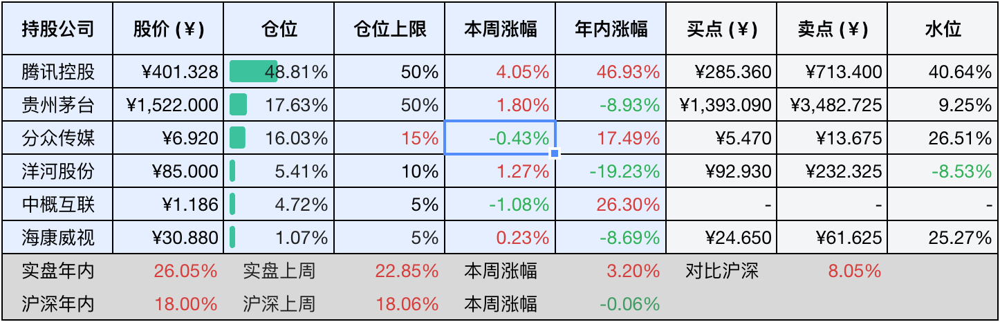
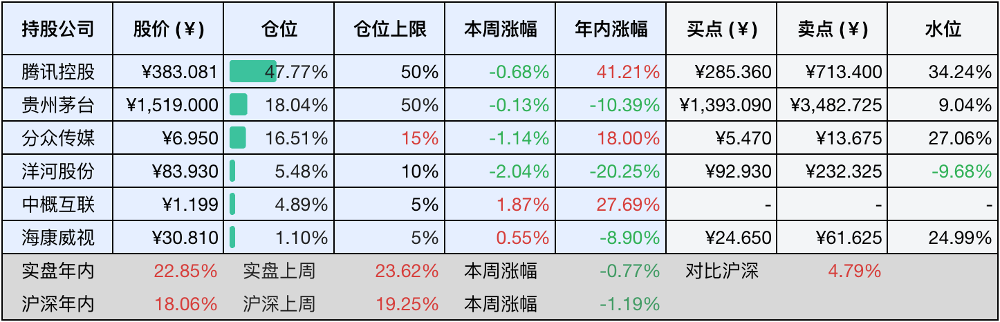

__微信公众号文章地址：[老罗投资周记-20241221](https://mp.weixin.qq.com/s/mOmAS4UQm8LkmCjNv-Dsbg)__

```
老罗投资周记，每周六更新。专注于股权投资、阅读、学习与个人成长，知行合一、日拱一卒、投资人生。微信公众号【老罗投资】，文章均首发于公众号。
```

### 1. 本周交易

无

### 2. 目前持仓

当前持有的股票包括：腾讯控股48.81%、贵州茅台17.63%、分众传媒16.03%、洋河股份5.41%、中概互联4.72%、海康微视1.07%。

此外还有少量现金，加上少量的恒瑞医药、上海机场、宋城演义等股票，其份额较少，仅作为观察仓不进行记录。

本周旗下公司整体上涨了<span class="red">+3.20%</span>，年内的收益<span class="red">+26.05%</span>。

**注1：表底为截止到今日，老罗和沪深300指数今年的收益率。**

**注2：表格中港股已按汇率换算为人民币。**



### 3. 上周数据



### 4. 本周事项

本周生病，除了茅台分红到账也没有其他大事，断更一周。

### 5. 本周读书

#### 5.1《我为孩子打突围战》

家中如果有小学生、初中生的家长强烈推荐看看本书，与孩子一同成长。

评分四星半⭐️⭐️⭐️⭐️❤️

### 6. 本周运动

本周生病，调理中。

如果觉得本文还不错，那就点个赞或者『在看』吧，祝大家周末愉快！

```
老罗投资周记，每周六更新。专注于股权投资、阅读、学习与个人成长，知行合一、日拱一卒、投资人生。微信公众号【老罗投资】，文章均首发于公众号。
免责声明：本公众号只作为本人的投资日志记录，本文中提及的个股都有腰斩或血本无归的风险，本人不做任何投资建议，投资请坚持独立思考。
```

__微信公众号文章地址：[老罗投资周记-20241221](https://mp.weixin.qq.com/s/mOmAS4UQm8LkmCjNv-Dsbg)__