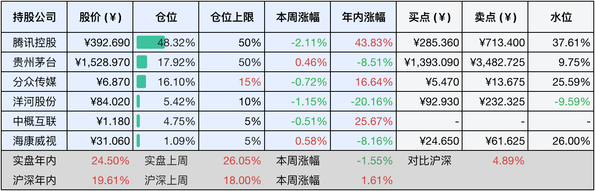

__微信公众号文章地址：[老罗投资周记-20241228](https://mp.weixin.qq.com/s/sYLH80D6EPyjH-cPwxIfaQ)__

```
老罗投资周记，每周六更新。专注于股权投资、阅读、学习与个人成长，知行合一、日拱一卒、投资人生。微信公众号【老罗投资】，文章均首发于公众号。
```

### 1. 本周交易

无

### 2. 目前持仓

当前持有的股票包括：腾讯控股48.32%、贵州茅台17.92%、分众传媒16.10%、洋河股份5.42%、中概互联4.75%、海康微视1.09%。

此外还有少量现金，加上少量的恒瑞医药、上海机场、宋城演义等股票，其份额较少，仅作为观察仓不进行记录。

本周旗下公司整体上涨了<span class="green">-1.55%</span>，年内的收益<span class="red">+24.50%</span>。

**注1：表底为截止到今日，老罗和沪深300指数今年的收益率。**

**注2：表格中港股已按汇率换算为人民币。**



### 3. 上周数据


### 4. 本周事项

+ 茅台回购终于要开始了
+ 海康威视启动股份回购计划
+ 微信小店推出送礼物功能

==只对持股和交易感兴趣的朋友，读到这里就可以退出了。后面是对上述事件的展开，无新内容。==

#### 4.1 茅台回购终于要开始了

贵州茅台的回购终于要开始了，12月27日深夜，贵州茅台发布公告称，拟采用集中竞价交易方式回购公司股份。此次回购股份的金额下限为不低于人民币30亿元，上限为不超过人民币60亿元，具体的回购资金总额将以回购方案实施完毕，或者回购期限届满时实际回购股份所使用的资金总额为准。

公告还明确，回购股份的价格不会超过1771.90元每股，而回购资金来源为公司自有资金。回购股份的期限为自公司股东大会审议通过回购方案之日起12个月内，并且所回购的股份将用于注销并减少公司注册资本，公司会依据相关规定通知债权人，从而充分保障债权人的合法权益。

其实，贵州茅台的此次回购事项早在2024年9月20日就已官宣，当时公司召开了第四届董事会2024年度第十一次会议，会上审议通过了《关于以集中竞价交易方式回购公司股份的方案》。之后在11月27日，公司又召开了2024年第一次临时股东大会，同样审议通过了该回购方案。到了12月17日，贵州茅台以网络互动的形式召开了2024年第三季度业绩说明会。

针对投资者提出的回购迟迟不进行的质疑，贵州茅台董事会秘书蒋焰回应称，此次回购是公司首次实施股份回购，目前公司即将完成专业中介机构比选、回购专用账户开立等前期工作。一旦完成这些工作，公司将按照中国证监会和上海证券交易所的有关规定，及时披露回购报告书，并开展股份回购相关工作。

茅台历史上的首次回购或许会因为对流程不够熟悉而显得有些波折，正所谓好事多磨，茅台作为龙头国企，迈出回购第一步意义非凡，能够起到良好的带头示范作用。

#### 4.2 海康威视启动股份回购计划

12月26日，海康威视发布公告，披露了公司首次回购股份的具体情况。海康威视第六届董事会第四次会议与2024年第二次临时股东大会分别于12月9日和12月25日召开，会上均通过了《关于回购公司股份方案的议案》。

在此次回购计划里，海康威视拟投入的资金总额在20亿元到25亿元之间用以回购股份，回购价格上限被设定为不超过40元每股，其资金来源为公司自有资金以及股票回购专项贷款，回购期限设定为不超过十二个月，所回购的股份将依法注销，从而减少公司注册资本。

在首次回购行动中，海康威视于12月26日回购了4,003,019股，占公司总股本的0.0434%。此次回购的最高成交价为31.50元/股，最低成交价为31.06元/股，成交总金额约为1.26亿元。

#### 4.3 微信小店推出送礼物功能

十年前，微信凭借一个小小的红包，搅动了整个移动支付市场，如今，微信小店送礼物功能被视为另一张王牌。

微信小店的送礼物功能不仅满足了节日、纪念日等场景需求，还成功打通了社交与电商的最后一公里。

无论是亲友间的节日心意，还是企业年货的批量配送，这项功能都让送礼变得轻松自然。更重要的是，微信小店的加入标志着微信生态中电商闭环的初步成型。

十年前，微信红包让微信支付一战成名；十年后，送礼物能否成为微信电商的下一个奇迹？

### 5. 本周读书

本周在读《我读巴芒：永恒的价值》，尚未读完。

### 6. 本周运动

本周小病初愈，调理中没有锻炼。生病期间没有胃口，体重几天减了三斤。

如果觉得本文还不错，那就点个赞或者『在看』吧，祝大家周末愉快！

```
老罗投资周记，每周六更新。专注于股权投资、阅读、学习与个人成长，知行合一、日拱一卒、投资人生。微信公众号【老罗投资】，文章均首发于公众号。
免责声明：本公众号只作为本人的投资日志记录，本文中提及的个股都有腰斩或血本无归的风险，本人不做任何投资建议，投资请坚持独立思考。
```

__微信公众号文章地址：[老罗投资周记-20241228](https://mp.weixin.qq.com/s/sYLH80D6EPyjH-cPwxIfaQ)__