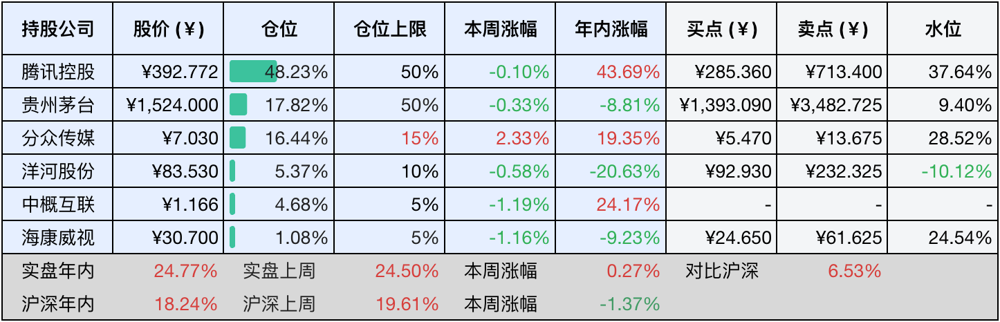
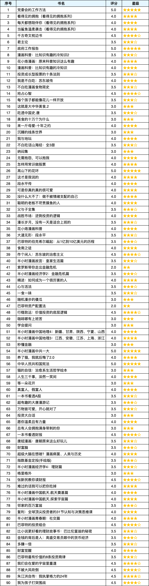

__微信公众号文章地址：[老罗年终总结-20241231](https://mp.weixin.qq.com/s/RLmleJUl5HxTZzeWW7LswA)__

```
老罗投资周记，每周六更新。专注于股权投资、阅读、学习与个人成长，知行合一、日拱一卒、投资人生。微信公众号【老罗投资】，文章均首发于公众号。
```

### 1. 目前持仓

又是一年终总结时，这一年收获过、欣喜过，跌倒过、迷茫过，感谢自己从来没有退缩过；这一年，有得，有失，有遇见，有感动，是成长，亦是蜕变。

当前持有的股票包括：腾讯控股48.23%、贵州茅台17.82%、分众传媒16.44%、洋河股份5.37%、中概互联4.68%、海康微视1.08%。

此外还有少量现金，加上少量的恒瑞医药、上海机场、宋城演义等股票，其份额较少，仅作为观察仓不进行记录。

截止到2024年12月31日，全年的收益<span class="red">+24.77%</span>，跑赢沪深300指数<span class="red">+6.53%</span>，完成预订目标。

**注1：表底为截止到今日，老罗和沪深300指数今年的收益率。**

**注2：表格中港股已按汇率换算为人民币。**



### 2. 全年交易统计

#### 2.1 累计卖出4次

+ 06月18日 卖出部分洋河股份(002304)，卖出价格为90.083元人民币
+ 06月24日 卖出部分洋河股份(002304)，卖出价格为85.130元人民币
+ 06月24日 卖出部分海康威视(002415)，卖出价格为31.430和31.420元人民币
+ 06月24日 清仓京沪高铁(601816)，卖出价格为5.190元人民币

#### 2.2 累计买入11次

+ 01月05日 买入洋河股份(002304)，买入价格为102.00元人民币
+ 03月05日 买入腾讯控股(00700)，买入价格为267.40元港币
+ 04月10日 买入洋河股份(002304)，买入价格为95.10元人民币
+ 06月18日 买入贵州茅台(600519)，买入价格为1540.000元人民币
+ 06月18日 买入分众传媒(002027)，买入价格为6.040元人民币
+ 06月20日 买入分众传媒(002027)，买入价格为5.990和6.010元人民币
+ 06月24日 买入分众传媒(002027)，买入价格为6.050和6.070元人民币
+ 06月24日 买入贵州茅台(600519)，买入价格为1461.300元人民币
+ 06月25日 买入分众传媒(002027)，买入价格为5.910和5.970元人民币
+ 06月26日 买入分众传媒(002027)，买入价格为5.910元人民币
+ 07月24日 买入分众传媒(002027)，买入价格为5.690元人民币

2024年整体上还是买入的操作较多，坚定地做一个优质公司股权的买入者。在9月底那波上涨行情来临之前，我已经买入了不少仓位。不过，在市场出现诸多机会的时候，还是苦于资金不足而无法进一步地扩大战果，所以今后还得继续努力开源节流，以增加可支配的投入资金。就目前而言，老罗对自己的仓位分布基本上是满意的。

目前手上还有一点现金没有处理，明年继续耐心等待目标公司到合适价位买入：贵州茅台1390元人民币，中国海洋石油H股16港币，中国平安H股35港币，哪个股价先跌到预订范围就给哪只，如果一直跌不到就放在券商那赚点货币基金的收益。

### 3. 全年读书

全年一共读书90本，比起23年阅读了172本书，确实少了不少，可能是过了只追求数量的阶段，之后的阅读会更加偏重阅读神作，字数更多的大部头书籍。

下表是全年书单明细，四星以上的书籍都是老罗觉得还不错的，值得一读。



### 4. 莫沉湎于过往，且勇敢向未来

人生路上，别再一味沉溺于“如果……当初”的幻想中，要知道，我们不可能在每一个抉择上都尽善尽美。许多事情，哪怕给予重来一次的机会，以当时我们的阅历与心智，很大概率还是会作出相同的决定，结局亦难以改变。

玫瑰赠予谁都会散发浪漫的气息，青春选择谁都会留下些许遗憾，人无法在拥有青春的同时就深刻理解青春的意义，正因如此，有些事物唯有在失去之后，我们才能真切体会到它们的弥足珍贵。

既然如此，那就无需频频回头张望，亦不必对往昔的自己妄加批判，人生的旅途漫长悠远，总会有形形色色的人陪伴我们去看相似的风景，过往的经历，无论是喜是悲，都是我们生命中不可或缺的部分。它们铸就了现在的我们，让我们在得到一些领悟的同时，也学会了坦然接受和勇敢前行。

如果觉得本文还不错，那就点个赞或者『在看』吧，祝大家新年快乐！新的一年每天都进步一点，斩获更好的人生！

```
老罗投资周记，每周六更新。专注于股权投资、阅读、学习与个人成长，知行合一、日拱一卒、投资人生。微信公众号【老罗投资】，文章均首发于公众号。
免责声明：本公众号只作为本人的投资日志记录，本文中提及的个股都有腰斩或血本无归的风险，本人不做任何投资建议，投资请坚持独立思考。
```

__微信公众号文章地址：[老罗年终总结-20241231](https://mp.weixin.qq.com/s/RLmleJUl5HxTZzeWW7LswA)__