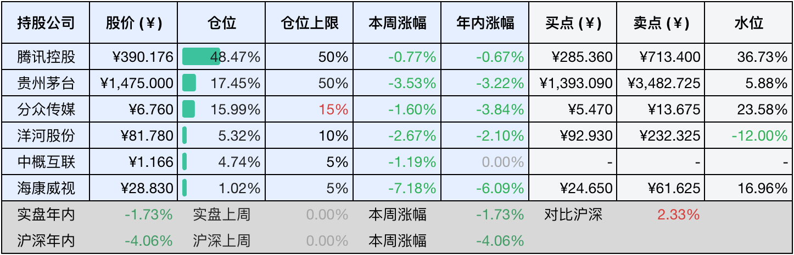
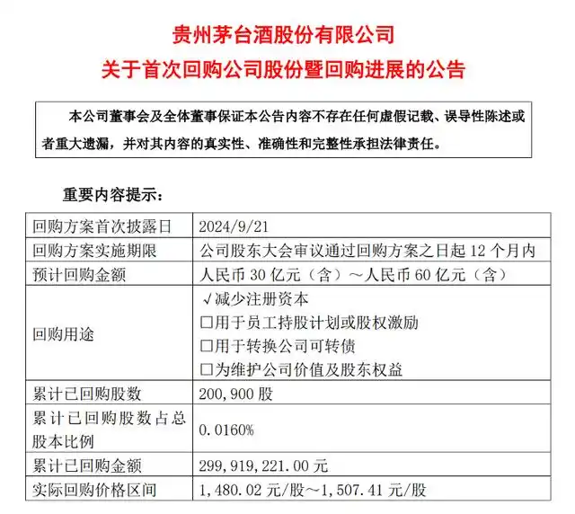

__微信公众号文章地址：[老罗投资周记-20250104](https://mp.weixin.qq.com/s/Rqeswfu-RvEW73UGJatojw)__

```
老罗投资周记，每周六更新。专注于股权投资、阅读、学习与个人成长，知行合一、日拱一卒、投资人生。微信公众号【老罗投资】，文章均首发于公众号。
```

### 1. 本周交易

无

### 2. 目前持仓

当前持有的股票包括：腾讯控股48.47%、贵州茅台17.45%、分众传媒15.99%、洋河股份5.32%、中概互联4.74%、海康微视1.02%。

此外还有少量现金，加上少量的恒瑞医药、上海机场、宋城演义等股票，其份额较少，仅作为观察仓不进行记录。

进入新的一年，年度收益清零，截止到今日，年内的收益率<span class="green">-1.73%</span>。

**注1：表底为截止到今日，老罗和沪深300指数今年的收益率。**

**注2：表格中港股已按汇率换算为人民币。**



### 3. 上周数据


### 4. 本周事项

+ 腾讯24年累计回购1120亿港元
+ 茅台24年业绩预告
+ 茅台实施首次回购
+ 茅台前董事长丁雄军被查
+ 洋河中期分红

==只对持股和交易感兴趣的朋友，读到这里就可以退出了。后面是对上述事件的展开，无新内容。==

#### 4.1 腾讯24年累计回购1120亿港元

截至2024年12月31日，腾讯控股（HK00700）于全年共计回购3.07亿股，回购总金额高达1120亿港元。

早在2024年3月，腾讯在其2023年年报里公布了年度回购计划，金额不少于千亿港元。从实际的执行状况来看，在2024年的各个季度中，腾讯的回购金额分别为148.35亿港元、375.15亿港元、359.13亿港元以及237.39亿港元，累计相加可达1120亿港元。在这一年里，腾讯总共进行了129次回购操作，日均回购金额达到了8.68亿港元。

在有条不紊地执行千亿港元回购计划的过程中，腾讯将所回购的股份全部予以注销，这种注销式回购的方式，使得腾讯的总股本明显减少，总股本的下降有助于提升每股收益，进而增强了股东回报。腾讯的总股本进一步降至92.2亿股，这一规模达也是十年来的最低水平。

腾讯持续进行回购这一行为，有着两方面的积极意义。一方面，这是对股东持续回报的一种体现；另一方面，也彰显出腾讯对自身业务发展所抱有的长期信心。

#### 4.2 茅台24年业绩预告

1月2日，贵州茅台披露2024年度生产经营情况公告。公告显示，公司预计营业总收入约为1738亿元，与去年同期相比增长幅度约为15.44%；预计归属于上市公司股东的净利润约达857亿元，同比增长约14.67%。经过初步的核算表明，2024年茅台酒基酒产量约为5.63万吨，系列酒基酒产量约为4.81万吨。

依据上述2024年14.67%的净利润增速数据来看，贵州茅台的净利润增速已经连续两年出现下滑情况，在之前的2022年和2023年，其净利润增速分别为19.55%和19.16%。

从细分产品的营收情况分析，按照所给出的数据，2024年茅台酒的营业收入同比增长预期约为15.18%，系列酒的营业收入同比增长预期约为19.24%。然而，在2023年的时候，贵州茅台旗下茅台酒和系列酒的营收增速分别为17.39%和29.43%。通过对比数据能够发现，2024年茅台酒的营收增速下降幅度较小，但是系列酒的营收增速却出现了大幅下滑的状况。

尽管如此，茅台在A股市场仍然占据着极为特殊的地位，宛如一个独特的存在，其目前的估值仍然处于不高水平。假如股价下跌至1390元，老罗依然会继续买入。

#### 4.3 茅台实施首次回购

本周，贵州茅台公布了股票回购进展情况，1月2日，茅台公司通过集中竞价交易方式回购200,900股股份，这部分已回购股份占公司总股本的0.0160%。此次回购中，股份的购买最高价为1,507.41元每股，最低价为1,480.02元每股，总共支付金额为2.99亿元。

这是贵州茅台自上市以来首次进行股份回购，值得纪念的事！



#### 4.4 茅台前董事长丁雄军被查

根据贵州省纪委监委1月2日发布的消息，贵州省市场监督管理局党组书记、省市场监督管理局（贵州省知识产权局）局长丁雄军因涉嫌严重违纪违法，目前正在接受贵州省纪委监委的纪律审查和监察调查。

2021年8月，贵州省政府推荐丁雄军担任中国贵州茅台酒厂（集团）有限责任公司董事、董事长以及贵州茅台酒股份有限公司董事、董事长人选。同年9月，贵州茅台酒股份有限公司发布公告，选举丁雄军为公司第三届董事会董事长。2024年4月，丁雄军不再担任茅台集团的相关职务，随后到贵州省市场监督管理局任职，直至此次被调查。

从2018年起，茅台一共换了四任董事长，平均任期仅有一年半，三任前董事长都已入狱或被查，茅台董事长真是高危职业！

#### 4.5 洋河中期分红

本周一（12月30日），洋河公布了2024年中期分红方案。此次中期分红拟向全体股东每10股派发现金红利23.3元，总计派发现金红利达35.1亿元。不过，该分红方案还需提交公司股东大会审议，股东大会将采用现场会议与网络投票相结合的方式来进行表决。

在此之前，洋河于2024年中报的第20页披露了一项股东回报规划，该规划明确指出，在2024-2026年期间年度现金分红需满足两个不低于的要求：其一，现金分红总额不低于当年归属于母公司净利润的70%；其二，现金分红总额不低于70亿。

现金分红总额必须同时满足这两个条件，也就是说，洋河承诺在2024-2026年每年最低分红70亿。本次35.1亿的中期分红，很可能是将2024年年度至少70亿的分红先分出去一半，等到发布2024年年报时，再宣布另外35亿的分红部分。

洋河每股一年分近5块钱，现在80元出头的价格，股息率都快到6%了。

### 5. 本周读书

#### 5.1 《我读巴芒：永恒的价值》

巴菲特历年致股东的信被公认为学习投资的优质教材，《我读巴芒：永恒的价值》的作者耗时数年，通读了1957-1970年的巴菲特致合伙人的信，1965-2023年的巴菲特致股东的信，以及巴芒相关的国内外版本图书与伯克希尔公司的公开资料。

作者从中梳理出重要事件和案例，并且结合自身多年来对巴芒的研究，还有作为私募基金经理的投资实践经验，撰写了近50万字的笔记与心得。

该书总结为10大模块，进一步细分为80个专题，对400多个子话题和知识点进行解读，这为学习巴芒的读者构建起了一个系统的全新视角。

巴菲特曾表示，阅读是最具价值的投资，这本书不但记录了巴芒六十余年的投资发展历程，而且展现了中国投资者在学习、思考、实践方面的逐步提升之旅，它既是作者学习研究巴芒投资学的成果，也是帮助热爱价值投资的读者系统学习巴芒投资的一本不错的书。

评分四星⭐️⭐️⭐️⭐️

### 6. 本周运动

本周遛弯一次，去年成功减重10斤，今年目标继续减重10斤。

如果觉得本文还不错，那就点个赞或者『在看』吧，祝大家周末愉快！

```
老罗投资周记，每周六更新。专注于股权投资、阅读、学习与个人成长，知行合一、日拱一卒、投资人生。微信公众号【老罗投资】，文章均首发于公众号。
免责声明：本公众号只作为本人的投资日志记录，本文中提及的个股都有腰斩或血本无归的风险，本人不做任何投资建议，投资请坚持独立思考。
```

__微信公众号文章地址：[老罗投资周记-20250104](https://mp.weixin.qq.com/s/Rqeswfu-RvEW73UGJatojw)__