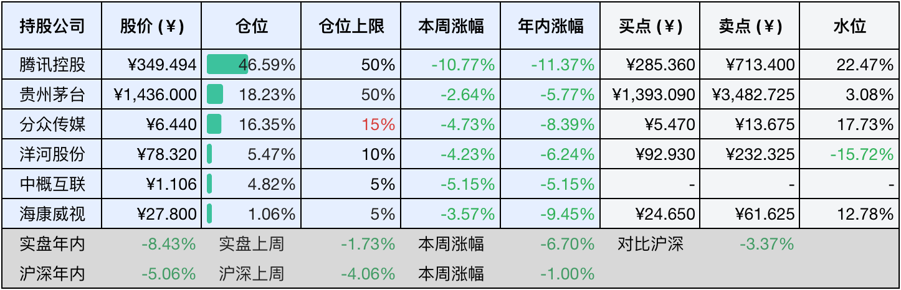

__微信公众号文章地址：[老罗投资周记-20250111](https://mp.weixin.qq.com/s/VjB8xplfSK6bPimC_7sSfg)__

```
老罗投资周记，每周六更新。专注于股权投资、阅读、学习与个人成长，知行合一、日拱一卒、投资人生。微信公众号【老罗投资】，文章均首发于公众号。
```

### 1. 本周交易

无

### 2. 目前持仓

当前持有的股票包括：腾讯控股46.59%、贵州茅台18.23%、分众传媒16.35%、洋河股份5.47%、中概互联4.82%、海康微视1.06%。

此外还有少量现金，加上少量的恒瑞医药、上海机场、宋城演义等股票，其份额较少，仅作为观察仓不进行记录。

本周旗下公司整体涨跌<span class="green">-6.70%</span>，年内的收益<span class="green">-8.43%</span>，今年第一次年化收益落后于沪深300指数。

**注1：表底为截止到今日，老罗和沪深300指数今年的收益率。**

**注2：表格中港股已按汇率换算为人民币。**



### 3. 上周数据


### 4. 本周事项

+ 腾讯被列入美国国防部名单
+ 加拿大、格陵兰岛并入美国？
+ 美国12月非农就业报告
+ 不要想着去赚快钱，知其不可为很重要

==只对持股和交易感兴趣的朋友，读到这里就可以退出了。后面是对上述事件的展开，无新内容。==

#### 4.1 腾讯被列入美国国防部名单

本周，美国国防部将腾讯公司列入中国军工公司名单（根据美国法律正式规定为第1260H条清单），受此事件影响，腾讯本周跌去10%，拖累老罗的实盘全年亏损超过8%。

感觉这件事本身就是个闹剧，难道腾讯的王者荣耀、和平精英、三角洲也能威胁到美国的安全了？就像之前限制中国的大蒜一样，美国黔驴技穷，已经到疯狂的地步了吧。

股价大跌，腾讯加大了回购力度，除1月6日正常回购了7亿港币，余下的四个交易日都回购加倍，回购金额达到了15亿港币，这一周回购的总金额（67亿港币约合63亿人民币）比茅台全年回购额度还要高。

投资中黑天鹅事件一定会出现，关键是要控制好仓位，足够保证风险出现后，不会造成不可挽回的损失。可能后面需要考虑，单个公司的持仓上限不能超过40%，差一点的公司仓位不超过20%，再次等公司仓位不超过10%，拿不太准的公司仓位不超过5%

#### 4.2 加拿大、格陵兰岛并入美国？

懂王本周在海湖庄园演讲，说他要把加拿大、格陵兰岛并入美国。如果加拿大拒绝加入美国，他就加关税，加到对方服从为止。如果丹麦不把格陵兰让给美国，或者格陵兰自己不愿意加入美国，他不排除使用武力。

丹麦内阁当然对懂王进行了凶猛的回击。懂王让丹麦开个价，你这格陵兰多少钱，我们美国有的是钱，丹麦反问，你们美国50个州打包，总共多少钱，开个价吧，我们丹麦钱有的是，我们买了，但不要美国联邦政府，嫌膈应。我们丹麦买下美国之后，马上实行善政，给美国人建立有效的、人道的、高水平的全民医保，美国老百姓健康保障这个球样，我们丹麦人早就看不过去了，这事我们愿意管。

懂王还没上任戏就这么多，上任之后吃瓜群众不更得应接不暇了？

#### 4.3 美国12月非农就业报告

美国12月非农就业人口增加25.6万人，增幅创2024年3月以来最大，且远超预期值16.5万人，前值由22.7万人修正为21.2万人；美国12月失业率4.1%，低于预期值和前值（两者均为4.2%）。数据显示，美国12月就业人数意外大幅增加，失业率下降，美联储暂停降息可能性提升。

非农数据异常亮眼，美国经济一片大好，一片勃勃生机、万物竞发的境界，犹在眼前。由于美国降息预期下降，当晚美股下跌，道指和纳指都跌去1.63%。美债这边，10年期国债收益率涨到了4.76%，依然是没人接盘的状态，后续态势如何，可能要等懂王上任后才能慢慢揭晓。

#### 4.4 不要想着去赚快钱，知其不可为很重要

1月5日，浙江大学78级校友段永平在时隔10余年后再次回到母校，和在校师生们分享了不少对于投资、创业、人生价值等方面的观点，有些内容我觉得很有学习价值，值得记录下。

主持人：我们来看看第一个问题，来自我们经济学院的同学。很幸运他成为今天第一个提问的同学，他的提问是，段学长在投资时，如何快速判断一家公司是否值得长期投资？

段永平：基本上，我不会快速做出这样的判断，过去十多年，我关注的公司就那几个，这源自我对企业、生意、产品多年的理解。我没见过谁能很快下判断，包括巴菲特和芒格这样的投资高手，他们的节奏也很慢，他们并不怕错过一些机会，但最重要的是不要踩雷。有人可能会说，有钱不需要快赚，但我们缺钱就想快赚。我回应说，这可能正是你缺钱的原因，因为你一直想着快速赚钱。其实我也想挣快钱，谁不想挣快钱？但是呢，知其不可为很重要，就是你还是要踏踏实实做该做的事情。

主持人：好的，学长的意思就是要敢于尝试，并且眼光要放得远一些。

段永平：敢于尝试这个太难了。你怎么个尝试法？就说呢，我不是一个不敢冒风险的人，但是呢，你要拼到你能够承受得起的风险。大家不能够说，哎呀，谁谁谁，你看他赌对了。那你说这个投资我最厉害的，那是二十分钟赚了二十多倍。人家说你干嘛呢？我在赌场呢。一百块钱赚了两千多块钱，我就走了，但是我可以重复这件事吗？我不能。那你说我当年投网易，那也是啊，几个月赚了二十几倍，真是二十几倍啊，而且我是全仓的。那人家说那你真厉害，你再来一次，我说这个不会。你碰上了。那你说苹果我们投也很好啊，那也是好。那你想我是2011年投的苹果，那现在都2025年了，差不多刚好就是14年了。那你看起来好像很好，那你要对这个生意理解不了，对文化理解不了，对商业模式理解不了，早就跑了，也不可能留到现在。所以快这个东西是比较难的，这个比商业模式还是需要快。

我特别赞同段永平所说的这一点，不要总想着去赚快钱，知其不可为很重要，慢慢来，比较快。

### 5. 本周读书

#### 5.1 《沃伦·巴菲特：终极金钱心智》

在《沃伦·巴菲特：终极金钱心智》一书中，作者不仅延续了对巴菲特和芒格思想的研究，更进一步探讨了如何培养像巴菲特一样的思考方式。

作者哈格斯特朗深入分析了巴菲特的金钱心智，尤其是他的资本配置能力，以及他在童年时期形成的对金钱和复利的理解。书中展示了这种心智模式如何影响个人在投资、商业乃至日常生活中的决策，从而决定其成功。

评分四星半⭐️⭐️⭐️⭐️❤️

#### 5.2 《UNIX传奇：历史与回忆》

无论是不是专业人士，人们对其是否了解，UNIX在过去、现在以及将来都会在各个方面深刻地影响人们的生活。例如，当今的两大手机操作系统iOS和Android，都源自UNIX分支或者类UNIX系统。

本书的作者是贝尔实验室的元老级人物，他与UNIX及其重要的C语言开发者有着深厚的交情，并且在很大程度上参与到UNIX的开发进程之中，是UNIX历史的参与者与见证者。

本书并不是严格意义上的技术类书籍，更像是一本回忆录，有些技术性的术语并不需要彻底理解，也能流畅地阅读。

评分四星半⭐️⭐️⭐️⭐️❤️

### 6. 本周运动

本周遛弯2次，每次4.5公里。

如果觉得本文还不错，那就点个赞或者『在看』吧，祝大家周末愉快！

```
老罗投资周记，每周六更新。专注于股权投资、阅读、学习与个人成长，知行合一、日拱一卒、投资人生。微信公众号【老罗投资】，文章均首发于公众号。
免责声明：本公众号只作为本人的投资日志记录，本文中提及的个股都有腰斩或血本无归的风险，本人不做任何投资建议，投资请坚持独立思考。
```

__微信公众号文章地址：[老罗投资周记-20250111](https://mp.weixin.qq.com/s/VjB8xplfSK6bPimC_7sSfg)__