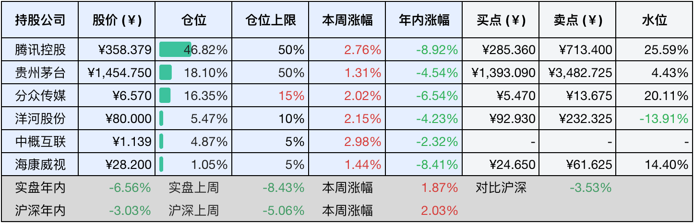
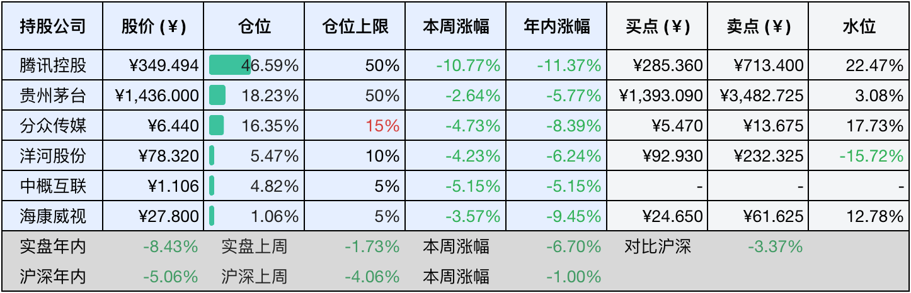

__微信公众号文章地址：[老罗投资周记-20250118](https://mp.weixin.qq.com/s/IRdwFWHGMy6hkkwH_Z-mBg)__

```
老罗投资周记，每周六更新。专注于股权投资、阅读、学习与个人成长，知行合一、日拱一卒、投资人生。微信公众号【老罗投资】，文章均首发于公众号。
```

### 1. 本周交易

无

### 2. 目前持仓

当前持有的股票包括：腾讯控股46.82%、贵州茅台18.10%、分众传媒16.35%、洋河股份5.47%、中概互联4.87%、海康微视1.05%。

此外还有少量现金，加上少量的恒瑞医药、上海机场、宋城演义等股票，其份额较少，仅作为观察仓不进行记录。

本周旗下公司整体涨跌<span class="red">+1.87%</span>，年内的收益<span class="green">-6.56%</span>，今年第二次年化收益落后于沪深300指数。

**注1：表底为截止到今日，老罗和沪深300指数今年的收益率。**

**注2：表格中港股已按汇率换算为人民币。**



### 3. 上周数据



### 4. 本周事项

+ 腾讯24年员工大会
+ 茅台披露去年业绩
+ 洋河中期分红

==只对持股和交易感兴趣的朋友，读到这里就可以退出了。后面是对上述事件的展开，无新内容。==

#### 4.1 腾讯24年员工大会

在13日下午，腾讯举行了2024年度员工大会。会上，腾讯公司董事会主席兼首席执行官马化腾、腾讯公司总裁刘炽平、首席运营官任宇昕以及高级执行副总裁张小龙等人依次发言，分享了公司对2024年业务的总结、战略与管理的思考，并对新一年的发展提出了期望。

马化腾首先回顾了2024年的大环境，并表示对中国经济的韧性充满信心，强调相信中国企业及企业家坚韧不拔的创业精神。他说，腾讯在过去两年已经实现筑底反弹，并鼓励大家齐心协力、同舟共济。办法总比问题多，只要有人才、技术和市场需求，无论面临什么困难，我们都能够解决。前景一定是光明的。

虽然上周被加入了美国国防部的名单，但并不影响腾讯的赚钱能力，不管外部环境如何，买入一家公司最核心的指标永远是长期盈利能力。

#### 4.2 茅台披露去年业绩

1月14日，贵州茅台官方公众号发布了2024年茅台集团的业绩情况，各项任务圆满完成，经营指标实现高质量增长，营收达1871.9亿元，同比增长13.3%；利润总额为1207.7亿元，同比增长10.2%；税收达817.4亿元，同比增长15.0%；研发投入同比增长11%。在行业不景气的情况下，还能保持两位数的增长，茅台的表现还是很优秀。

2025年，茅台集团明确主要目标为：各项主要指标稳中有进，全员劳动生产率、成本费用利润率、净资产收益率、营业现金比率、资产负债率稳定保持在优秀水平，同时研发投入同比增长10.2%。

#### 4.3 洋河中期分红

1月15日晚间，洋河股份发布2025年第一次临时股东大会决议公告，审议通过了2024年度中期利润分配议案。根据预案，公司拟以总股本15.06亿股为基数，向全体股东每10股派现23.30元，合计派现35.1亿元。

一年多次分红、预分红、春节前分红，江苏上市公司积极响应国务院号召，这也是苏酒老大上市15年首次实施中期分红。

洋河周五收盘价80元/股，按最近已实施的2023年度每10股分红46.6元，最新股息率为5.83%。假设洋河股价保持不变，如果投资者现价买入，收益率将是银行短期理财的3倍左右。

老罗在去年卖掉了大部分洋河换成了茅台，分红也不是太多，到手后暂时也没有去处，主要目标那几家公司股价太坚挺了，一直没有到击球区。

### 5. 本周读书

#### 5.1 《半小时漫画-史记2》

半小时漫画史记第二卷，主要讲春秋战国时期各个诸侯国的故事，半小时系列品质依然稳定。

评分四星⭐️⭐️⭐️⭐️

#### 5.2 《朱子家训》

《朱子家训》为日常之法，须时时精讯，可修身，可安家。

评分四星半⭐️⭐️⭐️⭐️❤️

### 6. 本周运动

本周没有运动，主要依靠节食减肥。

如果觉得本文还不错，那就点个赞或者『在看』吧，祝大家周末愉快！

```
老罗投资周记，每周六更新。专注于股权投资、阅读、学习与个人成长，知行合一、日拱一卒、投资人生。微信公众号【老罗投资】，文章均首发于公众号。
免责声明：本公众号只作为本人的投资日志记录，本文中提及的个股都有腰斩或血本无归的风险，本人不做任何投资建议，投资请坚持独立思考。
```

__微信公众号文章地址：[老罗投资周记-20250118](https://mp.weixin.qq.com/s/IRdwFWHGMy6hkkwH_Z-mBg)__