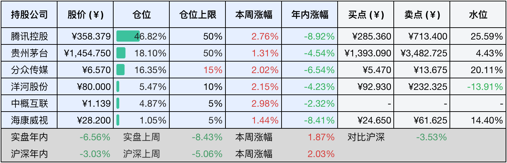

__微信公众号文章地址：[老罗投资周记-20250125-春节快乐](https://mp.weixin.qq.com/s/h2wXKhSDmm4sElt37d4x2w)__

```
老罗投资周记，每周六更新。专注于股权投资、阅读、学习与个人成长，知行合一、日拱一卒、投资人生。微信公众号【老罗投资】，文章均首发于公众号。
```

### 1. 本周交易

无

### 2. 目前持仓

当前持有的股票包括：腾讯控股47.36%、贵州茅台17.71%、分众传媒15.96%、洋河股份5.46%、中概互联4.97%、海康微视1.07%。

此外还有少量现金，加上少量的恒瑞医药、上海机场、宋城演义等股票，其份额较少，仅作为观察仓不进行记录。

本周旗下公司整体涨跌<span class="red">+0.84%</span>，年内的收益<span class="green">-5.72%</span>，今年第三周年化收益落后于沪深300指数。

**注1：表底为截止到今日，老罗和沪深300指数今年的收益率。**

**注2：表格中港股已按汇率换算为人民币。**


### 3. 上周数据



### 4. 本周事项

+ 中长期资金入市
+ 洋河特别分红到账
+ 努力需要长久坚持

==只对持股和交易感兴趣的朋友，读到这里就可以退出了。后面是对上述事件的展开，无新内容。==

#### 4.1 中长期资金入市

在农历蛇年春节的喜庆氛围渐近之时，A股市场终于迎来了一则备受瞩目的利好消息。2025年1月22日晚，中央金融办、中国证监会、财政部、人力资源社会保障部、中国人民银行以及金融监管总局六部委携手合作，正式印发了《关于推动中长期资金入市工作的实施方案》。

该方案聚焦于中长期资金入市这一关键领域，明确提出要重点引导商业保险资金、全国社会保障基金、基本养老保险基金、企（职）业年金基金以及公募基金等各类中长期资金，进一步加大进入资本市场的力度，为A股市场注入新的活力与动力。

随后，于1月23日上午9点，国务院新闻办针对此前的《关于推动中长期资金入市工作的实施方案》召开了新闻发布会。在发布会上，证监会主席吴清透露了一系列重要信息，为A股市场带来了明确的资金支持预期。

对于公募基金，此次明确提出，要明确其持有A股流通市值在未来三年，每年至少要实现10%的增长。这一举措旨在稳定和提升公募基金在A股市场中的持有规模，通过长期资金的持续注入，为市场的稳定发展提供有力支撑。

而对于商业保险资金，目标更为明确，力争让大型国有保险公司从2025年起，每年新增保费的30%专项用于投资A股。按照这一比例推算，每年将至少为A股市场新增几千亿元的长期资金，这无疑将为A股市场带来大量的活水，进一步增强市场的资金活力和稳定性。

与此同时，第二批保险资金的长期股票投资试点也有了具体的时间表和规模规划。相关试点将在2025年上半年落实到位，初期规模不低于1000亿元，并且后续还将根据市场情况和实际需求，逐步扩大试点规模。这不仅有助于保险资金更好地发挥其长期投资优势，也为A股市场的长远发展注入了源源不断的信心。

实际上，保险资金与A股市场是共荣共生的关系，作为A股市场坚定的价值投资者，保险资金通过长钱长投的方式贯彻落实长期投资理念。对于险资自身而言，这有助于实现资产负债的平衡管理，优化资产配置，确保长期的财务稳定和稳健收益。对于A股市场来说，险资的长期投资能够为市场提供稳定的资金来源，减少市场波动，推动市场的健康、可持续发展。

#### 4.2 洋河特别分红到账

本周二（1月21日），洋河股份发布了2024年度中期权益分派实施公告。此次权益分派的股权登记日定于1月24日，除权除息日为1月27日。本次分派对象是截至24日下午深圳证券交易所收市后，在深交所登记在册的洋河股份全体股东。股权登记日为本周五（1月24日），除权除息日为下周一（1月27日）。

在周五晚间，老罗就已经收到洋河的分红了，目前关注的贵州茅台、中国海洋石油H、中国平安H都没有到击球区，分红暂时不动，耐心等待。

#### 4.3 努力需要长久坚持

最后喝上一碗热乎乎的鸡汤：

努力，是人生路上一场需要深度沉淀、持之以恒的修行。它并非一蹴而就，而是如一颗种子的生根发芽，需要在静谧且充满挑战的土壤中独自成长。

在这个过程中，我们常常要经历无数个孤独与寂寞相伴的日子。没有人时刻为你喝彩，没有人与你并肩同行，你只能依靠自己，一步一步地向前迈进。每一步或许都充满艰辛，但正是这些默默努力的时光，如同为种子施肥浇水，为最终的成功积蓄着力量。

而真正能支撑我们走过这些艰难时刻的，是内心深处那份对目标的执着追求。当我们发自内心地渴望去做成一件事时，这种内在的驱动力就如同熊熊燃烧的火焰，炽热而坚定。它让我们不再过分在意外界的关注，不再纠结于是否要将自己的努力展示给别人看。因为我们深知，努力的过程，是为自己的人生积累财富的过程，是实现自我价值的过程，他人的目光不过是过眼云烟，只有内心的坚持才是通往成功的灯塔。

无论前方横亘着多少困难和挫折，无论道路多么崎岖坎坷，这份内在驱动力都能像钢铁般支撑着我们坚持到底。它让我们在面对困难时不气馁、不放弃，在挫折面前不屈服、不退缩。因为我们心中有着明确的方向，明白自己追求的目标是什么，所以我们能够义无反顾地朝着这个方向奋勇前行，直至抵达成功的彼岸。

### 5. 本周读书

#### 5.1 《茶馆》

《茶馆》讲述的是一个跨越了五十年的故事，从清末到民国初期，再到抗战胜利初期，老舍选取了三幕戏的形式，呈现出底层小人物的悲欢离合与命运沉浮。透过文字，我们依然能够强烈地感受到每个角色鲜明的个性，常二爷的义气、秦二爷的胸怀以及王掌柜的乖顺，都格外令人印象深刻。

他们在那样黑暗的社会里努力挣扎求生，可旧社会却使他们连喘息的机会都不留，在阅读的过程中，我一直在思考一个问题：如果我置身于那个年代，自己会是怎样的状态呢？我是否能像常二爷，在世道艰难、自身难保之时，仍然愿意给乞讨者施食呢？又或者像秦二爷那般，有以实业救国的魄力，哪怕最终一无所有？又或者是像王掌柜，在各级官吏的压迫下，始终保持笑脸，努力维持全家老小的生活？

他们不幸被自己的时代所困，但幸运的是，我们仍然充满希望，正所谓否极泰来，黑暗尽头便是光明，那么我们就好好活着，替他们好好感受这个世界吧。

评分四星半⭐️⭐️⭐️⭐️❤️


### 6. 本周运动

本周生病，没有运动，健康平安才是人生第一要务。

时光匆匆，转眼间，距离除夕只剩下三天的时间了。相信不少朋友此时已经踏上了回家团圆的旅程，身处归途中；或者已经和家人们欢聚一堂，共度欢乐的时光。不管怎样，都要提醒大家，在回家或者出行的途中，一定要注意安全！希望每一位朋友都能一切顺利，平安到家，和家人一起享受这美好的团圆时刻。

本周的周记就到这里了，这也是春节前最后一次的周记更新，接下来的日子里，大家都将沉浸在春节的喜庆氛围中。之后下一次更新，要等到2月8日了，让我们一起怀揣着节日的喜悦，静候那时的重逢吧。

如果觉得本文还不错，那就点个赞或者『在看』吧，祝大家在蛇年里吉星高照，身体健康，财运亨通，幸福美满！

```
老罗投资周记，每周六更新。专注于股权投资、阅读、学习与个人成长，知行合一、日拱一卒、投资人生。微信公众号【老罗投资】，文章均首发于公众号。
免责声明：本公众号只作为本人的投资日志记录，本文中提及的个股都有腰斩或血本无归的风险，本人不做任何投资建议，投资请坚持独立思考。
```

__微信公众号文章地址：[老罗投资周记-20250125-春节快乐](https://mp.weixin.qq.com/s/h2wXKhSDmm4sElt37d4x2w)__