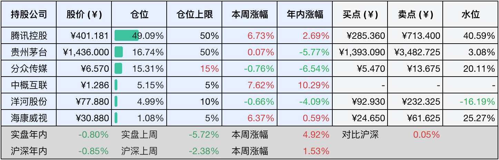

__微信公众号文章地址：[老罗投资周记-20250208](https://mp.weixin.qq.com/s/_PxpXA6i_AiVtJDUFSGOdg)__

```
老罗投资周记，每周六更新。专注于股权投资、阅读、学习与个人成长，知行合一、日拱一卒、投资人生。微信公众号【老罗投资】，文章均首发于公众号。
```

### 1. 本周交易

无

### 2. 目前持仓

当前持有的股票包括：腾讯控股49.09%、贵州茅台16.74%、分众传媒15.31%、中概互联5.15%、洋河股份4.99%、海康微视1.08%。

此外还有少量现金，加上少量的恒瑞医药、上海机场、宋城演义等股票，其份额较少，仅作为观察仓不进行记录。

本周旗下公司整体涨跌<span class="red">+4.92%</span>，年内的收益<span class="green">-0.80%</span>，连输三周后，本周终于稍稍跑赢沪深300指数，虽然依旧是负收益。

**注1：表底为截止到今日，老罗和沪深300指数今年的收益率。**

**注2：表格中港股已按汇率换算为人民币。**



### 3. 上周数据


### 4. 本周事项

+ 茅台10亿回购
+ 海康威视发布回购股份进展公告
+ 美国一月份非农就业数据爆冷
+ 哪吒登顶中国影史票房的一点感想
+ 投资中的不为清单

==只对持股和交易感兴趣的朋友，读到这里就可以退出了。后面是对上述事件的展开，无新内容。==

#### 4.1 茅台10亿回购

2月6日下午，贵州茅台发布了回购股份实施进展的公告，截止到今年1月份，茅台累计回购了68.51万股，已回购金额约10亿元，实际回购价格区间在1436.48-1507.41元之间，已回购股数占总股本的比例在0.0545%。

这次回购是贵州茅台首次大规模实施股份回购，回购方案还算是诚意满满，整体回购金额预计在30-60亿元之间，并且本次回购属于注销式回购。

在白酒行业整体增长放缓、需求疲软的当下，贵州茅台越发重视对股东的回报，在积极推动公司实施高比例分红的同时，通过大金额回购来维护公司市值。

#### 4.2 海康威视发布回购股份进展公告

2月4日，海康威视发布了股份回购进展公告，截止到1月27日收盘，公司通过集中竞价交易累计回购股份超过2000万股，成交总额约为5.93亿元。所回购的股份将全部用于注销，从而减少注册资本。

这是去年12月26日首次回购约400万股后的又一轮回购，按照此前披露的回购计划，海康威视打算投入20-25亿元资金进行回购，每股回购价格不超过40元，资金来源于自有资金和专项贷款，回购期限到2025年12月，并且会根据市场情况适时推进回购方案，以此来展现对公司未来发展前景的信心。

2024年上半年，国内市场消费需求不足，行业分化加剧；而且海外市场虽然整体稳定，但部分地区地缘政治冲突不断，主要经济体之间的贸易摩擦频繁发生，这些都对公司的全球经营和合规治理能力提出了更高的要求。

#### 4.3 美国一月份非农就业数据爆冷

2月7日，美国劳工统计局公布了相关数据，美国1月份非农就业人口增长了14.3万人，这一增长幅度创下过去三个月以来的新低，远低于市场此前预期的17.5万人。同时失业率有所下降，降至4%，低于前值以及市场预期的4.1%。

在数据发布后，美国金融市场随即出现一系列波动。美国三大股指期货短线跳水，其中纳指期货下跌0.08%，标普500股指期货下跌0.06%，道指期货下跌0.01%。美债收益率出现短暂上涨，10年期国债收益率在日内上升超过4个基点，达到4.481%。美元指数也短线拉升，一度上涨0.3%，当前报107.84。此外，现货黄金价格微涨0.27%，达到2863.89美元。

尽管当月就业增长未达预期，但是前月数据经过大幅上修，而且失业率意外有所下降，这次非农报告并没有为美联储降息争取到更大的空间，因此近期美联储降息的可能性不大。

#### 4.4 哪吒登顶中国影史票房的一点感想

春节前，媒体还在不停渲染中国电影业遭遇空前的低谷，票房同比下降了22%，全年收入425亿元，跌回到了10年前的水平。

没想到在蛇年的春节档，媒体就被啪啪啪打脸，一部《哪吒2：魔童闹海》横空出世了。刚刚上猫眼看了眼实时票房，已经达到72亿+了，这应该是首部超过10亿美元的非好莱坞影片，也是唯一一部单一市场破10亿美元的影片，真是可喜可贺。

本片取得的成就，其中最大的功臣当属饺子导演了，老罗知晓饺子导演也有十几年了，最早是通过他单人制作的那部获奖无数的短片《打，打个大西瓜》。在08年那个时代，一个通过自学maya的人，能独立做到那种水平，真的算是天赋异禀了。

从08年到25年，这漫长的17年，饺子导演一共就出过两部短片，两部电影，平均6年一部的产量，真正的精益求精，认真打磨，认没认真，真的一眼就能看出来。中国电影从来不缺少观众，只是缺少像饺子、郭帆这样认认真真讲好故事的的导演，说中国电影处在低谷中的那些导演、演员，应该先反思反思自己是不是真的在认真对待自己的事业，真正以观众为主导吧。

电影的本质是讲好故事，从而引发观众的情感共鸣，像一些导演明明手握优质的IP，却只想着圈钱，把观众当作傻子，那么注定会走向失败。这就好比投资，投资本质上是买入优秀公司的股票，与好公司共同成长，没有捷径可走，切不可妄图投机取巧。正所谓，走大道，大道人少。

#### 4.5 投资中的不为清单

段永平投资中的SDL(Stop Doing List)，个人觉得非常有价值，记录一下：

不做空，避开错误归零模式。

不借钱，当市场不顺时，不得不还的本息，就会变成刺向自己的一把尖刀，不上杠杆四个字价值最少四个亿。

不做不懂的东西，要在能力圈内投资，不懂的不做。

不要走捷径，捷径一般是最难最长的路，走大道，大道人少。

不盲目扩大自己的能力圈，这也是投资人最容易犯的错误。

不频繁决策，决策越多，犯错的机会就越多。

不做短期的投机，短线如果能赚大钱，就没有巴菲特什么事了。

对有息负债的公司不太愿意重仓，轻装前行。

不攻击竞争对手，攻击竞争对手，实际上就是承认自己不如别人，同时又自毁声誉。

不做没有差异化的产品，差异化的反面就是同质化，同质化的产品容易陷入价格战之中，会不断地摊薄企业的利润。

不打价格战，优质的差异化的产品，才不会陷入价格战之中。

不弯道超车，弯道超车易翻车，弯道超车，眼里盯的是别人；况且你要超越别人，别人也会想着超越你。

不赚快钱，慢就是快，赚快钱很难持续，也易导致短视。

不做不诚信的事，诚信的人值得交往，诚信的企业值得合作。诚信，不是别人监督时就诚信，没有监督时就不诚信。

不多元化，只集中优势兵力，朝一个城墙开火。

不虚夸产品，产品本来是什么样，就应该说成是什么样，这是做企业的本分。

### 5. 本周读书

#### 5.1 《弃长安》

这是一本讲述唐朝安史之乱时期历史进程与人物命运的书，它以安史之乱中唐明皇、李林甫、杨国忠、安禄山、颜杲卿、哥舒翰、杨玉环、李亨、张巡等多位关键人物的弃长安经历为主线，介绍唐朝由盛转衰的关键过程，通过这些身处乱离之中亲历者的经历，讲述“动乱何以爆发”以及“盛世何以崩陷”。

评分四星⭐️⭐️⭐️⭐️

#### 5.2 《一夜长大》

这本书是央视主持人尼格买提的个人随笔集，尼格买提能成为名人，看似一路顺遂，实则有迹可循。其中优秀的个人素质固然最为关键，但贵人的助力不可或缺，更为重要的是，当机遇出现时，他能够紧紧地将其抓住。这三点对于他的成功而言，缺一不可。

评分四星⭐️⭐️⭐️⭐️

#### 5.3 《治安疏》

明代著名清官海瑞于1566年冒死上奏给嘉靖皇帝，被誉为“天下第一疏”。其中的“嘉靖者言家家皆净，而无财用也”，据说嘉靖看到后暴跳如雷，胆子如此之大，敢这么骂皇帝，海瑞真汉子也。

评分四星半⭐️⭐️⭐️⭐️❤️

### 6. 本周运动

春节刚从老家回京上班，本周无运动，估计体重要上涨不少了（没敢上称），下周起要恢复锻炼了。

如果觉得本文还不错，那就点个赞或者『在看』吧，祝大家周末愉快！

```
老罗投资周记，每周六更新。专注于股权投资、阅读、学习与个人成长，知行合一、日拱一卒、投资人生。微信公众号【老罗投资】，文章均首发于公众号。
免责声明：本公众号只作为本人的投资日志记录，本文中提及的个股都有腰斩或血本无归的风险，本人不做任何投资建议，投资请坚持独立思考。
```

__微信公众号文章地址：[老罗投资周记-20250208](https://mp.weixin.qq.com/s/_PxpXA6i_AiVtJDUFSGOdg)__