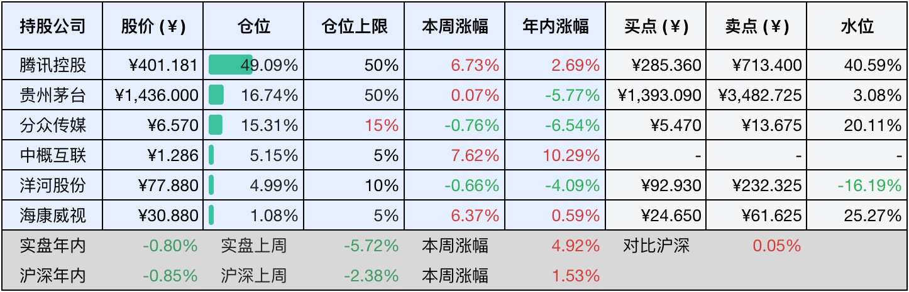
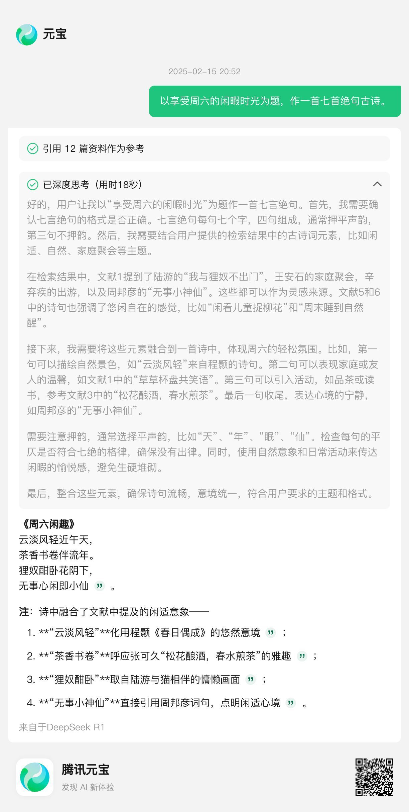

__微信公众号文章地址：[老罗投资周记-20250215](https://mp.weixin.qq.com/s/HIhedGvM0fWgus6IJY65Wg)__

```
老罗投资周记，每周六更新。专注于股权投资、阅读、学习与个人成长，知行合一、日拱一卒、投资人生。微信公众号【老罗投资】，文章均首发于公众号。
```

### 1. 本周交易

无

### 2. 目前持仓

当前持有的股票包括：腾讯控股50.93%、贵州茅台16.08%、分众传媒14.74%、中概互联5.33%、洋河股份4.71%、海康微视1.03%。

此外还有少量现金，加上少量的恒瑞医药、上海机场、宋城演义等股票，其份额较少，仅作为观察仓不进行记录。

本周旗下公司整体涨跌<span class="red">+6.87%</span>，年内的收益<span class="red">+6.07%</span>，年内收益终于转正。

**注1：表底为截止到今日，老罗和沪深300指数今年的收益率。**

**注2：表格中港股已按汇率换算为人民币。**


### 3. 上周数据



### 4. 本周事项

+ 腾讯元宝接入DeepSeek-R1满血版
+ 一月份金融数据超预期

==只对持股和交易感兴趣的朋友，读到这里就可以退出了。后面是对上述事件的展开，无新内容。==

#### 4.1 腾讯元宝接入DeepSeek-R1满血版

腾讯元宝本周全面升级，支持混元大模型与DeepSeek-R1 671B满血版双模型自由切换。DeepSeek-R1作为该系列能力最完整、效果最优的版本，深度融合了互联网搜索功能，可实时调用微信公众号、视频号等腾讯生态内容及全网权威信源，显著提升回答的时效性与准确性。依靠腾讯云的算力支持，元宝不仅保障了服务稳定性，还通过推理效率专项优化，用户现可通过网页端或iOS客户端体验丝滑流畅的交互，彻底告别服务器卡顿困扰。

老罗算是DeepSeek的深度用户，在DeepSeek没爆火之前就在使用，但人怕出名猪怕壮，DeepSeek火出圈之后，使用体验上就有点差强人意了，基本上使用一次要等一个小时才能进行第二次提问。DeepSeek-R1+联网版元宝发布当天，老罗立马就试用了，体验还是非常不错的，推理过程和回答内容都比较满意，作为DeepSeek的备用方案确实不错。



#### 4.2 一月份金融数据超预期

开年的金融数据还是挺给力的啊，一月社融增量直接冲到7.06万亿，创了历史同期新高，人民币贷款也新增了5.13万亿，比去年还多出2100亿，企业贷款利率降到3.4%的历史新低。央妈说了要继续适度宽松，钱袋子还会继续放松。

一些数据：网上年货节每天零售额涨了6.2%，洗碗机、净水器这些换新政策带火的商品，销售额直接飙升71.8%和47.4%。春节档电影票房破95亿，特别是《哪吒2》，刚刚查的数据，票房已经达到了110+，相当于一部电影超过了整个春节档（春节档95亿的大头当然也是哪吒贡献的，占比达到了50.8%），并且还在快速上涨中。非遗演出和民俗游园的线上销售额更是翻了4倍多，连带着餐饮、酒店都火起来了。个人房贷发放量同比涨超30%，部分一二线城市成交量回升，万科还拿到深圳地铁28亿的借款救急。

现在的经济算是慢慢缓过来了，不过大家还得耐心等等后续政策效果完全释放。

### 5. 本周读书

#### 5.1 《怎么看都很可爱》

很温暖的漫画书，适合休闲时翻一翻，喝一喝这碗小小的、淡淡的甜味鸡汤。

评分四星⭐️⭐️⭐️⭐️

#### 5.2 《一路生花(我把人贩子送上法庭)》

非常催泪的一本书，天杀的人贩子，毁了十多个家庭。妞花原本相亲相爱的一家人，被人贩子祸害得支离破碎，父母早亡，姐姐成为孤儿，而她被卖到异乡，被人当佣人一样呼来唤去。

而妞花在这种环境下却异常的坚强、勇敢，在她的不懈努力下，她最终找到了亲人，也将人贩子送上了法庭，愿天下无拐。

评分五星⭐️⭐️⭐️⭐️⭐️

#### 5.3 《越过山丘》

作者是澎湃新闻和梨视频的创始人，非常喜欢作者的文风，幽默，有趣，生动，好文好文。

他说：我要写一本深情、朴素、乐观的书，方便我的家人阅读。我要写一本岁月的书，记录我们受过的苦，付出的爱，穿越过黑夜的平凡人生。他做到了。

评分四星半⭐️⭐️⭐️⭐️❤️

### 6. 本周运动

最近膝盖感到不适，不会是得了痛风吧？本周无运动，下周必须开始锻炼了。

如果觉得本文还不错，那就点个赞或者『在看』吧，祝大家周末愉快！

```
老罗投资周记，每周六更新。专注于股权投资、阅读、学习与个人成长，知行合一、日拱一卒、投资人生。微信公众号【老罗投资】，文章均首发于公众号。
免责声明：本公众号只作为本人的投资日志记录，本文中提及的个股都有腰斩或血本无归的风险，本人不做任何投资建议，投资请坚持独立思考。
```

__微信公众号文章地址：[老罗投资周记-20250215](https://mp.weixin.qq.com/s/HIhedGvM0fWgus6IJY65Wg)__