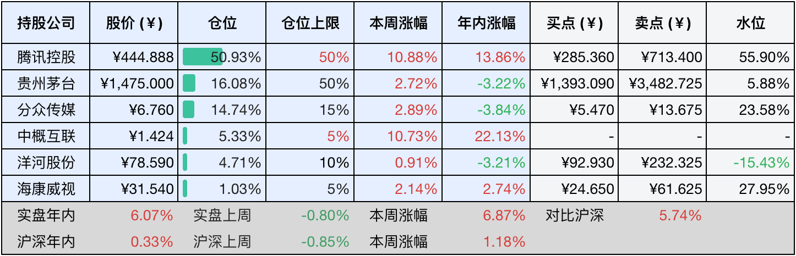
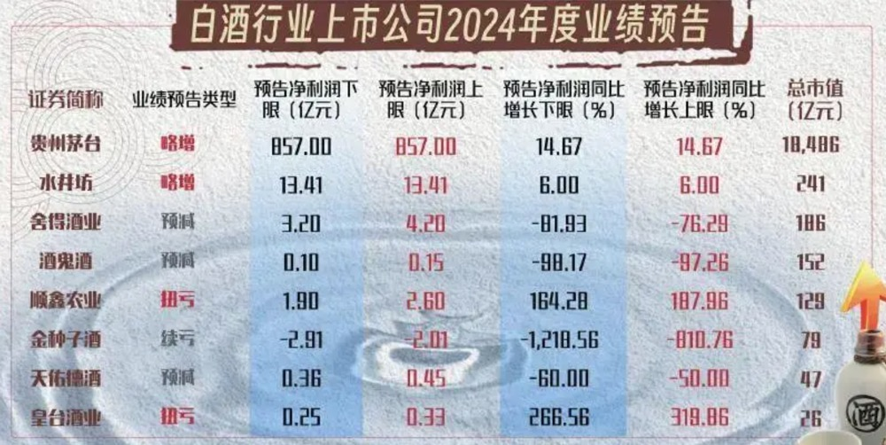

__微信公众号文章地址：[老罗投资周记-20250222](https://mp.weixin.qq.com/s/onvXvwiUs1zDLNQLTbpg-A)__

```
老罗投资周记，每周六更新。专注于股权投资、阅读、学习与个人成长，知行合一、日拱一卒、投资人生。微信公众号【老罗投资】，文章均首发于公众号。
```

### 1. 本周交易

无

### 2. 目前持仓

当前持有的股票包括：腾讯控股53.15%、贵州茅台15.60%、分众传媒13.31%、中概互联5.42%、洋河股份4.55%、海康微视1.03%。

此外还有少量现金，加上少量的恒瑞医药、上海机场、宋城演义等股票，其份额较少，仅作为观察仓不进行记录。

本周旗下公司整体涨跌<span class="red">+4.26%</span>，年内的收益<span class="red">+10.33%</span>，本周港股继续表现亮眼。

**注1：表底为截止到今日，老罗和沪深300指数今年的收益率。**

**注2：表格中港股已按汇率换算为人民币。**


### 3. 上周数据



### 4. 本周事项

+ 民营企业座谈会
+ 上市酒企2024年年度业绩预告
+ 千万不要中断复利

==只对持股和交易感兴趣的朋友，读到这里就可以退出了。后面是对上述事件的展开，无新内容。==

#### 4.1 民营企业座谈会

2月17日召开的民营企业座谈会，是在全球经济格局深度调整、中国经济转型升级关键节点召开的高规格政策宣示会议。这次会议既是对2018年民营企业座谈会的战略延续，更是针对新形势下民营经济高质量发展需求作出的系统性部署，释放出多重政策信号，对中国经济格局将产生深远影响。

参加会议的企业，明显体现了当前的政策导向，华为、比亚迪、宇树科技等硬科技企业占比超70%，显示国家将民企定位为突破卡脖子技术的主力军。2024年民企研发投入占全社会76%，半导体设备国产化率从25%升至38%，预计2025年人工智能、量子计算等领域投资增速将超25%，新能源汽车全球市场份额有望突破65%。

这次座谈会标志着中国民营经济进入法治护航+创新驱动新阶段，短期看，政策将推动今年的GDP稳定增长；长期则通过制度性改革，帮助民营企业在全球产业链中占据更高的占有率，同时，民营经济对提升就业率、促进消费，都有举足轻重的地位。

#### 4.2 上市酒企2024年年度业绩预告

2024年中国白酒行业在深度调整中呈现出显著的业绩分化格局，头部企业贵州茅台以营业总收入1738亿元(+15.44%)和归母净利润857亿元(+14.67%)的表现，超额完成了年度增长目标，核心产品茅台酒贡献营收1458亿元(+15.18%)，系列酒实现246亿元(+19.24%)的突破性增长。

但是，茅台酒基酒产量同比减少了900吨，至5.63万吨，这是近五年来的首次减产，而系列酒基酒增产5200吨至4.81万吨，显示出企业通过调节产能结构、强化核心产品稀缺性、拓展大众市场的战略意图。相比之下，水井坊虽实现营收52.17亿元(+5%)和净利润13.41亿元(+6%)的微增，但其股价较2021年高点累计下跌67%，反映出水井坊高端化转型过程中品牌溢价与市场认可度之间的失衡。

行业结构性调整的阵痛在腰部企业表现尤其显著，舍得酒业净利润同比下降76%-82%，酒鬼酒降幅达97%-98%，天佑德酒因营销费用激增利润下滑，金种子酒则因提价导致销量锐减续亏2.91亿元，这些企业普遍面临次高端需求疲软、库存周转天数翻倍(20-30天)和价格倒挂压力。而顺鑫农业通过剥离亏损的猪肉业务实现扭亏，皇台酒业借助诉讼负债转销完成业绩修复，这种非持续性盈利改善，还是难以掩盖区域酒企的生存困境，比如金种子酒在安徽市场份额已经从9%萎缩至3%，终端价格下挫了34%。



这种头部稳固、腰部承压、尾部淘汰的竞争格局，本质上是消费升级与存量博弈双重作用下的必然结果。头部企业凭借品牌壁垒(茅台毛利率超90%)、渠道革新(i茅台直营收入占比40%)和产能调控能力，构建起难以逾越的护城河。反观中小酒企，在成本控制(区域酒企原料成本占比35%对比茅台的7.5%)、数字化渗透和场景化营销等方面的系统性劣势，使其在行业调整周期中加速被边缘化。

当前白酒行业已进入从规模扩张向价值深耕的关键转型期，未来的竞争将更加聚焦于供需精准匹配、消费场景创新和产业链韧性构建，那些没能建立差异化竞争优势的企业可能会将被深度整合出局。

#### 4.3 千万不要中断复利

在投资的世界中，复利被称为世界第八大奇迹，它的力量不在于瞬间的爆发，而在于时间沉淀下的指数级增长。查理·芒格曾反复强调：复利的第一条规则，永远不要无故中断它。这句话看似简单，却展示了财富积累的核心逻辑：复利的威力需要时间的浇灌，而中途的动摇或中断，可能让多年的积累功亏一篑。

复利的本质是利滚利，收益的再投资让本金不断地壮大，假设每个月定投入1000元，年化收益率8%，30年后本金仅仅为36万元，而在复利效应下，总资产就可以达到226万元。但是如果中途因为市场波动、或情绪化的操作而中断了投资，收益将会大幅地缩水。正如爱因斯坦所言：复利需要时间，但时间不会等待任何人。越早开始并坚持，复利的雪球才能越滚越大。

价值投资者们，通过精选具有护城河的企业，在市场波动中坚守，最终收获复利奇迹，频繁交易不仅增加成本（如手续费、税费），更可能错失优质资产的长期回报。例如，年化收益率如果能从6%提升至8%，10万元的本金，在40年后差距可达114万元。因此聚焦长期价值，而非关注市场的短期涨跌，是复利的关键。

市场周期难以预测，但历史证明，恐慌性抛售往往和复利背道而驰。在2008年金融危机中，坚持持有标普500指数的投资者，十年后收益远超中途退出者，真正的复利践行者，会通过定投策略淡化择时，用纪律克服贪婪与恐惧。同时，避免负债(如高息信用卡、投资中上杠杆)对复利的侵蚀，确保资金的持续投入。

复利不仅是数学公式，更是一种生活哲学，它要求我们相信时间的力量，用耐心和纪律守护每一份投入。无论是投资理财，还是个人成长，唯有持续积累、避免中断，才能让复利的威力真正展现，今天的不断坚持，终将成就未来的财富自由。复利可以少，但不能没有。

### 5. 本周读书

#### 5.1 《我人生最开始的好朋友》

本书讲述了一个闽南小镇里，幼年的主角黑狗达与六个小动物的成长陪伴的故事，交织了阿太(姥姥)、爸爸、妈妈以及乡亲邻里的琐碎温暖。

童年时养宠物确实能培养小孩的爱心，同时也能尽早让孩子了解到，亲人、朋友的离别是无不可避免的，更要珍惜当下的时光。

评分四星⭐️⭐️⭐️⭐️

### 6. 本周运动

本周遛弯四次，健身环运动一次，本周起开始严格运动打卡，控制饮食，调整睡眠时间。

如果觉得本文还不错，那就点个赞或者『在看』吧，祝大家周末愉快！

```
老罗投资周记，每周六更新。专注于股权投资、阅读、学习与个人成长，知行合一、日拱一卒、投资人生。微信公众号【老罗投资】，文章均首发于公众号。
免责声明：本公众号只作为本人的投资日志记录，本文中提及的个股都有腰斩或血本无归的风险，本人不做任何投资建议，投资请坚持独立思考。
```

__微信公众号文章地址：[老罗投资周记-20250222](https://mp.weixin.qq.com/s/onvXvwiUs1zDLNQLTbpg-A)__