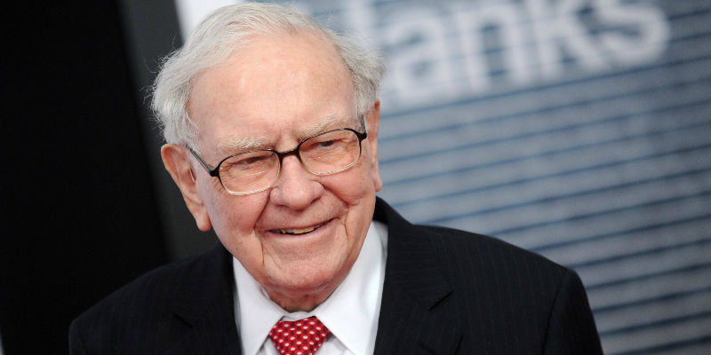

__微信公众号文章地址：[巴菲特致股东信-20250223](https://mp.weixin.qq.com/s/SHN_vlgltHEFglo4cle3HQ)__

**致股东信原文地址：**[https://www.berkshirehathaway.com/letters/2024ltr.pdf](https://www.berkshirehathaway.com/letters/2024ltr.pdf)

在2月22日发布的股东信中，94岁的巴菲特以伯克希尔掌舵60周年的历史性节点为背景，向全球投资者呈现了一份兼具战略总结，与未来展望的价值投资宣言。这封长达15页的信件，不仅是对一个甲子传奇的凝练，更包含了对新时代资本市场的深刻洞察。

2024年伯克希尔营业利润同比增长27%至474亿美元，其中保险业务改革成效显著，GEICO通过五年革新实现效率跃升，推动承保利润翻倍；铁路与公用事业板块虽利润有所改善，但仍有提升空间。目前公司现金储备创下3342亿美元的新高，被巴菲特称为『应对不确定性的氧气瓶』，既是对美股估值泡沫的审慎回应，也为未来危机中的狩猎行动埋下了伏笔。

在日本传统商社普遍被低估时，伯克希尔通过发行日元债券建立货币中性头寸，将五大商社(伊藤忠、三菱等)投资增加至235亿美元。这种价值洼地的布局，既是对日本企业治理模式的认可，更暗含对抗通胀与货币贬值的深层考量。巴菲特明确表示，这些投资将会跨越数十年的周期，成为全球化配置的重要一环。

268亿美元的企业所得税缴纳记录(占全美企业税收的5%)，体现出伯克希尔价值创造-社会反哺的良性循环。在60年间，对股东仅仅实行一次分红的克制，转化为持续再投资的动能，最终成就了从濒临破产的纺织厂到纳税冠军的蜕变。巴菲特将这种蜕变归功于『美国奇迹』，强调储蓄与资本再投资是投资增长的核心动力(复利)。

在明确继任者格雷格·阿贝尔已准备好领导伯克希尔的同时，巴菲特特别强调了其投资理念与公司价值观的高度契合。这种代际传承不仅体现在人事更迭上，更渗透于投资哲学的延续，信中重申『以合理价格买入卓越企业』的原则，批判杠杆投机，警示技术变革中的估值泡沫，构建起穿越周期的价值锚点。

针对核心的财产意外险业务，巴菲特既肯定了2024年定价走强带来的利润增长，也发出气候变化可能导致巨灾损失增加的预警。这种审慎乐观的态度，体现在3342亿美元现金储备与日本传统产业逆向布局的平衡之中。对于货币政策，他罕见地警告：如果财政政策失误，纸币价值可能蒸发，暗示在AI的狂热与利率的迷雾中，实体资产与跨国配置的重要性越发凸显。

这封跨越甲子的投资宣言，最终凝练成三个穿越周期的启示：在技术变革中坚守盈利本质的定力，在货币迷雾里识别真实价值的眼光，在代际更迭时传承价值内核的智慧。当伯克希尔的投资版图从奥马哈延伸到东京，从传统基建渗透至新能源领域，这场持续六十年的价值发现之旅，仍在为全球资本市场标注新的航向。

如果觉得本文还不错，那就点个赞或者『在看』吧。

__微信公众号文章地址：[巴菲特致股东信-20250223](https://mp.weixin.qq.com/s/SHN_vlgltHEFglo4cle3HQ)__