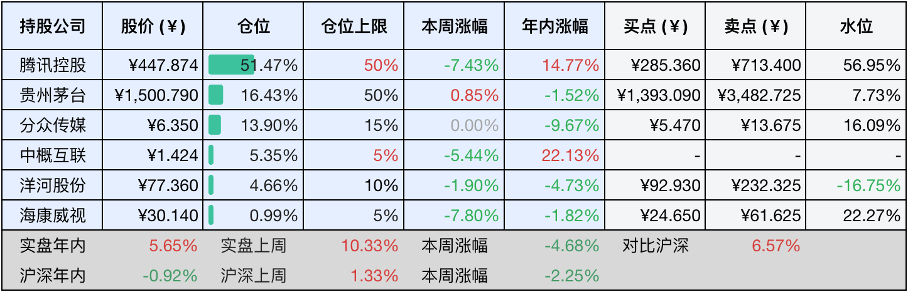
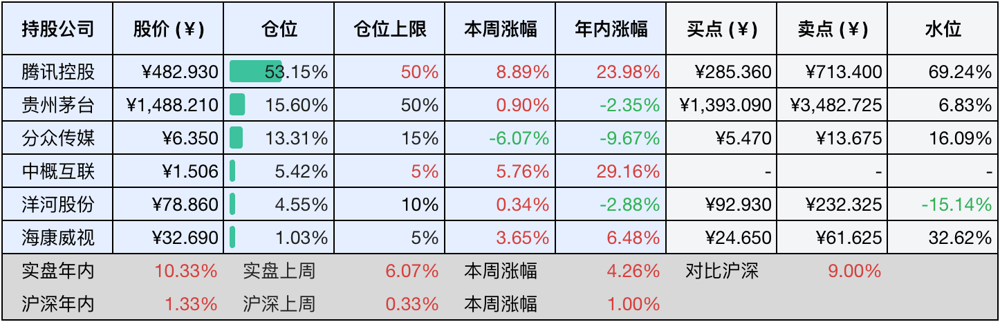

__微信公众号文章地址：[老罗投资周记-20250301](https://mp.weixin.qq.com/s/TXmKAAfV1lmVohF5IClapA)__

```
老罗投资周记，每周六更新。专注于股权投资、阅读、学习与个人成长，知行合一、日拱一卒、投资人生。微信公众号【老罗投资】，文章均首发于公众号。
```

### 1. 本周交易

无

### 2. 目前持仓

当前持有的股票包括：腾讯控股51.47%、贵州茅台16.43%、分众传媒13.90%、中概互联5.35%、洋河股份4.66%、海康微视0.99%。

此外还有少量现金，加上少量的恒瑞医药、上海机场、宋城演义等股票，其份额较少，仅作为观察仓不进行记录。

本周旗下公司整体涨跌<span class="green">-4.68%</span>，年内的收益<span class="red">+5.65%</span>。变化实在是太快，港股上周还是小甜甜，本周就变成牛夫人了。

**注1：表底为截止到今日，老罗和沪深300指数今年的收益率。**

**注2：表格中港股已按汇率换算为人民币。**



### 3. 上周数据



### 4. 本周事项

+ 微信支持电脑上收红包
+ 正确面对股价的短期波动

==只对持股和交易感兴趣的朋友，读到这里就可以退出了。后面是对上述事件的展开，无新内容。==

#### 4.1 微信支持电脑上收红包

微信PC版4.0.2测试版支持收红包，这是十年来首次支持，用户可以在电脑端直接领取红包，操作和手机端一样。

不过当前版本仍然存在三大限制：一是仅支持单聊红包收取​，群聊红包还是需要切换至手机端；二是无法通过PC端发送红包或者展示自定义红包封面；三是需要保持电脑与手机登录同一个账号，并且必须更新到最新的测试版本。

这次更新标志着微信从移动端优先，向智能终端协同转型又迈出了一步，尽管功能还没有完全对标移动端，但也算是可喜的进步。

3月1日还正式发布了电脑版腾讯元宝，支持Windows和macOS系统，工作场景下电脑版还是有相当大的优势的。

#### 4.2 正确面对股价的短期波动

正确面对股价短期波动，是投资者在股市中实现长期盈利的核心能力，市场的短期波动如同抛硬币一样难以预测，但其本质是市场情绪、资金博弈与信息不对称共同作用的结果，而并非企业内在价值的真实反映。

短期波动极易触发人性中的贪婪与恐惧，导致追涨杀跌的恶性循环。巴菲特的市场先生理论指出，市场报价如同情绪化邻居的任性报价，投资者需要以企业的基本面为锚点，避免被恐慌性抛售或狂热追高所裹挟。在恐慌性下跌中，优质股的估值可能被错杀，这时逆向布局往往能捕捉超额收益。2020年疫情初期全球股市暴跌期间，坚持持有核心资产的投资者在后续反弹中普遍获得30%以上的回报。

真正的投资高手往往将波动视为财富再分配的机遇，彼得·林奇说过：股市下跌如同科罗拉多州的暴风雪，当它来临时，你应该穿上皮衣而非卖掉牧场。在波动中保持战略定力，用系统化方法实现风险可控下的收益积累，才是穿越牛熊的终极法则。

### 5. 本周读书

#### 5.1 《正念教养：如何不焦虑、不内耗地与孩子相处》

育儿实践还是需要系统性的教养方法论来支撑的，多数人并非生来就具备养育者的专业素养，如果仅仅凭直觉经验教养子女，极易导致家庭教育失序。科学的育儿认知体系，能有效地规避教养过程中的盲目性，提升亲子关系的质量。这本书确实能带来帮助，值得一读。

评分四星半⭐️⭐️⭐️⭐️❤️

#### 5.2 《从布衣到帝王：刘秀的逆袭之路》

讲述了光武帝刘秀的一生，但书写得一般，像记流水账，人物描述也比较扁平化，可看可不看。

评分三星⭐️⭐️⭐️

### 6. 本周运动

本周遛弯五次，节食也同时进行中。

如果觉得本文还不错，那就点个赞或者『在看』吧，祝大家周末愉快！

```
老罗投资周记，每周六更新。专注于股权投资、阅读、学习与个人成长，知行合一、日拱一卒、投资人生。微信公众号【老罗投资】，文章均首发于公众号。
免责声明：本公众号只作为本人的投资日志记录，本文中提及的个股都有腰斩或血本无归的风险，本人不做任何投资建议，投资请坚持独立思考。
```

__微信公众号文章地址：[老罗投资周记-20250301](https://mp.weixin.qq.com/s/TXmKAAfV1lmVohF5IClapA)__