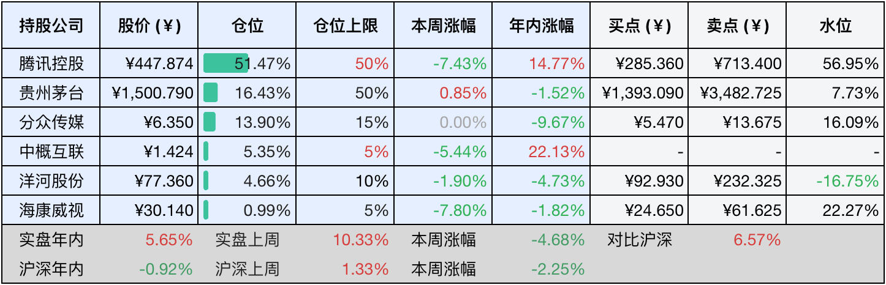

__微信公众号文章地址：[老罗投资周记-20250308](https://mp.weixin.qq.com/s/oMdLy5GsEtlZSpp0UpdaFQ)__

```
老罗投资周记，每周六更新。专注于股权投资、阅读、学习与个人成长，知行合一、日拱一卒、投资人生。微信公众号【老罗投资】，文章均首发于公众号。
```

### 1. 本周交易

无

### 2. 目前持仓

当前持有的股票包括：腾讯控股53.11%、贵州茅台15.48%、分众传媒13.35%、中概互联5.47%、洋河股份4.36%、海康微视1.02%。

此外还有少量现金，加上少量的恒瑞医药、上海机场、宋城演义等股票，其份额较少，仅作为观察仓不进行记录。

本周旗下公司整体涨跌<span class="red">+7.41%</span>，年内的收益<span class="red">+13.06%</span>。本周旗下公司普涨，继续保持没有操作，股价上涨反而更加怀念去年9月前遍地机会的『好时光』了。

**注1：表底为截止到今日，老罗和沪深300指数今年的收益率。**

**注2：表格中港股已按汇率换算为人民币。**


### 3. 上周数据



### 4. 本周事项

+ 茅台回购股份进展
+ 洋河变更签字注册会计师
+ 第一性原理

==只对持股和交易感兴趣的朋友，读到这里就可以退出了。后面是对上述事件的展开，无新内容。==

#### 4.1 茅台回购股份进展

根据3月4日贵州茅台发布的公告，截至到今年二月底，贵州茅台已经累计回购了82.22万股，约占总股本的0.06%，耗资11.998亿元(不含交易费用)。回购价格区间为1417.01元至1507.41元每股之间，均价约为1458元每股。

根据去年11月通过的方案，这次回购计划的总金额为30-60亿元，执行期限12个月，一直会持续到今年十一月份，目前已经完成约40%的额度(按30亿总额回购下限计算)，贵州茅台后续仍然有可能会根据市场情况择机推进回购工作。

在高端白酒竞争格局固化、市场分化加剧的背景下，茅台想通过以回购股票为支点，构建从品牌护城河到资本护城河的双重壁垒，近期老罗会重点关注茅台的回购执行节奏，与股价的稳定性情况。

#### 4.2 洋河变更签字注册会计师

洋河股份3月4日公告，24年度审计机构中喜会计师事务所因为内部工作调整，将原签字注册会计师吕小云​(项目合伙人)、邓雪雷更换为龚召平​(项目合伙人)和王文娟。这次签字注册会计师变更已经通过了公司董事会和股东大会的审议，符合合规流程，并且洋河强调了这次调整并非是因为审计质量的问题。

这次变更发生在年度审计关键阶段​，24年报的编制期，叠加洋河股份最近两年股价十分低迷，25年3月股价相较23年的高点已经下跌了约50%，更换签字注册会计师，引发部分投资者对财务透明度和潜在风险的担忧。但洋河明确表示，变更不会影响审计进度和质量，新任的会计师团队已经完成了工作交接。

虽说洋河这次变更签字注册会计师是正常的人事调整，但还是需要结合近几年业绩承压的背景谨慎考察，近期应该重点关注年报审计意见类型和关键的财务指标，以判断公司真实经营状况和长期价值。

#### 4.3 第一性原理

家庭的第一性原理：核心逻辑并非由情感主导，而是建立在经济基础之上。从原始社会的资源分配到现代社会的房贷、教育开支，经济稳定性始终是维系家庭和谐的关键要素。经济压力会直接激化矛盾，而稳定的收入则像混凝土般巩固家庭成员的安全感。

职场的第一性原理：本质是价值交换系统，而并非努力即正义的舞台。企业为结果买单，不为过程鼓掌，例如销售人员的业绩产出，比加班时长更能定义其的职场地位。

人际关系的第一性原理：本质上是资源互换的生态链，单方面讨好终将失衡，而互利关系则如齿轮般紧密咬合。

教育的第一性原理：终极目标是培养解决问题的能力，而并非制造考试的机器。让孩子学习烹饪、理财等生存技能，比追求卷面分数更能适应未来社会的复杂性。社会需要的不是标准答案的复读机，而是能独立思考的实践者。

成长的第一性原理：经历本身无法带来成长，反思才是蜕变的催化剂，重复踩坑十年的人和持续复盘者的差距，就如同矿石与精炼金属的价值差异。

​时间管理的第一性原理：时间无法被管理，但任务的重要性可以被排序。

理财的第一性原理：核心是构建持续现金流，而非追逐高风险收益。月薪直接进入还款账户的群体，与坚持先存钱再消费者相比，抗风险能力存在本质上的差异。

投资的第一性原理：赚十次抵不过亏一次是投资界的铁律。

​创业的第一性原理：创业成功取决于市场需求洞察，而并非个人的兴趣。​
​
​健康的第一性原理：医疗是健康系统的维修部门，而自律才是真正的预防工程。

爱情的第一性原理：爱情的本质是双向筛选，而非改造游戏，婚前理性评估三观的契合度，比婚后勉强磨合更符合人性规律。

决策的第一性原理：决策本质是锚定目标，而不是纠结各种选项。

这12条第一性原理都揭示了一个共性规律，即所有复杂系统的底层逻辑，最终都将回归到最简法则。家庭的经济基石、职场的价值交换、教育的实践导向等等等等，本质上都是对表象与本质关系的深度解构。

### 5. 本周读书

#### 5.1 《长期价值投资-如何稳健地积累财富》

伪价值投资，一些浅显的概念翻来覆去地说，同时还喜欢夹带点私货，不建议花时间阅读，价值投资好书那么多，为什么把时间浪费在这本书上？

评分二星⭐️⭐️

#### 5.2 《父亲巴菲特教我的事》

这本书并不是投资类书籍，作者彼得·巴菲特是股神巴菲特的小儿子，在老爸的光环下，他并没有去从事投资行业，而遵从内心选择了自己喜欢的音乐，成为了一名出色的音乐家和作曲家。

我与作者的三观还是很同频的，人生的容错率其实很高，犯错也没什么，勇敢去做自己热爱的事吧。

评分四星⭐️⭐️⭐️⭐️

### 6. 本周运动

本周遛弯五次，每次五公里以上，同时控制饮食，一周体重减去四斤多。可能是鞋不太合适，有点磨脚，脚上起了个水泡，下周可能会减少遛弯次数，欲速则不达。

如果觉得本文还不错，那就点个赞或者『在看』吧，祝大家周末愉快！

```
老罗投资周记，每周六更新。专注于股权投资、阅读、学习与个人成长，知行合一、日拱一卒、投资人生。微信公众号【老罗投资】，文章均首发于公众号。
免责声明：本公众号只作为本人的投资日志记录，本文中提及的个股都有腰斩或血本无归的风险，本人不做任何投资建议，投资请坚持独立思考。
```

__微信公众号文章地址：[老罗投资周记-20250308](https://mp.weixin.qq.com/s/oMdLy5GsEtlZSpp0UpdaFQ)__