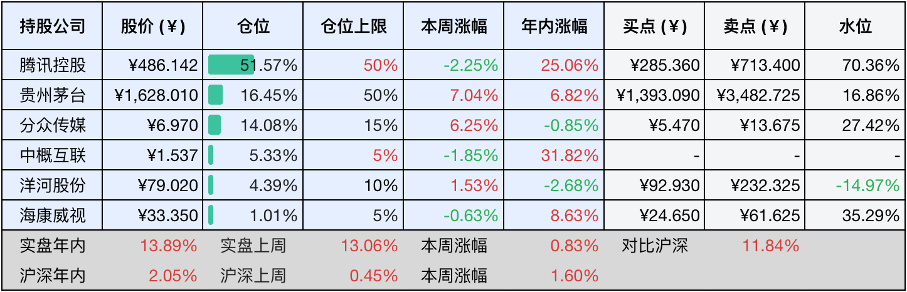

__微信公众号文章地址：[老罗投资周记-20250315](https://mp.weixin.qq.com/s/viPEUZLaKVMjpiyxWQqK1g)__

```
老罗投资周记，每周六更新。专注于股权投资、阅读、学习与个人成长，知行合一、日拱一卒、投资人生。微信公众号【老罗投资】，文章均首发于公众号。
```

### 1. 本周交易

无

### 2. 目前持仓

当前持有的股票包括：腾讯控股51.57%、贵州茅台16.45%、分众传媒14.08%、中概互联5.33%、洋河股份4.39%、海康微视1.01%。

此外还有少量现金，加上少量的恒瑞医药、上海机场、宋城演义等股票，其份额较少，仅作为观察仓不进行记录。

本周旗下公司整体涨跌<span class="red">+0.83%</span>，年内的收益<span class="red">+13.89%</span>。

**注1：表底为截止到今日，老罗和沪深300指数今年的收益率。**

**注2：表格中港股已按汇率换算为人民币。**



### 3. 上周数据


### 4. 本周事项

+ 腾讯预计下周发布财报
+ 段永平空仓了？
+ 农夫思维

==只对持股和交易感兴趣的朋友，读到这里就可以退出了。后面是对上述事件的展开，无新内容。==

#### 4.1 腾讯预计下周发布财报

腾讯控股预计将在3月19日发布24年第四季度财报与24年全年财报，这个时间节点符合腾讯近年来的财报发布惯例，通常会在次年三月中下旬披露全年业绩，这次财报将全面展示腾讯在24年的业务表现，尤其是在一些核心的领域，有较多需要关注的点。

第一，游戏业务复苏态势，尽管2024年上半年《王者荣耀》《和平精英》等旗舰游戏的流水已恢复同比增长，但全年需验证海外市场，比如《三角洲行动》和supercell旗下游戏的贡献，能否持续支撑第二增长曲线。

第二，AI技术商业化进程，腾讯混元+deepSeek双引擎战略下，混元大模型已经接入了700多个业务场景，开源文字生成视频能力并推出AI助手元宝，AI技术落地对云服务、广告及企业服务的赋能效果将成为关键看点。

第三，视频号与小程序的增长潜力，24年视频号用户时长和小游戏流水都实现较快增长，商业化变现能力或进一步释放。

第四，企业服务与降本增效，金融科技与企业服务收入占比持续提升，云服务、SaaS产品在多个行业的渗透率超过50%，叠加研发投入超3000亿元的长期积累，经营效率改善空间值得关注。

#### 4.2 段永平空仓了？

段永平3月11日在某投资社区发文称首次享受空仓快感，后来又澄清仅仅是部分仓位的调整，引发市场热议。这场重新定义空仓的舆论风波，折射出投资大佬对美股估值风险的警觉，这种审慎态度与巴菲特的现金储备策略(伯克希尔现金储备超3000亿美元)形成了呼应，共同表明了投资大佬们对美股泡沫的预判。

当前美股多项指标已经亮起了红灯，巴菲特指标(总市值/GDP)突破了200%警戒线，纳斯达克市盈率显著偏离历史均值，科技七巨头市值占比超过四分之一，特斯拉年内暴跌逾50%。这些现象印证着资本市场的周期性规律，泡沫不破，价值难寻。本轮美股长牛本质上是疫情时期无限量化宽松催生的货币现象，这种非常规政策造就的繁荣正在接受市场规律的检验。

投资者群体中近些年存在着两种极端认知偏差，“美股永远上涨”和“大A永远3000点”。确实，在过去的15年里，标普500指数年化收益率达到了14.3%，累计涨幅700+%，回报率之高确实让人十分心动。但如果将时间轴再往前移，1999-2009这十年间该指数年化收益率仅为-0.2%，没涨还微跌。更早的案例是，在1964-1981年长达17年的时间里，道琼斯指数从874.12点微涨至875点，累计涨幅仅仅0.1个百分点，

这些历史记忆警示我们，将美股永远涨的思维定式奉为投资圭臬，无异于将财富置于悬崖边缘。

#### 4.3 农夫思维

犹太人用《塔木德》的智慧缔造商业传奇，这背后隐藏着超越时代的生存哲学。将目光投向当代社会，我们会发现，真正持久的成功，往往来自对农夫思维的深刻践行。这种思维模式不仅是犹太商道的精髓，更是每个渴望突破的现代人需要领悟的底层逻辑。

农夫思维的核心理念是构建时间纵深，就像犹太商人将资金分为现金作物、中期投资和长期储备三部分，现代人也需建立即时收益+中期规划+未来布局的复合结构，这种结构既保证当下生存，又能抓住未来机遇。

农夫对土地的透彻认知，映射到现代就是对垂直领域的深度深耕。某乎大V半佛仙人持续输出财经内容五年，累计创作了200余万字，才最终形成独特的内容护城河。这种持续的专业积累会产生极强复利效应，当知识储备突破临界点时，就会形成碾压式的竞争优势，专业深耕不是重复劳动，而是螺旋上升的认知迭代。

真正的农夫思维包含对经济周期的敬畏与驾驭，在这个充满了即时反馈(猎人思维)充斥的时代，农夫思维提供了对抗浮躁的解药。它告诉我们：成功不是百米冲刺的爆发，而是马拉松式的持续深耕；不是投机取巧的侥幸，而是构建系统的必然。当我们学会了像农夫那样敬畏规律、专注深耕、布局未来，就能在时代浪潮中培育出属于自己的常青之树。这或许就是犹太人历经千年颠沛，仍然能够缔造商业奇迹的根本原因，也是每个普通人突破成长瓶颈的终极密码。

### 5. 本周读书

#### 5.1 《曾侯乙墓》

1978年5月，湖北随州擂鼓墩的爆破声炸开了一段沉睡2400年的历史，战国早期曾国国君曾侯乙的陵墓重见天日。这座深埋于十三米红砂岩层下的巨型岩坑竖穴墓，以220平方米的超大规模震惊考古界，其中最为珍贵的是在墓穴中室悬挂的65件青铜编钟，其音色清澈如初，可以称为人类音乐史上最完整的先秦礼乐实证。

评分四星⭐️⭐️⭐️⭐️

#### 5.2 《国宝100》1-3卷

用文物讲述历史，是了解历史的一种特殊方式，在这套书中，马未都从全世界的博物馆中遴选出100件中国文物，详细讲述，分别涉及到了青铜、陶瓷、玉器、漆器、家具、法书、碑帖、绘画等。《国宝100》一共4卷，本周一口气看完了1-3卷，马未都的写作风格非常幽默有趣，本书阅读起来一点也不累。

评分四星⭐️⭐️⭐️⭐️

### 6. 本周运动

本周因为生病暂停了运动，先是在周一有些感冒症状，但症状较轻，主要是咳嗽、流鼻涕、鼻塞、没精神。用以前屯的试纸测了下新冠阳性，没想到都5202年了还会中招新冠病毒。目前恢复良好，估计到下周就会恢复运动。

如果觉得本文还不错，那就点个赞或者『在看』吧，祝大家周末愉快！

```
老罗投资周记，每周六更新。专注于股权投资、阅读、学习与个人成长，知行合一、日拱一卒、投资人生。微信公众号【老罗投资】，文章均首发于公众号。
免责声明：本公众号只作为本人的投资日志记录，本文中提及的个股都有腰斩或血本无归的风险，本人不做任何投资建议，投资请坚持独立思考。
```

__微信公众号文章地址：[老罗投资周记-20250315](https://mp.weixin.qq.com/s/viPEUZLaKVMjpiyxWQqK1g)__