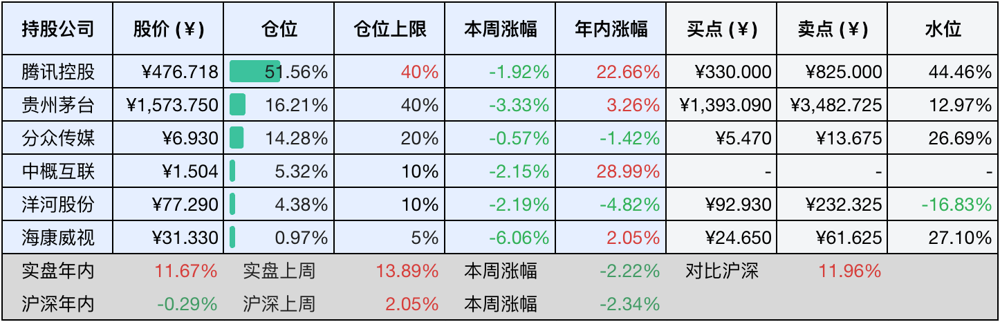
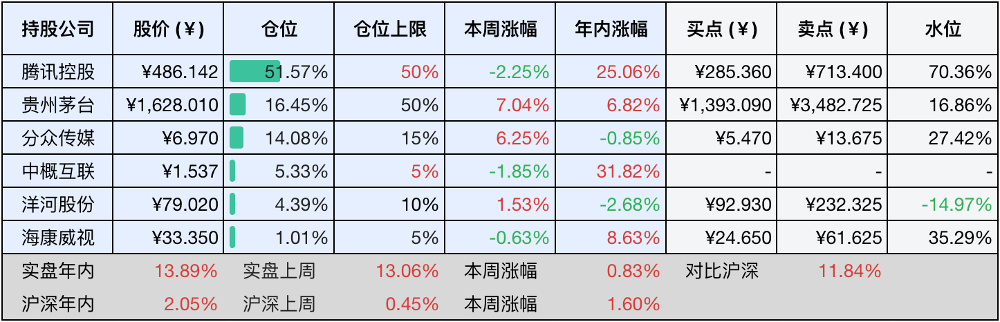

__微信公众号文章地址：[老罗投资周记-20250322](https://mp.weixin.qq.com/s/fwYscet57aTPR16zcj12Kg)__

```
老罗投资周记，每周六更新。专注于股权投资、阅读、学习与个人成长，知行合一、日拱一卒、投资人生。微信公众号【老罗投资】，文章均首发于公众号。
```

### 1. 本周交易

无

### 2. 目前持仓

当前持有的股票包括：腾讯控股51.56%、贵州茅台16.21%、分众传媒14.28%、中概互联5.32%、洋河股份4.38%、海康微视0.97%。

此外还有少量现金，加上少量的恒瑞医药、上海机场、宋城演义等股票，其份额较少，仅作为观察仓不进行记录。

本周旗下公司整体涨跌<span class="green">-2.22%</span>，年内的收益<span class="red">+11.67%</span>。

**注1：表底为截止到今日，老罗和沪深300指数今年的收益率。**

**注2：表格中港股已按汇率换算为人民币。**



### 3. 上周数据



### 4. 本周事项

+ 腾讯发布24年财报

==只对持股和交易感兴趣的朋友，读到这里就可以退出了。后面是对上述事件的展开，无新内容。==

#### 4.1 腾讯发布24年财报

本周腾讯如期发布了24年财报，财报中也有一些核心亮点：

第一，业绩全面超预期。营收与利润：全年营收达6602.6亿元(+8%)，归母净利润1940.7亿元(+68%)，调整后净利润2227亿元(+41%)，均显著高于市场的预期。毛利率创新高：综合毛利率提升至52.9%(+5pct)，主要得益于高毛利的视频号广告、国际游戏及AI技术驱动的降本增效。

第二，业务多元化增长。游戏业务：国际游戏收入580亿元(+9%)，本土游戏收入1397亿元(+10%)，长青游戏组合扩展至14款，支撑增值服务收入增长7%。广告业务：营销服务收入1214亿元(+20%)，视频号广告贡献显著，广告主需求集中在游戏、电商和教育领域。AI驱动创新：混元大模型与DeepSeek技术突破降低GPU依赖，AI广告平台升级及微信生态，商业化潜力初显。

第三，提高股东回报强化信心。2025年计划派息410亿港元(+32%)，每股4.5港币，但港股通收20%的红利税，相当于每股分到3.6港币分红；还将回购800亿港元股份，总股东回报达1210亿港元，直接提升每股价值。

最后是估值分析与买卖点测算。净利润预测：中性情景下，2027年净利润预计2500亿元(年增长10%)，并考虑AI商业化加速和游戏出海的潜力。PE倍数：参考行业均值20倍及腾讯历史区间(20-35倍)，给予25到30倍的PE。

按照PE模型估值：中性估值=2500亿净利润×25PE=62500亿市值，总股本92.6亿股，对应合理股价约670元人民币，安全边际调整后买点330人民币(老规矩打五折+向下取整)。卖点调整为825元人民币，买点和卖点都做了向下调整。目前的价格属于不高不低，还需要耐心持有。

本期周记只做财报简单的分析和公司估值调整，详细的财报分析可能会单发一篇。从这期开始，实盘持仓上限也正式调整了，之前50%的持仓上限感觉还是过于激进，将调整为最高40%，把握差一点的公司最高20%，再差一点的10%，没有太大信心的最高给到5%持仓，只分为这四个档位，记录下备忘。

### 5. 本周读书

#### 5.1 《国宝100》4卷

上周读完了1-3卷，本周将剩下的第4卷也阅读完成，感到意犹未尽，确实值得一读。

评分四星⭐️⭐️⭐️⭐️

#### 5.2 《罗刹海市》

刀郎的歌《罗刹海》就是取自于这本书，有原文，有翻译，仅一万字出头，却写出了一个光怪陆离的世界。

评分四星⭐️⭐️⭐️⭐️

### 6. 本周运动

本周运动三次的，主要还是遛弯，体重变化不大，可能还是需要跑步才能有比较明显的效果，但膝盖确实不像年轻时那么经造了，看来得慢慢加量了。

如果觉得本文还不错，那就点个赞或者『在看』吧，祝大家周末愉快！

```
老罗投资周记，每周六更新。专注于股权投资、阅读、学习与个人成长，知行合一、日拱一卒、投资人生。微信公众号【老罗投资】，文章均首发于公众号。
免责声明：本公众号只作为本人的投资日志记录，本文中提及的个股都有腰斩或血本无归的风险，本人不做任何投资建议，投资请坚持独立思考。
```

__微信公众号文章地址：[老罗投资周记-20250322](https://mp.weixin.qq.com/s/fwYscet57aTPR16zcj12Kg)__